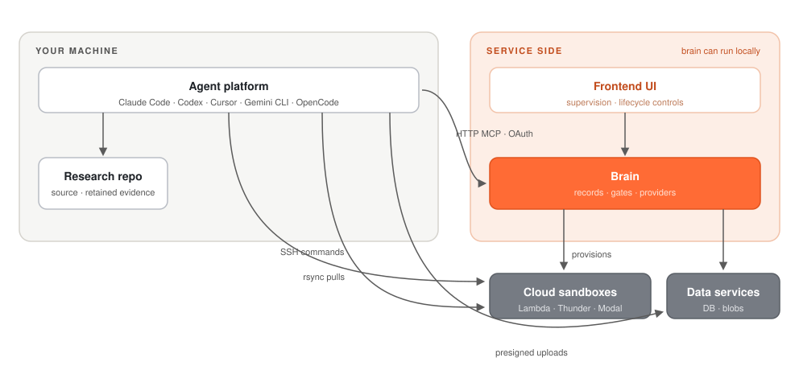

# Merv

Merv is a plugin for agentic coding platforms that helps agents run machine learning research as gated, reviewable experiment workflows.

It is designed to work with Claude Code, Codex, GitHub Copilot CLI, Cursor,
Gemini CLI, Qwen Code, Kilo Code, Hermes Agent, OpenCode, OpenHands, Replit
Agent, and other MCP-capable agent platforms. It includes a
frontend for humans to observe agent behavior ranging from macro research
strategy to experiment execution specifics.

The goal is to give research agents enough structure to plan experiments, execute them, review results, and reflect on the project direction to handle open-ended research problems.

## Experiment-level workflow

<picture>
  <source media="(prefers-color-scheme: dark)" srcset="assets/experiment-workflow-dark.svg">
  
</picture>

Each experiment begins with a generated plan that is adversarially reviewed by another agent. The plan/review loop persists until the reviewer approves the plan. After approval, the agent proceeds to execution. When it is done, it submits a report that is adversarially reviewed by a different agent. The reviewer can send the agent back to execution to fix something in the execution or the report, or it can send it back to the planning stage if the experiment proved faulty.

## Project-level workflow

<picture>
  <source media="(prefers-color-scheme: dark)" srcset="assets/project-workflow-dark.svg">
  
</picture>

After a set of experiments is complete, the plugin drives a project-wide reflection. Five different sub-agents are called, each analyzing the wave's snapshot of all terminal experiments and current claim statuses under a different lens. Their goal is to look for patterns of what works, what does not, and what has not been tried, in order to set up the next phase of experiments. The analysis of the sub-agents is consolidated into a report, logic graph, and change spec. Those artifacts are adversarially reviewed by a different agent for accuracy.

## How the system fits together

<picture>
  <source media="(prefers-color-scheme: dark)" srcset="assets/system-architecture-dark.svg">
  
</picture>

Merv has three main pieces:

- **Agent adapters** connect Claude Code, Codex, GitHub Copilot CLI, Cursor,
  Gemini CLI, Qwen Code, Kilo Code, Hermes Agent, OpenCode, OpenHands, Replit
  Agent, and other agentic clients to the same workflow.
- **Backend** owns the research state: projects, claims, experiments, artifacts, review gates, reflections, and sandbox orchestration.
- **Frontend** gives humans a visual way to inspect the project: experiments, reviews, artifacts, logic graphs, timelines, and current progress.

By default the plugin connects to the hosted brain; it can also run fully
locally. In either deployment the checkout root and caller SSH private keys
stay on the user's machine. Agents send explicit project ids, typed metadata,
and selected submitted bytes; the brain never opens the checkout directly.
Brain management keys remain separate operational credentials.

## Hosted setup

### Codex

```bash
codex plugin marketplace add rapidreview-io/Merv
codex plugin add merv@rapidreview
codex mcp login merv
```

Update with `codex plugin marketplace upgrade rapidreview`, then `codex plugin add merv@rapidreview`.

### GitHub Copilot CLI

```bash
copilot plugin marketplace add rapidreview-io/Merv
copilot plugin install merv@rapidreview
```

Start Copilot and run `/mcp auth merv`. Update with
`copilot plugin update merv@rapidreview`.

### Claude Code

```bash
claude plugin marketplace add rapidreview-io/Merv
claude plugin install merv@rapidreview
claude mcp login plugin:merv:merv
```

Enable automatic updates once under `/plugin` → **Marketplaces** → **RapidReview**.

### Gemini CLI

```bash
gemini extensions install https://github.com/rapidreview-io/Merv --ref merv-client --auto-update
```

Start Gemini and run `/mcp auth merv`. The extension updates automatically.

### Qwen Code

```bash
qwen extensions install rapidreview-io/Merv --ref=merv-client
```

Start Qwen, open `/mcp`, and sign in to Merv. Update with
`qwen extensions update merv` when prompted.

### Cursor

```bash
cursor-agent plugin marketplace add https://github.com/rapidreview-io/Merv
cursor-agent
```

In `/plugin`, install **merv** from **rapidreview**. Then select **Connect** for
Merv in **Customize**. Team marketplaces can enable **Auto Refresh**.

### Kilo Code

```bash
kilo plugin 'github:rapidreview-io/Merv#merv-client' --global
kilo mcp auth merv
```

Skills update when a new session starts. Run `/reload` to update the current
session. On a remote machine over SSH, connect with
`ssh -o ExitOnForwardFailure=yes -L 19876:127.0.0.1:19876 user@host` first so
the browser's sign-in callback reaches Kilo there — see
[Remote machines](merv/docs/AUTH.md#remote-machines).

### Hermes Agent

```bash
hermes plugins install rapidreview-io/merv-hermes-client --enable
hermes mcp add merv --url https://experiments.rapidreview.io/mcp --auth oauth
```

Update with `hermes plugins update merv` when Merv announces an update.

### OpenCode

```bash
opencode plugin 'github:rapidreview-io/Merv#merv-client' --global
opencode mcp auth merv
```

Skills update automatically when a session starts. Rerun the install command
when Merv announces an adapter update. On a remote machine over SSH, connect
with `ssh -o ExitOnForwardFailure=yes -L 19876:127.0.0.1:19876 user@host` first
so the browser's sign-in callback reaches OpenCode there — see
[Remote machines](merv/docs/AUTH.md#remote-machines).

Headless runners and CI use `MERV_MCP_KEY`. See
[Authentication](merv/docs/AUTH.md#when-a-static-key-is-still-required) and
[client details](merv/docs/CLIENTS.md).

### First run

Ask the agent to call `project(action="list")`, then
`workflow.status_and_next(project_id)`. Follow along at
[rapidreview.io/merv](https://rapidreview.io/merv).

## Self-hosting

The hosted brain runs this repo's code, and you can run the whole stack — brain,
Postgres, and an S3-compatible store — yourself. Start from the reference
deployment in [merv/deploy/README.md](merv/deploy/README.md); operations are in
[CONTROL_PLANE_OPERATIONS.md](merv/docs/CONTROL_PLANE_OPERATIONS.md). Clients
connect the same way — point the MCP `url` at your own brain.
