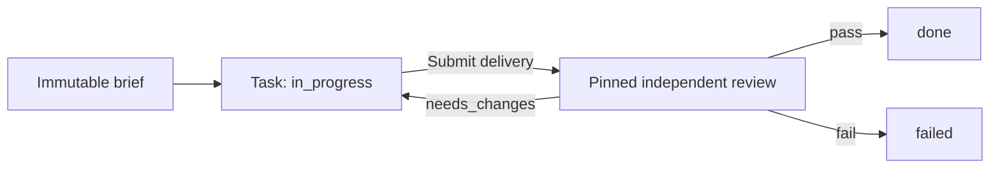
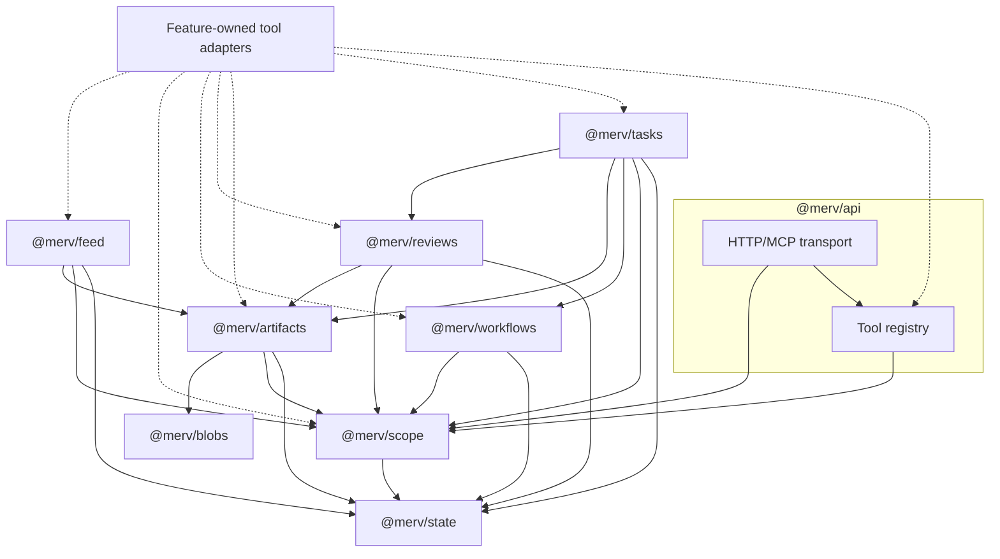

# Merv TypeScript

A small, durable Merv built from real [Cordis](https://github.com/cordiverse/cordis) plugins. Create a task, pin its brief, submit immutable evidence, and have a different actor review the submission. Share progress through the independent feed. Verdicts and task transitions commit together; work survives a server restart.



## Run locally

Requires Node.js **22.13 or later** and npm. The development baseline is Node **22.13.1** (`.nvmrc`) and npm **11.1.0** (`packageManager`). SQLite uses Node's built-in `node:sqlite`; some supported Node versions print an experimental-module warning.

From this directory:

```sh
npm ci
npm run typecheck
npm test
npm run init -- --name "My project" --dir .merv
npm run cli -- actor --name Producer --role producer --dir .merv
npm run cli -- actor --name Reviewer --role reviewer --dir .merv
npm start -- --dir .merv --host 127.0.0.1 --port 3081
```

`init` creates a project and local operator. It writes `.merv/credentials.json` with mode `0600`. Each `actor` command prints the path to its own credential file under `.merv/credentials/`; its token is stored there, not printed. The server prints its HTTP and MCP URLs when ready. `Ctrl-C` drains admitted calls and shuts down the plugin graph.

The data directory contains `state.sqlite`, immutable blobs, and local credential files. Keep that directory to retain work across restarts. The HTTP server binds to loopback by default; hosted authentication, TLS termination, and public deployment are outside this release.

### Development

This directory is an npm workspace subtree of the Merv repository. Run `npm ci` here to install the exact committed lockfile; the development dependencies are required because the current start command runs TypeScript through `tsx`. Do not use a production-only dependency install for this source checkout.

```sh
npm run format:check
npm run typecheck
npm run build
npm test
```

Use `npm run format` before committing. Prettier is version-pinned and uses the shared repository configuration in this directory. Integration tests bind temporary loopback ports; an environment that forbids listening needs that permission for the HTTP/MCP checks.

Dependencies, build output, caches, default runtime directories, SQLite files, and credential files are ignored. Custom `--dir` locations also have `credentials.json` and `credentials/` ignored; keep their artifact bytes private and outside source control. See [the execution plan](EXECUTION_PLAN.md) and [execution evidence](EXECUTION_LOG.md) for the ongoing component integration work.

### Configure plugins

The application uses upstream `@cordisjs/plugin-loader@1.0.0-rc.7`. Its default composition is [config/default.json](config/default.json). To run an explicit plugin list:

```sh
npm start -- --dir .merv --config config/default.json --host 127.0.0.1 --port 3081
```

A JSON configuration has a `plugins` array. Each entry has a stable `id`, a module `name`, an optional `config` object, and optional `disabled` and `required` flags. Module names can be installed packages or relative file paths. Relative paths resolve beside the configuration file; programmatic `config` objects resolve them from this workspace root. New plugins are added here without editing `src/app.ts`.

`${directory}`, `${host}`, and `${port}` are the supported substitutions inside configuration values. An exact `${port}` retains its numeric type. Command-line host/port values supply substitutions; literal plugin values stay literal. State, blobs, registry, and API also validate their own configuration before acquiring resources or publishing services. `init` and `actor` keep their minimal State/Scope composition and do not accept `--config`.

Cordis's loader waits for the whole dependency tree. Merv then checks required entries and their activation errors before reporting readiness. An entry defaults to required; disabled entries are intentional absences. Feed and its tool adapter are optional in the default configuration, so disabling only the feed provider lets the rest of the application start. Other custom optional failures remain visible in status. Dependencies are never silently installed to repair an invalid composition.

Startup JSON includes `plugins` status without configuration values. In an embedded application, `app.status()` returns current entry IDs, module names, lifecycle states, readiness requirements, and missing dependencies; `app.getFiber(id)` resolves the current Cordis handle. `app.setEnabled(id, false)` and `app.setEnabled(id, true)` operate through the loader and await completion. Runtime toggles are in-memory; edit the JSON configuration to retain a choice across restarts. Source-file watching and automatic code reload are not enabled by this step.

Feature contracts can live in their owning package. Feed now owns `@merv/feed/types`, including its Context declaration. Consumers use `import type` for that entry and declare their runtime `inject` dependency. Boundary tests verify public type modules contain no executable implementation or hidden implementation reexports.

Roles:

| Role       | Capability                                                         |
| ---------- | ------------------------------------------------------------------ |
| `operator` | Manage actor credentials, create work, review another actor's work |
| `producer` | Create artifacts and tasks; submit their own task deliveries       |
| `reviewer` | Read evidence, claim reviews, submit verdicts                      |
| `reader`   | Read project work and evidence                                     |

Operators, producers, and reviewers can publish feed posts; readers can read posts and activity. Posting to the feed does not grant other write permissions.

The producer cannot review their own submission, including when they have the operator role. Distinct credentials establish distinct Merv identities; review quality still depends on the reviewer actually inspecting the evidence.

## Connect a coding agent

Load the producer's credential into an environment variable. Replace the example filename with the path printed by the producer `actor` command:

```sh
export MERV_ACTOR_CREDENTIAL=".merv/credentials/actor_REPLACE_ME.json"
export MERV_TOKEN="$(node -e 'const fs=require("node:fs");process.stdout.write(JSON.parse(fs.readFileSync(process.argv[1],"utf8")).token)' "$MERV_ACTOR_CREDENTIAL")"
```

Configure Codex with a Streamable HTTP MCP connection:

```sh
codex mcp add merv --url http://127.0.0.1:3081/mcp --bearer-token-env-var MERV_TOKEN
```

Equivalent Codex configuration:

```toml
[mcp_servers.merv]
url = "http://127.0.0.1:3081/mcp"
bearer_token_env_var = "MERV_TOKEN"
```

Launch Codex from that shell. For the reviewer, launch a separate Codex instance from another shell with `MERV_TOKEN` loaded from the reviewer credential. Each HTTP request authenticates its bearer token independently. The MCP connection uses the official TypeScript SDK's stateless Streamable HTTP transport. See [Codex MCP configuration](https://developers.openai.com/codex/mcp/) and the SDK's [stateless server example](https://github.com/modelcontextprotocol/typescript-sdk/blob/v1.x/src/examples/server/simpleStatelessStreamableHttp.ts).

A suitable first instruction to the producer is:

> Use Merv to create a small task. Store a text brief containing the goal and every acceptance check, create the task with that brief, do the work, store a delivery document addressing every check, and submit the delivery. Leave it in independent review.

The reviewer should inspect `task.get`, `review.get`, and the pinned artifacts through `artifact.read`, claim with `review.start`, then submit a verdict through `review.submit` with the current task workflow revision.

If a reviewer becomes unavailable or their credential is revoked, the task's producer or an operator can call `task.reissue_review` with `taskId`, `expectedRevision`, `reason`, and a fresh `requestId`. It replaces an open review with a new unclaimed review, preserves the evidence and criteria, and advances the task revision. Refresh `task.get` for the new review ID and revision. The old claim is superseded; an already submitted verdict cannot be reset this way.

## HTTP and tools

| Endpoint             | Behavior                                                    |
| -------------------- | ----------------------------------------------------------- |
| `GET /health`        | Unauthenticated readiness response                          |
| `GET /tools`         | Authenticated tool catalog and JSON schemas                 |
| `POST /tools/<name>` | Authenticated tool call with a JSON argument object         |
| `POST /mcp`          | Authenticated MCP initialization, discovery, and tool calls |

All tool endpoints require `Authorization: Bearer <token>`. Arguments may include an optional `projectId`; it defaults to the actor's project, and the server checks access. Caller identity is constructed from the bearer token. A tool argument never substitutes for the authenticated actor.

For example, with `MERV_TOKEN` set:

```sh
curl --fail-with-body http://127.0.0.1:3081/tools \
  -H "Authorization: Bearer $MERV_TOKEN"

curl --fail-with-body http://127.0.0.1:3081/tools/actor.whoami \
  -H "Authorization: Bearer $MERV_TOKEN" \
  -H 'Content-Type: application/json' \
  --data '{}'
```

HTTP successes return `{ "result": ... }`; failures return `{ "error": { "code": "...", "message": "..." } }` with an appropriate status. MCP tool failures use `isError: true` and the same error object in a text content block. HTTP request bodies are limited to 3 MiB by default, covering a 2,000,000-byte artifact encoded as base64. Origin-bearing requests are rejected unless an origin is explicitly configured in `ApiServer`.

The installed feature adapters contribute **26 tools**:

| Owner        | Tools                                                                                                  |
| ------------ | ------------------------------------------------------------------------------------------------------ |
| Scope        | `project.get`, `actor.whoami`, `actor.list`, `actor.create`, `actor.revoke`                            |
| Artifacts    | `artifact.create`, `artifact.get`, `artifact.read`, `artifact.list`                                    |
| Workflows    | `workflow.catalog`, `workflow.list`, `workflow.get`, `workflow.history`                                |
| Reviews      | `review.list`, `review.get`, `review.start`                                                            |
| Task program | `task.create`, `task.get`, `task.list`, `task.submit_delivery`, `task.reissue_review`, `review.submit` |
| Feed         | `feed.post`, `feed.get`, `feed.list`, `feed.activity`                                                  |

Tool schemas are strict and runtime-validated. Use `GET /tools` or MCP `tools/list` for the exact required arguments. Workflow mutation tools are owned by the task program so callers cannot bypass its evidence and review gates.

## Nine plugin packages

Arrows mean **requires**. Solid edges describe service dependencies. The dotted edges aggregate the optional feature adapters: each adapter requires its own service and the tool registry; the workflow adapter also checks scope. API/tools is one package containing two Cordis plugins.



| Package           | Owns                                                                                  | Required capabilities                       |
| ----------------- | ------------------------------------------------------------------------------------- | ------------------------------------------- |
| `@merv/state`     | Synchronous SQLite transactions, per-component migrations, durable events             | None                                        |
| `@merv/blobs`     | Immutable bytes on disk, project namespaces, content hashes                           | None                                        |
| `@merv/scope`     | Projects, actor identities, bearer credentials, roles and access checks               | State                                       |
| `@merv/artifacts` | Completed immutable documents/files, metadata and authorship                          | State, scope, blobs                         |
| `@merv/workflows` | Versioned graphs, durable instances, transitions, revisions and request deduplication | State, scope                                |
| `@merv/reviews`   | Pinned evidence/criteria snapshots, independent claims and immutable verdicts         | State, scope, artifacts                     |
| `@merv/tasks`     | Brief/delivery rules, task records, installed task graph and atomic review routing    | State, scope, workflows, artifacts, reviews |
| `@merv/feed`      | Immutable project posts, artifact attachments, cursor reads and durable activity      | State, scope, artifacts                     |
| `@merv/api`       | Generic tool registry, runtime argument validation, HTTP/MCP transport and draining   | Registry: scope. Transport: scope, registry |

`@merv/contracts` contains shared interfaces and runtime helpers. Domain packages import those contracts or type-only public contracts such as `@merv/feed/types`, rather than sibling implementations. Each feature's `tools.ts` is an optional adapter depending on the generic registry and its own service. `src/app.ts` is the composition root; services also work through explicit constructor injection without HTTP, MCP, or the task program.

For example, an artifacts-only Cordis application can install `statePlugin`, `blobsPlugin`, `scopePlugin`, and `artifactsPlugin`. It does not need workflows, reviews, tasks, or API. `createApp({ directory, components: ['state', 'blobs', 'scope', 'artifacts'] })` builds that composition and rejects missing dependencies. All packages are currently local npm workspaces; publishing and deployment packaging remain separate work.

### Shared dependencies and the exposure hub

**State and scope have the most foundational dependents.** State serves scope and all five durable feature services; scope supplies project access to those features and the API plugins. Their contracts stay limited to storage transactions and identity/access, so neither acquires task or review rules.

**Artifacts is the shared evidence dependency.** Tasks, reviews, and feed attachments use the same immutable files and metadata; future programs can reuse that capability. Workflows is the corresponding reusable execution-state component, currently consumed by the task program. These services remain useful when the Merv task program is absent.

**The tool registry is an exposure hub.** Six feature adapters and the HTTP/MCP transport meet there. The feature cores do not depend on it, and the registry imports no feature implementation. Adding a tool means registering a validated handler from its owner; it does not add a task-specific dispatch branch to the gateway. Cordis owns activation and registration disposal, while each service owns its durable records and rules.

## Durable behavior and lifecycle

- **Transactions stay synchronous.** `SqliteState.transaction()` rejects promise-returning callbacks. Cross-component operations pass the same live transaction through declared interfaces. A foreign or expired transaction is rejected. The store uses WAL, full synchronous writes, and `BEGIN IMMEDIATE` for write transactions.
- **Migrations belong to components.** Applied SQL is hashed under `(component, version)`. Changing an applied migration or inserting an older version is rejected. Migration failure rolls back the component's changes.
- **Artifacts are completed and immutable.** Bytes are content-addressed, writes do not overwrite existing content, reads verify hashes, and database triggers reject metadata updates/deletes. Upload streaming and mutable drafts are outside this version. A failed metadata transaction can leave an unreferenced blob; no garbage collector runs automatically.
- **Workflow versions are pinned.** Persisted graph definitions are fingerprinted and immutable. Existing instances retain their version. Publishing another version does not migrate live instances. A managed graph returns an owner registration handle; direct generic mutations are rejected. The task program keeps that handle private.
- **Supported mutations are retryable.** Task commands, workflow commands, and review request/verdict commands persist their original response. Reusing a request ID with different input is a conflict. `artifact.create` and `actor.create` are not deduplicated commands. Revision checks reject stale transitions; request retries return the previously committed response.
- **Review routing is atomic.** Delivery submission pins the evidence and opens review with the task transition in one transaction. A verdict, task transition, events, and deduplication records also commit or roll back together. `needs_changes` permits a new delivery and a fresh review snapshot.
- **Open claims can be recovered.** `task.reissue_review` atomically supersedes the current unsubmitted review, pins the same evidence and criteria into a new review, increments the task revision, and records the reason. Only the task producer or an operator can do this. Stale claims and stale revisions cannot submit a verdict against the replacement.
- **Feed posts commit once.** Body, author, same-project artifact references, activity event, and request response commit together. Posts are immutable. `feed.list` uses a post sequence cursor; `feed.activity` uses a separate event ID cursor and includes activity recorded while the feed was unloaded.
- **Unloading releases runtime resources.** Feature tool registrations return awaited disposers; they stop admission and drain admitted calls. HTTP shutdown also drains calls when their clients have disconnected. Grouped Cordis effects withdraw provided services and await consumers before closing resources. Durable records, blobs, and workflow histories remain on disk.

The runtime is pinned to **`cordis@4.0.0-rc.10`**. It is upstream Cordis, not the Harness vendored fork. Keep grouped lifecycle effects and their tests when upgrading. TypeScript uses Bundler module resolution for Cordis's extensionless declaration imports. `@merv/contracts` imports `cordis` before augmenting its `Context`, ensuring service types merge with the actual runtime declaration.

This release includes no model provider, agent scheduler/session manager, sandbox service, frontend, experiment program, reflection, literature search, or ML execution. Existing coding agents invoke the tools; Merv remains the durable authority for the task-and-review loop. The existing Python Merv is unchanged, and its database is not automatically migrated into this implementation.

## Feed and runtime removal

`feed.post` takes `{ body, requestId, artifactIds? }`: a nonblank message of at most 8,000 characters and at most ten distinct artifact attachments. Reusing the same request ID and exact input returns the original post. `feed.list` reads posts in ascending sequence order (`after`, `limit`, default 50 and maximum 100). `feed.activity` reads the project's durable events, including work performed while feed was absent. Actor-management events are visible only to operators; other actors can page past hidden events to later project activity.

The application controls configured plugins by stable loader entry ID:

```ts
const originalProvider = app.getFiber('feed');
await app.setEnabled('feed', false);
// Cordis withdraws feed and suspends its existing tool adapter.
// Tasks, reviews, state, scope, artifacts and HTTP/MCP keep running.

await app.setEnabled('feed', true);
const replacement = app.getFiber('feed');
// A new provider handle, with the original dependent adapter reactivated.
console.log(app.status());
```

`getFiber` and the compatibility `components`/`adapters` views read the current loader entries. Retain a specific fiber only to observe that particular instance's disposal; use the entry ID for the next operation. Runtime removal leaves durable records intact. MCP clients can refresh `tools/list` to see the current catalog; a cached call to an absent feed tool returns `unknown_tool`.

Run the repeatable removal experiment with the official MCP SDK client:

```sh
npm run test:feed-unload
```

It pauses an admitted `feed.post` at a test barrier, disables **only the feed provider entry**, checks that Cordis removes the four tools and waits for the call, then finishes a task/review loop while feed is absent. Re-enabling only the provider restores the original adapter, posts, and durable activity. The same process, listener, client connections, and unrelated service instances remain throughout. The barrier makes removal overlap the otherwise synchronous feed call; it does not replace Cordis, SQLite, or the MCP transport. The command retains a synthetic database and `report.json` under a new `live-runs/feed-unload-<timestamp>/` directory.

## Verification

```sh
npm run typecheck
npm run build
npm test
```

`build` emits JavaScript and declarations under `dist`; the supplied launch commands execute the workspace TypeScript with `tsx`. The tests use temporary data directories and actual SQLite. HTTP/MCP tests bind loopback sockets, so environments that restrict networking must permit local listeners for those tests.

| Test file                       | Coverage                                                                                                                                                               |
| ------------------------------- | ---------------------------------------------------------------------------------------------------------------------------------------------------------------------- |
| `tests/config.test.ts`          | Validated plugin declarations, substitutions, explicit module bases, default selections, optional feed                                                                 |
| `tests/plugin-config.test.ts`   | Cordis resource configuration validation, invalid inputs before acquisition, valid API defaults                                                                        |
| `tests/loader.test.ts`          | Config-only extension, asynchronous dependencies, current entry handles, failure readiness, optional absence                                                           |
| `tests/cli-config.test.ts`      | Explicit config startup, safe status, argument validation, missing API cleanup, signal shutdown                                                                        |
| `tests/state-lifecycle.test.ts` | Native SQLite handle closure on initialization failure and failed Cordis activation                                                                                    |
| `tests/workflow-unload.test.ts` | Immediate tool withdrawal, held-call draining, independent services, and restoration through loader entries                                                            |
| `tests/foundations.test.ts`     | Migration immutability/rollback, durable events, role/project access, revocation, artifact immutability/corruption, real Cordis activation/disposal                    |
| `tests/workflows.test.ts`       | Exact replay, pinned versions across restart, competing revisions, atomic rollback, managed mutation ownership, graph validation and provider withdrawal               |
| `tests/tasks.test.ts`           | Delivery/review loop, revision and replay handling, evidence and UTF-8 gates, verdict rollback, generic reviews, restart recovery, review reissue authority/rollback   |
| `tests/api.test.ts`             | Strict schemas, authenticated identity/scope, duplicate registration, awaited disposal, HTTP limits, official MCP client roundtrip, shutdown after disconnection       |
| `tests/boundaries.test.ts`      | Package import boundaries, declared Cordis dependencies, feature adapter ownership, exported paths, independent service boot with only its dependency closure          |
| `tests/app.test.ts`             | Fully assembled MCP task/review loop across two server restarts, credentials and retained evidence, invalid composition cleanup                                        |
| `tests/live-evidence.test.ts`   | Live acceptance rejects unrelated tasks, missing pinned documents, and evidence read only after a verdict                                                              |
| `tests/feed.test.ts`            | Independent feed, reviewer communication, project/attachment permissions, immutable posts, atomic deduplication, cursor reads and persistence                          |
| `tests/feed-unload.test.ts`     | Real Cordis provider removal during an admitted MCP call, automatic adapter suspension/reactivation, task completion while feed is absent, retained posts and activity |

The separate live acceptance runner launches **three new Codex CLI processes** with synthetic data and separate producer, reviewer, and reader credentials:

```sh
npm run test:live
# Optional new output directory (must not already exist):
npm run test:live -- live-runs/my-acceptance-run
```

It requires an installed, authenticated `codex` CLI, network access to its configured model provider, and permission to listen on loopback. Set `MERV_CODEX_BIN` if the executable is elsewhere. These are real model calls and use the signed-in account's Codex allowance; they are separate from `npm test`.

Each session uses an empty workspace, a read-only filesystem sandbox, disabled shell tools and app connectors, and an allowlist of the scenario's MCP tools. Per-tool approvals apply only to that child process and the synthetic server. Persistent Codex settings are unchanged. Merv still enforces producer/reviewer/reader permissions, including the deliberately refused operations. These settings use the documented [Codex MCP tool policy](https://learn.chatgpt.com/docs/extend/mcp).

The producer creates a brief and arithmetic delivery, enters review, and attempts a forbidden self-review. The server restarts; the reviewer inspects retained evidence and submits a verdict. After another restart, the reader checks the final task and history and attempts a forbidden administrative mutation. The runner checks three distinct session IDs, server permission-denial codes, the exact expected task, and transcript arguments proving the reviewer read every pinned artifact before submitting. It also asserts durable task state, revisions, and identities through the application services.

Results go to a new `live-runs/<timestamp>/` directory by default. Inspect each phase's `.jsonl`, `.stderr.log`, and `.final.txt`; `report.json` is written only after the runner's checks and final shutdown succeed. A runtime failure writes `failure.json`. The directory also retains its synthetic database and credentials and is excluded from Git. See [the recorded verification](VERIFICATION.md) for the automated and live acceptance results.
