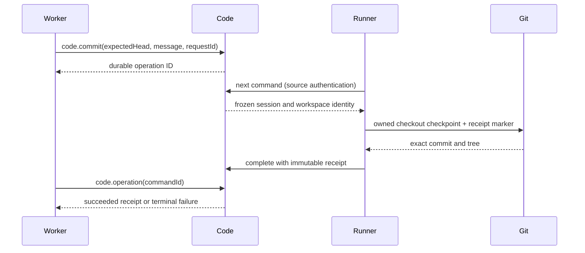

# Live code checkpoints

The Code plugin lets a running worker request a Git checkpoint without giving the worker write access to private Git metadata. Code stores the request and its immutable result. The existing machine Runner performs the fixed Git operation in that worker's assigned checkout.

Live checkpoints are the first slice of Code. The service also supports [immutable proposal sealing](CODE_PROPOSALS.md) inside an admitting domain transaction. Production research review and central publication remain unfinished. A successful checkpoint is evidence of a commit; it is not an approval or a published project head.

## Plugin boundaries

Code/Git is optional for the research stack. Experiments, Tasks, Consolidation and
Knowledge bind it through Cordis child injections; unloading Code preserves those
services, their workflow registrations and non-Git assignments. Git experiment and
Git task creation and assignment, capture validation, Git task delivery and review,
and Git consolidation require the service and report `code_unavailable` when it is
absent. Retained records remain readable, and artifact-only tasks never ask for Code.
Knowledge reports unavailable Code references as `unavailable`, distinct from
`missing`, and resolves them normally once Code returns.

Set the default configuration's `code` entry to `"disabled": true` to run without
Code. Its adapters are optional for startup and remain pending until Code returns.
No workflow is silently converted from Git to non-Git, and no agent is restarted
merely because this optional service changes.

| Plugin     | Direct Cordis dependencies        | Responsibility                                                                                 |
| ---------- | --------------------------------- | ---------------------------------------------------------------------------------------------- |
| Code       | State, Scope, Sessions, Artifacts | Durable command identity, worker admission, source ownership, immutable receipts and proposals |
| code-tools | Code, Tools                       | `code.commit` and `code.operation`                                                             |
| code-api   | Code, API                         | Source-authenticated command retrieval and completion                                          |
| code-ui    | Code, UI                          | Recent operations and sealed proposals in the Code page                                        |
| Runner     | None; separate machine context    | Poll command controls over HTTP, execute bounded Git operations, retain and retry receipts     |

Code does not inject Runner. Runner uses common command schemas and the API, with no Code implementation import. No new guardian process, agent credential or execution socket is introduced. Cordis removal suspends Code's adapters while keeping unrelated domain providers available; the command records remain in State.



## Agent contract

The step must grant both tools, declare a writable Git workspace, and belong to an active attached session. Ordinary actor or account tokens cannot request a commit. The worker reads its current full Git HEAD, finishes editing, then calls:

```json
{
  "expectedHead": "<full lowercase Git commit OID>",
  "message": "Explain the completed change",
  "requestId": "checkpoint-1"
}
```

Inspect `code.operation` with the returned `command.id` until the result is terminal. Keep files stable while the checkpoint is pending: the Runner captures their contents when it processes the request. Repeating the same request ID and input returns the same operation; changing that input conflicts. A session can have only one queued or dispatched operation at a time. A later checkpoint uses a new request ID and the new current HEAD.

Workers can read only their own current session's operations. Authorized project readers can inspect project operations, including after a worker closes. The Code page lists the latest 100; it does not imply a complete history count.

A receipt contains command, repository and workspace IDs, the retained workspace base, expected parent, resulting head, exact tree and change statistics. Statistics are from the retained base to the resulting head, and can include earlier persistent-workspace history. A checkpoint with no content change succeeds at the existing HEAD; it does not create an empty commit. Git author/committer metadata uses the Runner identity, while Code records the original worker actor and workflow revision.

## Execution and recovery

The server command is durable before dispatch. It freezes the project, session, actor, instance, revision, runner, host and original workspace attachment. Requests carry no executable, arguments, environment, credential, repository path or checkout path. The Runner validates the full descriptor against its session before accepting it.

The Runner journals the command before Git work. It uses a private operation index, freezes the resulting tree, and produces a deterministic commit. A single Git ref transaction checks the checkout owner and expected HEAD while updating the owned branch/HEAD and creating a unique receipt marker. Hooks, filters and unsafe Git configuration stay disabled. Changed files above 50 MiB are refused. The worker's sandbox permissions remain unchanged.

| Failure                                              | Outcome                                                                                                         |
| ---------------------------------------------------- | --------------------------------------------------------------------------------------------------------------- |
| Duplicate request or dispatch reply                  | Same immutable command, no second checkpoint                                                                    |
| Command received after worker stops                  | Resolve after final capture fences the old owner; no new Git mutation                                           |
| Dispatch reply lost before local journaling          | Recover an already-dispatched descriptor after session closure and resolve its stopped-safe outcome             |
| Controller dies while preparing objects              | Retry using the durable command and frozen tree; private operation indexes cannot overwrite a successor's index |
| Git ref update succeeds but acknowledgement is lost  | Recover its exact receipt marker and retry the same server result                                               |
| An old Git child survives its controller             | Capture changes the durable owner ref; the old ref transaction cannot update a successor's checkout             |
| Server unavailable during completion                 | Keep the local outcome and checkout reservation; retry before releasing capacity                                |
| Session closes before a queued request is dispatched | Cancel the request when its source next reconciles it                                                           |

Capture changes the owner ref to a permanent closed marker instead of deleting it. This also prevents an old, delayed initial ownership claim from reappearing after capture. Unknown Git outcomes remain unresolved until a receipt or the closed ownership fence proves the result. A late acknowledgement never reactivates a closed session or changes its workflow state.

Final WIP capture still runs after confirmed process-group stop. It can preserve edits made after a named checkpoint, so its final HEAD may differ from the checkpoint receipt. A program reviewing a named checkpoint must pin the receipt's head, not a later checkout or final-capture head.

## Units, acceptance and automatic bases

This is stage S1 of [the Git model](GIT_MODEL.md). Code keeps one row per unit of work (a task or an experiment, named by its workflow instance id) with two write-once sections: the base the unit was pinned to, and its acceptance.

**Acceptance.** When a task passes review or an experiment's results are accepted, the owner plugin calls `acceptUnit` inside that review transaction, for every workflow version, whenever Code is loaded. A Git unit's acceptance names the exact reviewed commit, resolved by Code from the capture reference the owner already stored (a task's delivered `code-commit`, an experiment's submitted `session-final`), together with the submission and review it belongs to and whether the reviewer's checkout was attached at exactly that commit. A unit without a workspace records an explicit code-less acceptance, which is what lets a later base look past it. An acceptance is hashed and immutable: the same acceptance replays, a different one is refused with `code_acceptance_conflict`. Code refuses only what the owner's own guard already required (a ready capture of that unit's own writable session); whether accepted code can serve as a base is judged where a base is derived, so a repository the project is not bound to never fails a review. `storage` is `legacy-local`: the accepted objects live only in the runner's repository and the server makes no durability claim for them. With Code unloaded nothing is recorded and scratch work is unaffected.

**Binding.** `code.local.bind` names the one local runner repository the project's Git work lives in (`repositoryId`, the identity the runner reports for its checkouts) and the commit of its main (`mainOid`). Only a signed-in project administrator may call it; an API key, an actor credential or a leased worker is refused with `code_human_required`, because main is consolidated research and no agent moves it. The server cannot look inside a local repository, so both values are taken as stated. The first call binds. A later call with the same `repositoryId` moves main and must carry `expectedMainOid`, the main last read from `code.status`; anything else is refused with `code_main_changed`, so a replayed or racing call cannot move main backwards. Another `repositoryId` is refused with `code_rebind_required`: the binding is immutable. Every bind is journaled in `code_operations`: the same `requestId` and input replays its result, a changed input is refused with `request_conflict`. A base that is already pinned keeps the commit it copied.

**Automatic base.** A Git task or Git experiment created without `baseTaskId` (`task@5`, `experiment@8`) is declared to Code at creation, and its base is derived from its `dependsOn` prerequisites: a prerequisite accepted with code contributes exactly that commit and ends the walk on its path; one that succeeded without code is looked through to its own prerequisites; no commit at all means the project's main. The derivation happens again inside the transaction that acquires the unit's first producing lease, and the result is written once: the pin holds the commit, every acceptance that contributed (two prerequisites accepted with the same commit are one base with two sources, also recorded as `based_on` rows in `code_edges`) and the declared dependency ids. Later leases, a returned task, a revised plan and a moved main all read the same pin; an experiment pins at its planner's lease and its `running` checkout inherits it. `baseTaskId` remains the explicit form and selects `task@4` / `experiment@7`, which work as before; a task accepted on those versions has an acceptance too, so newer work depending on it gets its commit automatically.

| Blocker                     | Key                 | Meaning                                                                                                                                                                                                      | Recovery                                                                                            |
| --------------------------- | ------------------- | ------------------------------------------------------------------------------------------------------------------------------------------------------------------------------------------------------------ | --------------------------------------------------------------------------------------------------- |
| `code_base_pending`         | `main`              | The project is not bound, so there is no main and no repository to check acceptances against.                                                                                                                | A signed-in administrator runs `code.local.bind`. Every waiting unit is derived again in that call. |
| `code_base_pending`         | `acceptance:<unit>` | A prerequisite succeeded on a version that declares a workspace, but its acceptance is missing (it succeeded before S1 or while Code was unloaded), no longer matches its hash, or names another repository. | Recreate the work with `baseTaskId` naming one accepted Git task, or redo the prerequisite.         |
| `code_base_pending`         | `dependency:<unit>` | A code-less prerequisite succeeded although one of its own prerequisites has not, so what it was built on is unknown.                                                                                        | Finish that work; if it failed, use `baseTaskId`.                                                   |
| `code_merge_required`       | `merge`             | The prerequisites were accepted with different commits. Automatic merging is disabled, or this is a runner-owned repository.                                                                                 | Recreate the work with `baseTaskId`, or make one prerequisite carry the combined code.              |
| `code_dependencies_changed` | —                   | A lease found declared dependencies other than those the pin was derived from. Not published; Tasks and Experiments never change them.                                                                       | Recreate the work.                                                                                  |

Blocked work is refused at lease admission, so it is never a dispatch candidate and never launched. A unit waiting for unfinished prerequisites is not blocked by Code: Workflows already reports `dependencies_pending`. Code derives a unit again when it is declared, when the project is bound or main moves, when Code loads, and when work it waits on ends (the durable consumer `code.reconcile.v1`); between a prerequisite ending and that consumer running, the refusal is already in force and the published row follows within one delivery.

S1 supports one local runner repository per project. A runner whose repository lacks the pinned commit is still offered the work and fails it with `workspace_failed`, a counted launch failure; keeping such runners away is part of stage S2.

**Reads.** `code.unit.get {unitId}` returns one unit's base pin, where its base stands (`baseStatus`: `pinned`, `ready`, `waiting` or `blocked` with the blockers) and its acceptance; the task and experiment pages read the same record. `code.status` returns the binding, the newest 200 units and every blocker Code has published. Both are project-scoped reads, and none of the three tools is granted by any execution policy.

**Shared bases.** Hosted work (`task@6`, `experiment@9`) merges several accepted commits automatically. `code.status.bases` gives the frozen plan, sponsors, result, execution epoch/deadline, retry count and operator reason. A conflict has one reviewed `task@7`, shared by all waiters. Sessions admits server work only with dispatch enabled, capacity free (`sessions.serviceConcurrency`, default one per project), and project/root budgets available. `code_base_admission` names a capacity, dispatch, usage, budget or missing-provider wait; `code_base_blocked` names suspended, cancelled or exhausted infrastructure work. Both appear in `session.stuck` without consuming launch or review limits. Wall time is charged once to the project and fully to each root frozen when the record was created. After a crash an abandoned execution is charged its reserved deadline duration.

Only an administrator using a human identity or operator key may call `code.base.retry`, `code.base.suspend`, `code.base.resume`, `code.base.cancel` or `code.base.quarantine`. Each takes the base key, a reason and a stable requestId. Retry restores five infrastructure attempts; resume preserves the existing work. A suspended resolution task still requires a human's `workflow.extend_limit`. Cancellation retains the record and asks for replanning. Quarantine also blocks existing pins, downstream acceptances, writers and their future mirror pushes; it never changes a sealed result. Resolved bases publish asynchronously through the existing mirror as create-only `refs/heads/merv/bases/<key>`; an outage cannot hold up acceptance or work.

**Blockers.** A plugin that cannot let work proceed publishes an opaque blocker through Workflows (`wf_blockers`). It gates `workflow.status_and_next` for that instance (the overview lists it under `blocked`), appears in `session.stuck` as `work_blocked`, and stays readable while the publishing plugin is unloaded. Ending the work is still answered on its own terms, and the rows go when the work ends. The refusal itself is the owner's lease hook, never this projection. With Code unloaded, a Git unit that was never blocked has no row: `workflow.status_and_next` shows `code_unavailable` as the refusal to begin it, and `session.stuck` does not list it. `code_base_pending`, `code_merge_required`, `code_base_wait`, `code_base_admission`, `code_base_blocked`, `code_merge_conflict`, `code_quarantined` and `code_dependencies_changed` raised while an offer is being built are not counted as launch failures.

## The Code repository

Stage S2 of the [Git model](GIT_MODEL.md) makes Code the shared remote. This section covers what exists so far: the repository Code keeps for a project, how history gets into it, and what admission refuses. Writer generations, runner transfers and mirroring build on it and are described as they land.

**Where it lives.** The `code` plugin takes `repositories.root` (default `${directory}/code`, on the data volume in a deployment). Without it the server keeps no repositories: `code.status` reports `store: null`, `code.repository.import` answers `code_store_unavailable`, and everything else of Code works as before. Beneath the root:

```text
writer.sock                       the writer lock, held for the life of the process
tmp/                              home and temporary directory of every Git child
<key>/merv-project.json           {format, projectId, repositoryId}; key = first 32 hex of sha256(projectId)
<key>/repository.git              the project's bare repository
<key>/quarantine/<operation>/     one transfer: bundle.part, bundle, objects/, scratch.git
<key>/held/<operation>.bundle     a bundle admission found something in, mode 0600, served by no route
<key>/exports/                    bundles cut for machines (swept after 15 minutes)
```

A repository is created from an empty template with a configuration Code wrote (`core.bare`, `core.fsync=all`, `core.fsyncMethod=fsync`, `gc.auto=0`, `transfer.fsckObjects`) and is checked whenever a process first opens it: another project's marker, an `objects/info/alternates` file, a hook, or any configuration key Code did not write (`remote.*`, `include.*`, `core.sshCommand`, …) refuses it with `code_repository_foreign` or `code_repository_unsafe`. Only objects that passed admission ever enter it; no configuration, hook, alternate or ref of another repository does. The server runs Git only through `packages/code/src/git.ts`: fixed `PATH`, empty home, no system or user configuration, no prompt, no hooks, and no transport unless the caller names the one it needs. Start-up requires Git 2.38 or newer and fails with `code_git_unsupported` otherwise.

**One writer per volume.** Code binds `<root>/writer.sock`; the operating system releases it however the process dies. A second server on the same root fails to load Code with `code_repository_locked`; a socket left by a dead process refuses connections and is taken over. Two servers started on one volume in the same instant are not protected from each other, and one server per volume is the supported deployment. Work on one project runs in turn, and at most two transfers index or write packs at once.

**Import.** `code.repository.import` (project administrator, never a leased worker; the project must already be bound with `code.local.bind`) promises one Git bundle: the commit it delivers (`tip`), its `sha256` and size (at most 512 MiB). The call returns an operation; the bundle is then sent with `PUT /code/v2/uploads/{id}/parts/{offset}` (`application/octet-stream`, at most 4 MiB a part, the operation says which size it wants) and admitted with `POST /code/v2/uploads/{id}/complete`; `POST /code/v2/uploads/{id}` reads the operation. The file's size is what was received: a part at that offset is appended, one wholly inside it is a replay, any other is `code_upload_offset`. Completion checks the size and the sha256 (`code_upload_incomplete`, or `code_bundle_hash_mismatch`, which drops the bytes) and then admits in the project's turn. It answers with the operation as it stands after a few seconds; ask again until `status` is no longer `prepared` — asking again never starts a second admission. The operator command does all of it and only reads the local repository:

```sh
npm run cli -- code-import --url https://merv.example --repository /path/to/repo --ref main --token-env MERV_TOKEN [--project ID]
```

It leaves out whatever the server already holds (`store.tips` in `code.status`), so a history larger than one transfer is imported oldest first, a branch or tag at a time. `source: "github"` instead reads one ref of the linked GitHub repository on the server, as the administrator who asked and with a read-only installation token that exists only in the environment of that one Git child and is revoked afterwards. The fetch lands in the operation's quarantine (`scratch.git`), writes no ref, tag or `FETCH_HEAD` into the project's repository, is ended when it outgrows one transfer, and what arrived is turned into a bundle that takes exactly the path an uploaded one takes.

The first completed import records the repository once (`code_projects.store_json`: object format, root, source, GitHub's numeric repository id) and makes the project **hosted**: `code.status` shows `durability: code`, for good. `main.stored` says whether Code's repository holds the commit named as main; an import that brings it, or a later `code.local.bind` naming a commit already held, sets it.

**Limits.** Per transfer: 512 MiB of bundle, 2 GiB and 100,000 new objects, 50 MiB per object. Per project: a disk quota (`quotaBytes`, default 10 GiB) over everything the project keeps — objects, quarantine, held bundles and exports — checked when a transfer begins; per volume a reserved free-space floor (`reservedFreeBytes`, default 2 GiB) checked when a transfer begins and on every part. Both answer 507 `code_store_full`, leave the operation open, and pass when there is room. A download is weighed the same way before its bundle is written, against what the commits it sends take on the disk; the one that session held is given back first, so a machine asking for a download never costs the project more than one of them. A project has at most four transfers receiving at once (503 `code_store_unavailable`), a transfer nobody sends a byte to for a day is given up (`code_upload_abandoned`), and a project holds at most eight held bundles or 1 GiB of them, the oldest making room. `code.repository.configure` sets the project's `denyGlobs` and `secretExemptGlobs`.

**The journal.** Every transfer is one `code_operations` row, idempotent by `requestId` and input like every Code command, and only the principal that began it continues it. A database transaction and a Git ref transaction cannot commit together, so the row walks `receiving → admitting → objects_durable → refs_applied → completed | failed`, and the database is the authority: the exact target and receipt ref are written down before any ref moves, packs are hard-linked into the repository and synced before the row says `objects_durable`, and one `git update-ref` transaction creates the receipt ref (`refs/merv/imports/<operation>`). A start after a crash either finds that receipt or retries that same update; a ref that holds anything else leaves the operation open with `code_recovery_required`, because recovery never invents a target. Recovery runs when Code loads and every `sweepSeconds` (300), which also removes quarantine directories of finished operations, expired exports and interrupted temporary packs. It never touches held bundles, receipt, import, work or accepted refs, or any pack, and nothing collects garbage or prunes. `code.status` lists every unfinished operation with its phase, bytes received and, under `waiting`, why it is not moving and what would move it.

**Unloading.** Code stops taking transfers and waits up to `drainSeconds` (45) for running ones. After that it ends their Git children, marks the operations `code_drain_pending` and releases the lock; the next start replays them.

**Backup and restore.** Back up the database and the repository root together: stop the server (or unload Code), snapshot both, start again. Restoring one without the other leaves operations the other does not know; after a restore, Code's start-up recovery completes or reports what was in flight.

## Admission and quarantine

Admission examines the whole history a transfer introduces, never the difference of its last commit: a credential committed and removed again inside one transfer is still in what would be kept.

1. **The bundle is what was promised.** Node reads the header: version 2, or version 3 with only `@object-format`; a `@filter` (a partial bundle) or any other capability, two refs, a head other than the promised commit, or a prerequisite the repository does not hold is refused. The bundle's ref name authorises nothing.
2. **Indexing.** The pack is indexed with `git index-pack --fix-thin --strict --fsck-objects` into the operation's quarantine, which borrows the kept objects through an alternate this server names; nothing in an upload can name one. Strict fsck refuses malformed objects, `.`/`..`/empty names, names containing `/` and `.git` with its HFS+ and NTFS spellings.
3. **Connectivity and surplus.** `git rev-list --objects <head> --not --all` must succeed, so nothing the history needs is missing. Every object in the pack must be part of that history or a copy `--fix-thin` made of a kept object; anything else is `code_bundle_surplus`, because it would be kept without ever being examined. What is _new_ is the intersection: the objects of the pack that the history reaches and nothing kept reaches. Limits and scans run over exactly those.
4. **Findings.** Object count, expanded size and object size; tree modes other than `100644`, `100755`, `40000`, `120000` (`mode`), submodules (`gitlink`); names with a backslash, a control character, a trailing dot or space, `.git` spellings, more than 255 bytes or 64 levels; names that collide when case is folded (`path_collision`); symbolic links that are absolute, longer than 4096 bytes or leave the checkout (`symlink_escape`); the project's deny globs; and `credentials@1`: private-key blocks, GitHub tokens (`gh[pousr]_…`, `github_pat_…`), Slack tokens, Anthropic keys and Merv session secrets, in new blobs and commit messages. Depth, links and deny globs are about where a path stands rather than about an object, so a kept directory that a new commit puts somewhere else is judged again there: a link inside it that now climbs out of the checkout, a path inside it that is now too deep, and a path inside it that is now under a denied one are all findings, and a rename is no way past a glob. A finding names the rule, the path and the object, never the matched text. A glob is matched against the whole path from the repository root: a literal matches itself, `?` one character and `*` any run within a segment, `**` any run across segments.

A transfer that is not what was promised fails with its own code (`code_bundle_header`, `code_bundle_head`, `code_bundle_prerequisite`, `code_bundle_corrupt`, `code_bundle_disconnected`, `code_bundle_surplus`, `code_bundle_lineage`, `code_bundle_format`) and nothing of it is kept. A transfer with findings fails with `code_import_rejected`, the findings are on the operation, nothing is admitted and no ref moves, and its bundle is moved to `held/` for an operator to read from the disk; no route serves it. The scanner is not proof that a history holds no secret: it keeps the unmistakable ones out of Code and, later, out of GitHub. A false positive on a fixture is answered with `secretExemptGlobs`; note that an exempted blob is kept, and the same bytes are not examined again wherever they later appear.

## Writer generations and fencing

A unit whose workflow version names the `code.v2` driver (`task@6`, `experiment@9`) has one branch in Code's repository, `refs/merv/work/<unit>`, and at most one writer at a time. The writer is a leased session, known by a **generation**:

| `writerState`       | Meaning                                                                                                                                                                                                                                                                   |
| ------------------- | ------------------------------------------------------------------------------------------------------------------------------------------------------------------------------------------------------------------------------------------------------------------------- |
| `idle`              | No session has written yet (generation 0).                                                                                                                                                                                                                                |
| `reserved`          | The owner's lease acquisition reserved generation g+1 in the lease's own transaction, right after the base was pinned; a refused offer takes it back.                                                                                                                     |
| `active`            | The session attached its checkout, or began its first upload.                                                                                                                                                                                                             |
| `closing`           | The session ended; its machine still owes the one final capture. The unit is no dispatch candidate (`code_writer_busy`, never counted).                                                                                                                                   |
| `closed`            | The final capture was admitted, or the session ended before it attached. The next lease gets g+1.                                                                                                                                                                         |
| `recovery_required` | No final capture came within `finalizeGraceSeconds` (default 900; blocker `code_recovery_required`, key `writer`), or the final capture was quarantined (blocker `code_capture_quarantined`, key `capture`). A late final capture of the same generation still closes it. |

Every upload names the whole fence — unit, generation, session, lease, the head it expects and the head it proposes — under a request id (the commit command's id, or the server-fixed `final:<session>`), and the server compares all of it when the upload begins, on every part while it is receiving, and once more in the transaction that fixes the ref update, after which a database trigger keeps the generation from changing until the operation has ended. Refusals: `code_generation_stale`, `code_writer_closed`, `code_head_conflict`, `request_conflict`. A `code.commit` succeeds only once Code admitted exactly that commit under the command's id (`code_upload_required` otherwise), and an acceptance of such a unit records `storage: code` with the `receipt`, the operation that made the commit durable; the journal then writes `refs/merv/accepted/<unit>`.

The final capture is the one thing a machine may still send after its session closed. It is authenticated by the source that leased the session together with the runner and launch the session records, reaches no tool route, and is accepted once per generation; sending it again answers with the same operation.

`code.unit.fence` (a signed-in project administrator, with a `requestId`) ends a generation that will not end by itself. It first lets every admitted upload of the unit finish, refuses with `code_operation_unresolved` while one cannot, ends what was only receiving as `code_generation_stale` — those bytes are kept under `held/`, never admitted and never served — closes the writer at the last admitted head and clears the blockers. The next lease continues from that head as generation g+1, on any machine.

## Mirroring

Code's own repository is where work lives; the linked GitHub repository is where it is
published. Publication is the server's own asynchronous work and is never on anybody's path: a
handoff is complete the moment Code holds the commit, and a repository that is away, refusing
or moved by another hand leaves the publication queued, retrying or blocked while every
session, review and acceptance goes on exactly as before.

- **What is published.** `refs/merv/work/<unit>` becomes `refs/heads/merv/work/<unit>` and only
  ever fast-forwards; `refs/merv/accepted/<unit>` becomes `refs/heads/merv/accepted/<unit>` and
  is only ever created. Nothing else is touched, and nothing is ever deleted or forced.
- **What authorises it.** The owner's linked repository together with the write automation they
  turned on (`github.configure_automation` with `mode: write`). The server reads that link with
  no caller: turning the automation off, or unlinking the repository, is the off switch. Without
  either, `code.status`'s `mirror.state` is `off` and `blockedBy` says which — that is quiet, not
  an error.
- **What it uses.** One installation token per push, scoped to that one repository and to
  `contents`, passed only in the environment of the one Git child and given up again however the
  push ends. No GitHub credential ever reaches a machine.
- **How it decides.** The published ref is read first. Equal to what Code holds: done. Absent:
  created. For a work branch, the published commit must be an ancestor of what Code holds, asked
  of Code's own repository; `--force-with-lease` is then the compare-and-set on top of that. Anything
  else is `code_mirror_diverged`. A push whose answer was lost is read again, never repeated blindly.
- **When it is behind.** Requests for one ref coalesce, and the newest head is what a run
  publishes, so a delayed run can never put an older commit back. A failure is retried with a
  doubling backoff and, after five attempts, waits for an operator. `code.status` says how many
  refs are waiting, since when, the last error and every blocked ref; `mirroredHead` and
  `mirroredAt` on a unit say how far publication has come, beside `canonicalHead`.
- **Putting one right.** `code.mirror.retry` (a project administrator, with a `requestId`) queues a
  blocked ref again. For `code_mirror_diverged` it also wants `acknowledgeRemote` set to exactly
  the commit the published ref holds, which records that the operator has seen it; the push still
  only ever fast-forwards, so the ref moves only once that commit is behind Code's or gone.
- **Where it is shown.** The `mirror` block and `warnings` of `code.status`, and the
  `code.mirror_blocked` event. A blocked mirror is never a blocker of the unit and never
  withholds work from a machine.

## The machine protocol on the wire

Machines reach all of this under `/code/v2/`, inside the same non-session branch of the HTTP
API as `/code/commands/*`: a leased worker's credential can never reach it. The API forwards
opaque JSON bodies (at most 64 KiB) and the bytes of one part (`application/octet-stream`, at
most 4 MiB) and reads neither; only Code interprets them. `workspace` gives a machine the
manifest of what to prepare, `uploads`/`finalize` begin a transfer, `uploads/<id>/parts/<offset>`
carry it, `uploads/<id>/complete` admits it, and `downloads` with `downloads/<id>/read` serve a
bundle back. The legacy `/code/transport/*` grant routes are untouched and still serve
GitHub-mode machines on the legacy workflow versions.

## Trust boundary and next integration

The server authenticates the original source, checks ownership and validates replay consistency. It does not independently fetch Git objects or prove the reported tree and statistics. Source revocation or loss of authority leaves cleanup awaiting authorized reconciliation; there is no alternate credential bypass.

The runner's repository and its private central ref remain machine-local. For the live-checkpoint protocol described at the top of this page there is no central advance, general merge/cherry-pick tool, remote push/fetch, cross-machine object transfer, production code proposal tool or research consolidation program; the server-side repository above is where stage S2 adds them.

Code now freezes proposals against exact receipts and authored evidence. The next production integration must implement the research domain records that determine the proposal's corpus, acceptance criteria and current review. Publication follows those domain gates and needs an expected-head compare-and-swap and its own immutable receipt. A stale, cancelled or superseded publication attempt must never be revived by a delayed result. See [the publication plan](CODE_PUBLICATION_PLAN.md).

See [Git workspaces](WORKSPACES.md) for workspace ownership and source isolation. Automated checks live in `tests/code-*.test.ts` and `tests/runner-code-*.test.ts`; `scripts/live-code.ts` exercises a bounded real producer and independent reviewer on a synthetic program. Latest execution results belong in [VERIFICATION.md](../VERIFICATION.md), rather than being inferred from the existence of these scripts.
