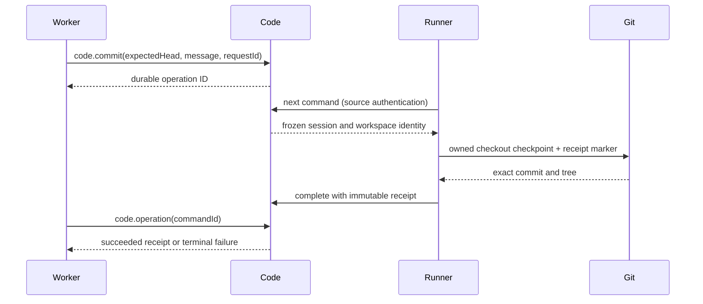

# Live code checkpoints

The Code plugin lets a running worker request a Git checkpoint without giving the worker write access to private Git metadata. Code stores the request and its immutable result. The existing machine Runner performs the fixed Git operation in that worker's assigned checkout.

Live checkpoints are the first slice of Code. The service also supports [immutable proposal sealing](CODE_PROPOSALS.md) inside an admitting domain transaction. Production research review and central publication remain unfinished. A successful checkpoint is evidence of a commit; it is not an approval or a published project head.

## Plugin boundaries

Code/Git is optional for the research stack. Experiments, Consolidation and Knowledge
bind it through Cordis child injections; unloading Code preserves those services,
their workflow registrations and non-Git assignments. Git experiment creation and
assignment, capture validation, and Git consolidation require the service and
report `code_unavailable` when it is absent. Retained records remain readable.
Knowledge reports unavailable Code references as `unavailable`, distinct from
`missing`, and resolves them normally once Code returns.

Set the default configuration's `code` entry to `"disabled": true` to run without
Code. Its adapters are optional for startup and remain pending until Code returns.
No workflow is silently converted from Git to non-Git, and no agent is restarted
merely because this optional service changes.

| Plugin     | Direct Cordis dependencies        | Responsibility                                                                                 |
| ---------- | --------------------------------- | ---------------------------------------------------------------------------------------------- |
| Code       | State, Scope, Sessions, Artifacts | Durable command identity, worker admission, source ownership, immutable receipts and proposals |
| code-tools | Code, Tools                       | `code.commit` and `code.operation`                                                             |
| code-api   | Code, API                         | Source-authenticated command retrieval and completion                                          |
| code-ui    | Code, UI                          | Recent operations and sealed proposals in the Code page                                        |
| Runner     | None; separate machine context    | Poll command controls over HTTP, execute bounded Git operations, retain and retry receipts     |

Code does not inject Runner. Runner uses common command schemas and the API, with no Code implementation import. No new guardian process, agent credential or execution socket is introduced. Cordis removal suspends Code's adapters while keeping unrelated domain providers available; the command records remain in State.



## Agent contract

The step must grant both tools, declare a writable Git workspace, and belong to an active attached session. Ordinary actor or account tokens cannot request a commit. The worker reads its current full Git HEAD, finishes editing, then calls:

```json
{
  "expectedHead": "<full lowercase Git commit OID>",
  "message": "Explain the completed change",
  "requestId": "checkpoint-1"
}
```

Inspect `code.operation` with the returned `command.id` until the result is terminal. Keep files stable while the checkpoint is pending: the Runner captures their contents when it processes the request. Repeating the same request ID and input returns the same operation; changing that input conflicts. A session can have only one queued or dispatched operation at a time. A later checkpoint uses a new request ID and the new current HEAD.

Workers can read only their own current session's operations. Authorized project readers can inspect project operations, including after a worker closes. The Code page lists the latest 100; it does not imply a complete history count.

A receipt contains command, repository and workspace IDs, the retained workspace base, expected parent, resulting head, exact tree and change statistics. Statistics are from the retained base to the resulting head, and can include earlier persistent-workspace history. A checkpoint with no content change succeeds at the existing HEAD; it does not create an empty commit. Git author/committer metadata uses the Runner identity, while Code records the original worker actor and workflow revision.

## Execution and recovery

The server command is durable before dispatch. It freezes the project, session, actor, instance, revision, runner, host and original workspace attachment. Requests carry no executable, arguments, environment, credential, repository path or checkout path. The Runner validates the full descriptor against its session before accepting it.

The Runner journals the command before Git work. It uses a private operation index, freezes the resulting tree, and produces a deterministic commit. A single Git ref transaction checks the checkout owner and expected HEAD while updating the owned branch/HEAD and creating a unique receipt marker. Hooks, filters and unsafe Git configuration stay disabled. Changed files above 50 MiB are refused. The worker's sandbox permissions remain unchanged.

| Failure                                              | Outcome                                                                                                         |
| ---------------------------------------------------- | --------------------------------------------------------------------------------------------------------------- |
| Duplicate request or dispatch reply                  | Same immutable command, no second checkpoint                                                                    |
| Command received after worker stops                  | Resolve after final capture fences the old owner; no new Git mutation                                           |
| Dispatch reply lost before local journaling          | Recover an already-dispatched descriptor after session closure and resolve its stopped-safe outcome             |
| Controller dies while preparing objects              | Retry using the durable command and frozen tree; private operation indexes cannot overwrite a successor's index |
| Git ref update succeeds but acknowledgement is lost  | Recover its exact receipt marker and retry the same server result                                               |
| An old Git child survives its controller             | Capture changes the durable owner ref; the old ref transaction cannot update a successor's checkout             |
| Server unavailable during completion                 | Keep the local outcome and checkout reservation; retry before releasing capacity                                |
| Session closes before a queued request is dispatched | Cancel the request when its source next reconciles it                                                           |

Capture changes the owner ref to a permanent closed marker instead of deleting it. This also prevents an old, delayed initial ownership claim from reappearing after capture. Unknown Git outcomes remain unresolved until a receipt or the closed ownership fence proves the result. A late acknowledgement never reactivates a closed session or changes its workflow state.

Final WIP capture still runs after confirmed process-group stop. It can preserve edits made after a named checkpoint, so its final HEAD may differ from the checkpoint receipt. A program reviewing a named checkpoint must pin the receipt's head, not a later checkout or final-capture head.

## Trust boundary and next integration

The server authenticates the original source, checks ownership and validates replay consistency. It does not independently fetch Git objects or prove the reported tree and statistics. Source revocation or loss of authority leaves cleanup awaiting authorized reconciliation; there is no alternate credential bypass.

The repository and its private central ref remain machine-local. This slice provides no central advance, general merge/cherry-pick tool, remote push/fetch, cross-machine object transfer, production code proposal tool or research consolidation program.

Code now freezes proposals against exact receipts and authored evidence. The next production integration must implement the research domain records that determine the proposal's corpus, acceptance criteria and current review. Publication follows those domain gates and needs an expected-head compare-and-swap and its own immutable receipt. A stale, cancelled or superseded publication attempt must never be revived by a delayed result. See [the publication plan](CODE_PUBLICATION_PLAN.md).

See [Git workspaces](WORKSPACES.md) for workspace ownership and source isolation. Automated checks live in `tests/code-*.test.ts` and `tests/runner-code-*.test.ts`; `scripts/live-code.ts` exercises a bounded real producer and independent reviewer on a synthetic program. Latest execution results belong in [VERIFICATION.md](../VERIFICATION.md), rather than being inferred from the existence of these scripts.
