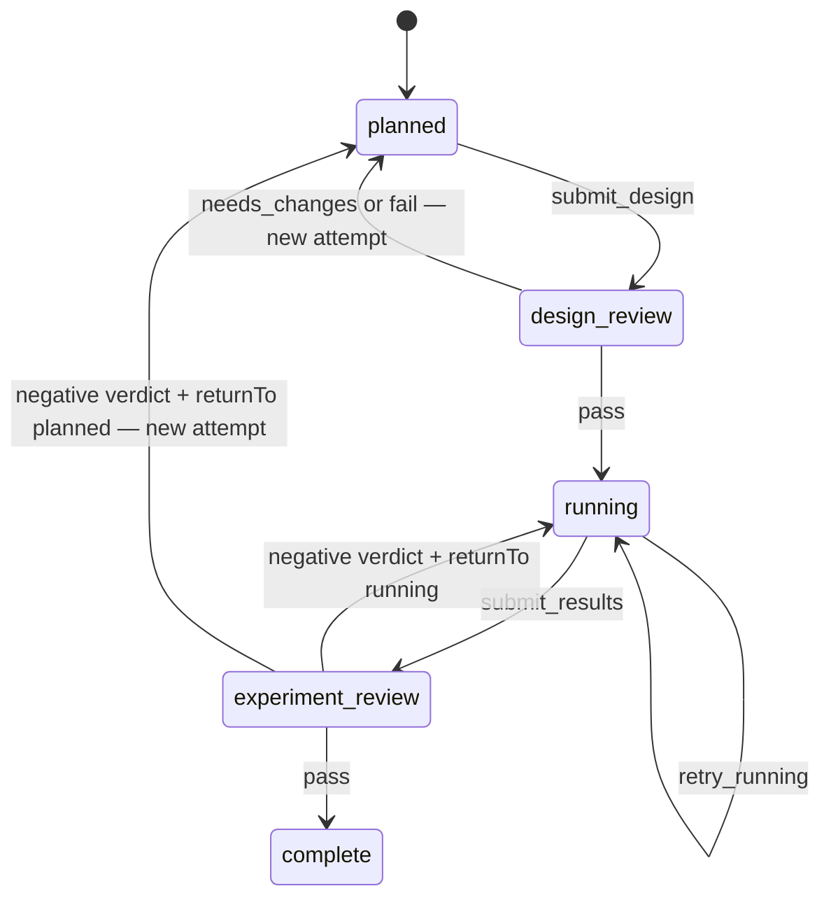

# Experiments

The production Experiments plugin connects a research question to design review,
execution, result review and an explicit conclusion. It retains every attempt
and submitted evidence selection. A completed experiment means its research was
accepted by an independent reviewer; a negative or inconclusive finding can pass.
Reviewers carry what it means into the living paper.

## Ownership and dependencies

The provider injects **State, Scope, Artifacts, Workflows, Reviews, Context Builder,
Code and Paper**. It owns experiment/attempt/evidence/submission records, the
managed `experiment` programs, four context recipes and its Reviews submission
route. New experiments start on version 5 (scratch) or on 6, 7 or 8 (explicit
Git); every design carries a feasibility statement. Versions 1-4 could no longer
start and were retired on 2026-09-22 with their records; the events log keeps
their history.
Workflows continues to own transitions, guidance and execution authority;
Reviews owns independent claims and verdicts; Artifacts owns immutable file
metadata and bytes.

The tools adapter injects Experiments and Tools; the optional UI adapter injects
Experiments and UI. Sessions leases the program through Workflows' generic
hooks. Runner consumes those sessions without Experiments importing either
implementation. Feed can show experiment events through State. There are no
separate plugins for experiment context adapters or individual stages.

See the [package inventory](../packages/experiments/README.md),
[service contract](../packages/experiments/src/types.ts) and
[record DTOs](../packages/experiments/src/models.ts).

## Public tools and records

All tools use the authenticated current project and actor. Inputs cannot inject
another identity. HTTP and MCP use the same strict schemas and tool registry;
there is no separate legacy experiment REST contract.

| Tool                    | Inputs                                                                                                                             | Result                                                                                                     |
| ----------------------- | ---------------------------------------------------------------------------------------------------------------------------------- | ---------------------------------------------------------------------------------------------------------- |
| `experiment.create`     | `name`, `intent`, `requestId`; optional `details`, `dependsOn`                                                                     | New experiment, initially `planned`, revision 0, attempt 1                                                 |
| `experiment.list`       | Empty object                                                                                                                       | All current-project experiments, including terminal records, ordered by creation time and ID               |
| `experiment.get_state`  | `experimentId`                                                                                                                     | Workflow, current attempt, attempt history, evidence/submission metadata and conclusion; no artifact bytes |
| `experiment.attach`     | `experimentId`, `artifactId`, `role`, `path`, `attemptIndex`, `expectedRevision`, `requestId`; optional `resultFormat` for results | Immutable evidence association replacing the current role/path slot                                        |
| `experiment.transition` | `experimentId`, `transition`, `expectedRevision`, `requestId`; optional `evidence.reason`/`detail` for applicable owner actions    | Original committed experiment response                                                                     |
| `experiment.exhibit`    | `experimentId`                                                                                                                     | Read-only metrics preview while running, including source associations, bytes, hash and `willPin`          |

Names are trimmed, 3–48 characters, begin with an ASCII letter/digit and then
use letters, digits, `.`, `_` or `-`. They are unique within a project without
case distinctions. Intent must be nonempty; intent/details are trimmed and
bounded to 16,000 characters. Details defaults to an empty string.
dependency arrays default to empty, accept at most 100 IDs and deduplicate IDs
without changing their order. Prerequisites must be project tasks.

At most seven experiments may be nonterminal in a project. Creation is available
to producers/operators, with the authenticated authority actor recorded as the
logical owner. The name, intent, details, owner and creator
are retained identity fields. There is no public rename, intent rewrite or
delete operation.

Each evidence association identifies experiment, attempt, role, path, artifact
ID/hash, verified figure IDs, author/session, timestamp and sequence. Replacing a
slot retains the older association. `current` describes selection, not whether
the association's attempt is the current attempt. An attachment does not advance
the workflow revision; its revision/attempt guards prevent attaching across a
stage or attempt handoff.

## Stages, returns and execution time



Owner tools expose `submit_design`, `submit_results`, `retry_running`, `abandon`
and `mark_failed`. Review transitions are applied only through `review.submit`
with the exact review, active claim and expected workflow revision.

| Review outcome                    | Required return input            | Result                                                                                      |
| --------------------------------- | -------------------------------- | ------------------------------------------------------------------------------------------- |
| Design `pass`                     | Omit `returnTo`                  | Enter running; pin that exact design submission (plan and feasibility statement) and review |
| Design `needs_changes` or `fail`  | Omit `returnTo` or use `planned` | New planning attempt; old attempt and assessment remain retained                            |
| Attempt `pass`                    | Omit `returnTo`                  | Complete the experiment                                                                     |
| Attempt `needs_changes` or `fail` | Explicit `returnTo: "running"`   | Repair execution/reporting in the same attempt under the same approved plan                 |
| Attempt `needs_changes` or `fail` | Explicit `returnTo: "planned"`   | New attempt requiring a new design and approval                                             |

A design review has four criteria, and criterion 4, the accuracy of the
feasibility statement, is required: a `pass` needs it `met` with the statement
artifact among its cited evidence, never `waived`.

A negative review never implicitly terminally fails the experiment.
`abandon` and `mark_failed` are separate owner/operator actions from any
nonterminal stage, require a nonempty `evidence.reason` and supersede any
unfinished current review. The exact active production worker may also perform
its declared terminal actions; review workers cannot. Owner/operator terminal
cancellation remains possible while a production lease is active. Retained evidence and review history remain available after termination.

`retry_running` records infrastructure feedback and advances the workflow
revision while preserving the attempt, approved plan and first execution clock.
Its default reason is `infrastructure failure`. It is a recovery marker, not a
new scientific attempt or a command that launches another process.

Planning and design review may proceed while prerequisites are unfinished.
Execution assignment, activation and result submission wait for successful
dependencies. Design approval itself does not start the experiment clock.
`attempt.startedAt` derives from the first `running` Workflows work-start in
that attempt's revision interval. Execution repair preserves it; returning to
planning starts a new interval with no execution start. Historical attempt
start times remain attributed to their original attempts.

Returns are [limited](BUDGETS_AND_LIMITS.md). `design_rounds` caps `revise_design` out of
`design_review` (Experiments config `limits.designRounds`, default 4); a `fail` design
verdict takes the same edge and counts too. `result_rounds` caps `revise_plan` and
`revise_execution` out of `experiment_review` together (`limits.resultRounds`, default 3).
Attempts are therefore bounded. At an exhausted limit the returning verdict is refused with
`loop_limit_reached`, the experiment is listed as escalated and is not dispatched, and a
human passes it, abandons it, or has an admin allow more rounds. `retry_running` is not
capped.

## Evidence gates and immutable submissions

Create retained artifacts first, then attach their IDs. The role rules are:

| Role          | Writable stage | Submission requirement                                                                                 |
| ------------- | -------------- | ------------------------------------------------------------------------------------------------------ |
| `plan`        | planned        | Exactly one selected plan, with nonempty Summary, Objective & hypothesis, Evaluation sections          |
| `feasibility` | planned        | Exactly one selected JSON statement whose own figures show no shortfall, absent dependency or blocker  |
| `result`      | running        | At least one selected result; declared finite JSON or explicitly qualitative text                      |
| `report`      | running        | Exactly one selected report, with nonempty Summary, Results, Deviations from plan, Conclusion sections |
| `exhibit`     | System only    | Generated and pinned when a submitted result declares JSON                                             |

Each input role accepts nonempty valid UTF-8 at most **16,000 bytes**. Logical
paths are bounded relative labels: no absolute paths, traversal, empty segments,
backslashes or URL syntax. They do not direct filesystem writes. Role and path
form the replaceable slot within an attempt. Public attachment is refused during
review and after termination.

### Feasibility statement

A design that cannot be run should be stopped before it is reviewed for
anything else. In scenario run 01 the design review returned a plan four times
on feasibility alone, starting from "the entire 973-receipt corpus is smaller
than every required training arm" (`dev_docs/scenario-runs/01/report.md:163`);
the facts that would have settled it were cheap to state while planning. The
planner therefore attaches one JSON artifact as role `feasibility` beside the
plan:

```json
{
  "formatVersion": 1,
  "resources": [
    {
      "kind": "data",
      "name": "receipt corpus",
      "unit": "receipts",
      "required": 900,
      "available": 973,
      "basis": "Row count of the retained corpus inventory art_…"
    }
  ],
  "dependencies": [
    { "name": "base checkpoint", "present": true, "basis": "Model inventory art_…" }
  ],
  "blockers": []
}
```

`kind` is `data`, `compute` or `time`; at least one `data` resource is stated;
quantities are finite and non-negative; unknown keys are refused. The shape is
checked at attachment (`invalid_experiment_evidence`) and again at submission.
`submit_design` then applies the statement's own arithmetic: any resource with
`available` below `required`, any dependency with `present: false` and any
listed blocker refuses the submission with `experiment_infeasible` (409) and
names each shortfall; `workflow.status_and_next` shows the same blocker. The way
forward is a smaller design or ending the experiment with the reason.

The server does not measure anything, so an overstated figure or an omitted
requirement passes this check. That is what the required review criterion is
for: the statement is pinned into the design review, the reviewer recomputes it
from the records each `basis` names and looks for what it leaves out, and a
passing criterion 4 finding must cite the statement (`feasibility_not_cited`
otherwise). A successor planner inherits the statement with the plan, and the
approved statement travels with the approved plan into execution and the
results review.

Draft plan/report sections may be unfinished at attachment. Declared JSON
results are parsed immediately, and any plan/report images must already
resolve. Full document gates run at submission. Heading checks
ignore HTML comments and fenced examples; they verify structure, not scientific
truth. The independent reviewer still judges controls, execution and inference.

Figures use inline Markdown ``. Every target must be a retained
artifact in the current project with nonempty bytes, matching hash/size and
PNG/JPEG/GIF/WebP media type. The service does not fetch URLs or resolve local
paths. A lease also requires each figure to be a frozen input or that worker's
own output. Attachment records figure IDs so unfinished drafts can survive a
worker handoff; submission includes them in the sealed review and artifact
grants. Figure checks validate retained bytes/provenance and declared media type;
they are not a full image-decoder validation pass.

Result submission includes the exact approved design selection, never a newer
plan upload. It retains the selected association records, figures, producing
actor/session, attempt, stage, round, workflow revision, manifest hash and exact
review ID. Workflow transition, exhibit metadata, submission, review request,
events and request receipt commit together. Review application likewise commits
the verdict, transition and attempt/conclusion changes in one transaction.
The conclusion uses explicit review evidence when supplied, otherwise the pinned
report's Conclusion section, then the review notes.

## Metrics and shared next-action guidance

`experiment.exhibit` preserves original result data and its path, artifact ID,
SHA-256 hash, attachment timestamp and declared result format. Sources sort by
path. The window records the attempt's first execution start, or an empty string
if execution has not begun. The `verdict` object contains only the result-file
count: it is not a scientific verdict, score or success threshold.

Bytes are deterministic JSON with sorted object keys, preserved array order,
two-space indentation and a trailing newline. No generation clock is added.
Finite JSON values, including `null`, scalar values and keys such as
`constructor`, are retained safely. An explicit JSON result pins the exhibit
even when its value is `null`; an entirely qualitative selection does not.
The builder accepts at most 100 result sources and bounds generated bytes to
the 2,000,000-byte artifact limit.

When an exhibit will be pinned, the report must reference its filename,
`metrics_exhibit.json`. Submission creates the system exhibit at the logical
path `experiments/<name>/metrics_exhibit.json`, and its artifact joins that
immutable review round. After submission, read the pinned artifact rather than
asking for a fresh running-stage preview.

`workflow.status_and_next` uses the same read-only exit validator as submission,
so missing sections and missing exhibit references become
blockers. Guidance creates no artifacts, events or transitions. Assignment
eligibility, fixed-policy reference resolution, dispatch and activation remain
metadata-only; building a context packet reads its pinned inputs deliberately.

## Context, authority and recovery

The program owns four recipes: `experiment.design`,
`experiment.design_review`, `experiment.execute`, and
`experiment.attempt_review`. Tasks' `experiment.plan` type, the earlier way to plan an
experiment as a task, was retired on 2026-09-25. Packets include experiment metadata, the current paper,
the exact approved plan where applicable, numbered review criteria, selected
evidence, interruption feedback and retained rejected assessments.

A design rejection opens a new attempt whose `feedbackReviewIds` names only the
review that caused it, so `feedback.previousReviews` covers the current attempt
alone. Design and execution packets therefore also carry `feedback.history`:
every rejected round of the experiment across all attempts, oldest first,
labelled `<stage> attempt N round M`, in the bounded form described in
[Rework history](RECOVERY_AND_CONTEXT.md#rework-history) (8000 characters).
`references.reviews` names each of those reviews. Stored attempts and
`feedbackReviewIds` are unchanged. Reviewing packets carry no history: a design
or result reviewer is shown no verdicts from earlier attempts.

A session offer freezes the selected artifact metadata, figure references,
recovery associations and context inputs, including the Scope-owned Project
Introduction. Later Introduction edits affect later offers; refreshing an
existing lease preserves its original input. Previously rejected review artifacts
are context for correction, not permission to relabel them as new output.
New artifacts authored by that worker can extend its output set. Later ordinary
project uploads do not widen an existing lease's read grants.

The submitting worker must retain its **own plan or report**, after checking any
inherited work. A successor may reuse and reattach exact frozen result tuples:
experiment, attempt, role, path, artifact/hash and result format must
match. This does not transfer the artifact's original authorship. Reviews receives
server-computed pinned input IDs and the actual submitting worker as producer.

Logical source ownership and worker identity are separate. The same human or
source key may delegate independent producer/reviewer leases with different
operational actors; the producer cannot review its own output. Review leasing
checks the source's review permission and lets the new worker acquire its own
claim. Release identifies the original lease and claim, so delayed cleanup cannot
release a replacement reviewer's claim. See [Sessions](SESSION_LEASES.md).

Every read and mutation checks current Scope authority. Production is available
to the logical owner or an operator when no worker owns that revision; an active
lease fences those ordinary writes. The worker must still own the exact
experiment/revision/attempt/stage and, for review, its exact claim. Ordinary
project credentials keep their broader project permissions; the fixed tool and
artifact restrictions apply to leased workers.

Mutation receipts are scoped to project, actor and request ID. After current
authorization, identical normalized input returns the original saved response
before comparing a newer revision. Different input conflicts. Revoked/expired
authority cannot use a receipt as a bypass. Borrowed State transactions let
other trusted components compose these commands atomically.

## UI, lifecycle and remaining parity

The Experiments UI reads the actual plugin tools. It shows inventory and detail,
revision/attempt, approved plan, retained evidence, review history, feedback,
workflow blockers/dependencies and a metrics preview. Agents create and update
experiments through tools; this page reads their records. The browser
verification checkpoint is recorded below.

Provider unload withdraws its generic review route, workflow/context registrations
and dependent tools/UI. State and retained artifacts remain. Reload can restore
the same versioned program and durable records; stale in-flight generations are
fenced by Workflows/Sessions. Removing only the UI adapter leaves the service
and tools available.

This is a real Experiment program, but it does not complete the wider Python
research system. Knowledge now provides current metadata inventory, scoped
reference resolution and immutable terminal corpus snapshots; see
[research inputs](RESEARCH_INPUTS.md). Remaining work includes reflection-wave
scheduling and its seven-slot reservation/threshold policy, five-lens reflection,
and production code consolidation and central publication.

## Explicit Git execution

Omitting `workspace`, or selecting `"none"`, selects the scratch program
(version 5). Omitted input stays absent in command hashes; existing records,
submissions and frozen contexts are not rewritten. Creating with
`workspace: "git"` selects the Git program (version 6). Planning/design review remain scratch;
running uses a retained private persistent checkout, and attempt review uses an
ephemeral read-only checkout based on an exact captured commit.

The Runner's trusted local configuration supplies the repository. The producing
session must attach its workspace before result submission. `submit_results`
seals that exact worker's future `session-final` reference in the immutable
submission. After handoff the Runner stops the process and reports its final
capture. Review dispatch waits for this exact observation; it then freezes
`references.code` to that head OID, with source/worker/revision provenance in
context. Later captures cannot substitute, and a missing reference or local Git
object has no central fallback. New observations include a real tree OID;
legacy reports can remain without one.

A Git experiment created without `baseTaskId` starts on version 8. Its base is not
named: Code derives it from what the `dependsOn` tasks were accepted with and pins it
when the first producing lease is acquired. That is normally the planner's, although
planning has no checkout, so the plan is written against a fixed base and the `running`
checkout inherits it as `reference:base`; a revised plan or a new attempt keeps the same
pin. While no base can be derived the experiment is not offered and shows
`code_base_pending` or `code_merge_required` ([workspaces](WORKSPACES.md#the-derived-base)).
Version 6, based on `central`, stays registered for the experiments already on it.

With `workspace: "git"`, optional `baseTaskId` names a Git task that is also among
`dependsOn`; the experiment then starts on version 7, whose `running` checkout is
based on `reference:base`, frozen to the commit that task delivered once it is
accepted. Without `workspace: "git"` it is refused (`invalid_workspace`); a base that
is not a Git task among the prerequisites is `invalid_workspace_base`; a base without
an accepted delivered commit is `experiment_base_unavailable`. Experiments on
versions 5 and 6 finish under their own versions. The objects exist only in the
producing runner's repository, so the experiment must run there
([workspaces](WORKSPACES.md)).

This integrates captured code as reviewed experiment evidence. It supplies no
remote compute, sandbox provisioning, object transport, code consolidation or
central publication. Sessions/Runner still owns process and checkout lifecycle.
The current seven-experiment cap does not implement the future reflection
scheduler's reserved slots. Exact capture and compatibility details are in
[research inputs](RESEARCH_INPUTS.md).

TypeScript deliberately adds strict bounded schemas, safe relative paths,
explicit result formats, revision/attempt fencing and durable request receipts.
Python's ambiguous JSON-null exhibit behavior is not reproduced. Source-specific
differences and remaining order are in the
[Python reference](EXPERIMENTS_PARITY_REFERENCE.md) and
[research-program plan](RESEARCH_PROGRAM_PARITY_PLAN.md).

## Verification checkpoint

The bounded independent pass completed **34 tests** across
[evidence/input](../tests/experiment-evidence.test.ts),
[recovery invariants](../tests/experiment-invariants.test.ts),
[core lifecycle](../tests/experiments.test.ts), and
[assignment/lease integration](../tests/experiment-assignments.test.ts).
Backend typecheck passed. This includes exact recovery reattachment, inherited
draft figures, foreign/missing/post-offer figure refusals, metadata-only admission,
both attempt return paths, shared exit gates and restart restoration.

The complete integration suite passes **610/610**, including prepared Nisa.
Four fresh native workers completed the actual production lifecycle with **24
successful MCP calls, zero failed calls and five shell calls**. Independent audit
matches both review manifests, actual executed code/stdout, the reproduced
calculation and final state. A post-run report lookup bug was repaired against
retained evidence without repeating model execution; exact hashes are recorded.

Actual browser verification on a restored copy of those records checks the gate,
plan/evidence/reviews, attempts/evidence and plugin removal/restoration while Claims
continues. Separate real-record component SSR checks recovery attribution and
latest-review selection after closure. Builds, typechecks and formatting pass.
These use tiny synthetic data and local credentials; they do not claim shared
provider login, cloud execution or broader research parity.
See [verification](../verification/experiments.json),
[native evidence](../verification/experiments-live.json), and
[the checkpoint](../VERIFICATION.md).

The later Git/corpus foundation has focused service and actual local Git tests.
Its four-agent `--git` acceptance is running at this documentation checkpoint;
the historical 610-test/scratch-native record above does not prove the new Git
path. Final native results will be recorded separately after inspection.

## Paper changes in the results review

The plan and results reviewers own Methods/Results updates. Read the current paper, then include reviewer-authored `paperChanges` with `review.submit` (see [Living paper](LIVING_PAPER.md)). Plan reviews describe hypotheses and proposed methods as planned work; results reviews explain the execution, findings and limits in project context. Edits save atomically with any verdict, including rejections, and retain reviewer attribution and source evidence. When no edit is warranted, explain why in review notes. Producers submit scientific evidence and reports without paper changes; no separate paper assignment is created.
