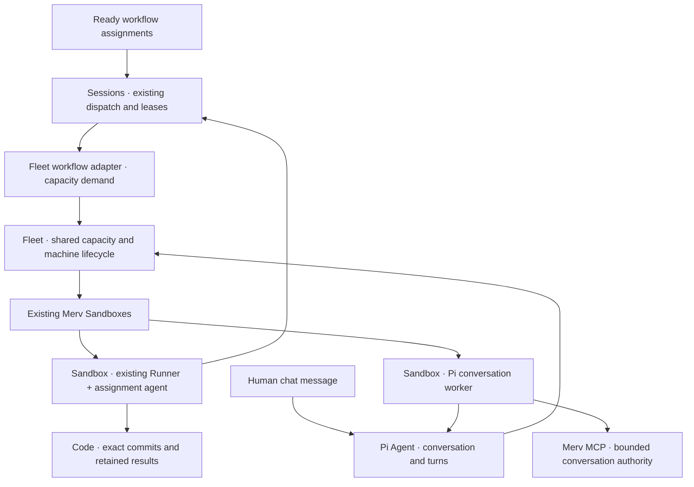

# Optional Fleet and Pi agent — implementation proposal

Design status: proposed, not implemented. Prepared 2026-09-23. This replaces the architecture in `HOSTED_AGENT_PROPOSAL.md`; that document remains historical context. No VMs were provisioned and no implementation files were changed while preparing this proposal.

**The decision in plain language.** Fleet is the manager that gets a machine when somebody needs one and returns it when the work is safe to leave. A workflow runner asks for work from Sessions. A chat agent receives messages from its conversation. Both get their machines through Fleet and our existing Sandboxes service. A conversation never has to become a task to get a machine.

We will build two optional packages:

- `@merv/fleet`: shared compute admission, allocation, lifecycle and inventory. Its optional workflow adapter supplies machines for existing Runner processes.
- `@merv/pi-agent`: conversation UI, turn control, Pi runtime and tool bridge. This package has a hard dependency on Fleet.

Merv without either package continues to accept Codex/Claude and existing runners. Fleet without Pi can execute tasks using configured existing Runner profiles. Pi cannot run without Fleet. Cloudflare remains entirely behind our Sandboxes service.

This is a responsibility diagram, not a Cordis injection graph. The exact package dependencies are in the Fleet design.

**What we reuse.** Current Runner already advertises capacity and launches concurrent agents; Sessions transactionally selects and reserves eligible assignments. Code's `code.v2` driver transfers exact Git commits between machines and captures results under writer fences. Sandboxes already provisions Cloudflare containers, runs jobs through its reverse tunnel, renews leases and releases machines. The existing one-shot `Sandboxes.checks` capability is a pattern to follow, not an interactive-runtime interface to repurpose.

Older Runner documents contain statements that cross-machine Git transfer remains unimplemented. Those statements describe the older machine-local workspace path; current `code.v2` code and its two-machine integration test establish the newer path. This proposal assumes `code.v2` for hosted coding assignments and does not migrate old pinned workflow versions implicitly.

**Decisions that keep the implementation small.**

| Decision | Initial choice |
|---|---|
| Allocation unit | One isolated sandbox and one runtime per Fleet allocation |
| Workflow allocation | One Runner slot; one successful assignment lease; capture, then exit |
| Chat allocation | One conversation in one project; may serve consecutive turns until idle release |
| Shared capacity | Fleet counts all its provisioning, live, warm, draining and uncertain allocations |
| Task selection | Existing Sessions automatic lease path; Fleet never selects task IDs |
| Conversation selection | Pi owns its durable command queue; Fleet knows only an opaque owner reference |
| Hardware | Existing configured Cloudflare offer through Sandboxes |
| Runtime delivery | Versioned, digest-verified artifact; no dependency installation during cold start |
| Worker networking | Outbound HTTPS to Merv; no browser-to-VM connection |
| Model access | Narrow authenticated model relay; provider key stays outside the worker |
| Initial UI | Agent conversation row; Fleet status/control row; links to Sessions and Sandboxes |
| Code in conversations | Discuss/create work; coding edits execute as real assigned tasks |
| Not in the first release | Generic harness framework, Kubernetes, warm-pool scheduler, cross-project runtime reuse, automatic migration of old workflows |

The one-assignment runtime choice is deliberate. It avoids retaining a broad reusable runner source credential on an ephemeral machine and keeps cleanup auditable. It does not remove existing multi-slot support from user-managed runners. Later reuse requires fresh delegation, proven cleanup and an explicit security review.

**Reading the full specifications.**

- [Fleet plugin proposal](FLEET_PLUGIN_PROPOSAL.md): contracts, demand calculation, fairness, managed-runner enrollment, sandbox lifecycle, failure matrix and ownership.
- [Pi agent proposal](PI_AGENT_PROPOSAL.md): conversation records, SDK integration, chat authority, commands/events, checkpointing, UI and cancellation.

**Implementation sequence.** Each phase should be a bounded reviewable change set. Tests use fakes first and disposable infrastructure only in explicit acceptance runs.

| Phase | Deliverable | Exit gate |
|---|---|---|
| 0 — Contract and provider proof | Freeze package contracts and threat boundary; prove a pinned runtime can be staged/run/stopped through existing Cloudflare Sandboxes. Establish protected launch and source-delegation gaps. | Measure full readiness and memory; output retained after release; no secrets in job rows/logs; current provider limits recorded |
| 1 — Fleet core, fake provider | Optional package, persistent demand/allocation state, atomic cap reservation, idempotent reconcile, API/UI, fake Sandboxes adapter. | Concurrent requests respect caps; lost replies do not allocate twice; disable/restart/revoke fail closed; core starts with Fleet absent |
| 2 — Real runtime lifecycle | Narrow Sandboxes runtime capability and protected bootstrap delivery; worker enrollment, heartbeats, stop/release receipts, orphan cleanup. | Fresh Cloudflare allocation runs fixed fake worker; Merv/service restart recovers it; lost machine becomes uncertain; finite lease cleans orphan |
| 3 — Workflow fleet | Authoritative Sessions demand snapshot, managed-runner principal and lease binding, one-assignment Runner mode/drain receipt; existing harness profile first. | Three independent code.v2 tasks run on separate VMs; no double claims; external runner coexistence; one failed VM; results survive teardown and review handoff |
| 4 — Pi conversation shell | Pi package hard-depending on Fleet; durable private conversations/commands/events with deterministic fake worker; compiled Agent view. | Chat creates no workflow instance; idempotent sends; owner/membership checks; streaming reconnect; Fleet absence does not silently fall back |
| 5 — Real Pi, read-only pilot | Pinned SDK worker, narrow MCP bridge, bounded conversation grant, model relay, full Pi session checkpoint/restore and stop. | Real query; steer/follow-up; disconnect; destroy/recreate runtime; interrupted tool reconciliation; no source/provider keys on worker |
| 6 — Complete research assistant | Explicit coordinator writes and linking real tasks; Pi assignment profile; separate producer/reviewer workers and Code retention. | Hosted chat creates real task; Fleet runs it; external/hosted review both ways; self-review rejected; domain evidence controls completion |
| 7 — Multi-user release | Fairness, production limits, metering, deployment drain, failure injection and staged rollout. | Cross-user isolation, global/project cap races, overload/provider outage, revocation, budget behavior, zero leaked allocations after recovery; rollback preserves history |

Phase 3 is independently useful without chat. Phase 5 is a private read-only pilot, not the finished assistant. Phases 6–7 complete the production scope. No implementation duration is asserted before phase 0; authorization, protected bootstrap and crash recovery are the main uncertainties, not the sidebar.

**Initial operational defaults, subject to measurement.** Four Fleet-managed allocations globally during the pilot; configurable per-project/user limits; one active conversation per user; one turn executing per conversation; five-minute chat idle grace; finite renewable sandbox lease; 15-minute interactive turn deadline. Workflow assignments retain their existing explicit deadlines and consume capacity until process and capture cleanup settle. These caps do not purport to govern independently operated external runners or separate research/GPU sandboxes.

Use fair admission between conversation and workflow demand. Warm idle chat consumes real capacity and can be reclaimed after checkpoint when queued work needs its slot. Running assignments are never preempted just to make a chat appear instant. The UI shows waiting and startup accurately.

**Acceptance scenario.** With Fleet and Pi enabled, a user opens history without starting a VM, sends a message, and receives a streamed response. They ask for three independent tasks. Those are created through ordinary authorized Merv tools; Sessions publishes eligible demand; Fleet adds capacity subject to limits. Existing Runner instances claim distinct assignments, receive exact Code bases, and retain changes. A separate reviewer verifies the results. The user can leave the browser, return, inspect the conversation and task results, and see that idle machines were released. Repeat with Pi disabled and tasks created through external Codex: workflow execution still works. Repeat with Fleet absent and manually operated runners: existing behavior still works.

**Review focus before implementation.** The detailed proposals specify required new authority and bootstrap contracts rather than assuming current APIs provide them. The first implementation review must settle their concrete schema/migration shapes, prove authorization at native transactional writes and mounted dispatch, and prove same-sandbox worker code cannot obtain a reusable provisioning/source credential. Code capture and Pi checkpoint durability are separate requirements. Unknown remote side effects remain unknown until reconciled; no component promises exactly-once model execution.

Source verification was read-only. Relevant local anchors: `packages/runner/src/index.ts`, `packages/sessions/src/dispatch.ts`, `packages/code/src/driver/index.ts`, `packages/sandboxes/src/types.ts`, `tests/runner-code-v2-integration.test.ts`, and sibling `merv-sandboxes/docs/providers/cloudflare.md` / `docs/jobs.md`. Current Pi contracts were checked against [the official SDK](https://github.com/earendil-works/pi/blob/main/packages/coding-agent/docs/sdk.md). This is not a live multi-VM acceptance report.
