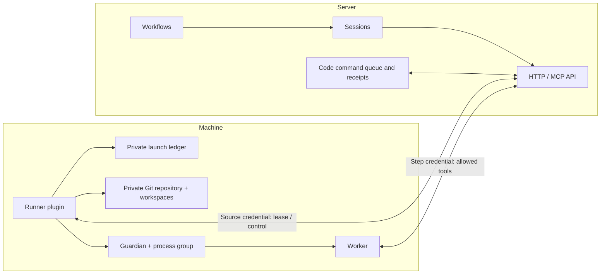

# Machine runner

The optional `@merv/runner` plugin runs on an agent machine. It polls Merv over
authenticated HTTP, receives one frozen workflow assignment, and starts a local
worker with that assignment's scoped MCP credential. Workflows still decides
the gate, context recipe and allowed operations. Sessions still owns admission,
leases, expiry and recovery. The runner executes those decisions.


```mermaid
flowchart LR
  subgraph Server
    W[Workflows] --> S[Sessions]
    S --> A[HTTP / MCP API]
    K[Code command queue and receipts] <--> A
  end
  subgraph Machine
    R[Runner plugin] --> L[Private launch ledger]
    R --> B[Private Git repository + workspaces]
    R --> G[Guardian + process group]
    G --> C[Worker]
  end
  R <-->|Source credential: lease / control| A
  C <-->|Step credential: allowed tools| A
```

These arrows describe communication, not Cordis injection. Runner has `inject: []`
and provides `ctx.runner`; it does not require the server State, API or Sessions
providers in its own process. Its SQLite ledger is private machine state. The
server's default configuration does not install it, and it adds no agent tools.
The server-side [Code service](CODE_OPERATIONS.md) exposes `code.commit` and
`code.operation`; Runner consumes its fixed command protocol through HTTP.

## Running it

Copy [the example configuration](../config/runner.example.json) and set its
server URL, project, private local directory and installed executable. Export an
ordinary Merv actor credential or user-owned machine key under the named
`credentialEnv`, then run:

```sh
npm run cli -- runner --config /absolute/path/runner.json
```

The config contains the environment variable's name, never its secret value.
Directory and path-like executable names resolve relative to the config file.
Bare executable names use `PATH`; command arguments remain literal strings.
The CLI installs only the runner plugin and handles SIGINT/SIGTERM through its
Cordis disposer. Readiness includes an offline state if the server is unavailable.

A runner has no repository of its own: Git work comes through Code's `code.v2`
driver, which `merv runner` always composes. Workflows
must declare their Git policy; assignments without one still use scratch.

Enable dispatch from the server's Sessions page. Default dispatch is off. Pause
prevents new assignments while preserving current workers. Halt closes leases;
the machine observes closure and stops their process groups. A source refusal on
runner control stops its workers immediately; a transient outage retains them
only until their last confirmed deadline. A single-session refusal stops that
session without revoking other sessions.

## Local launch profiles

| Profile   | Supported behavior                                                                                                                                                                |
| --------- | --------------------------------------------------------------------------------------------------------------------------------------------------------------------------------- |
| `codex`   | Native Codex CLI, frozen assignment on stdin, scoped MCP catalog, bounded local shell, read-only or assigned-workspace-write filesystem policy. Model and effort are optional.    |
| `command` | Trusted local executable plus literal argv, the same frozen stdin and MCP environment. Read-only leases are refused because this profile supplies no verified filesystem sandbox. |

Remote desired settings can enable/disable an existing profile and tune its
parallelism, model and effort. They cannot supply an executable, command
arguments, harness, environment variables or a new local profile. Responses are
checked against the requested project, session, runner and lifecycle state.

The source credential stays in the controller. Workers receive only their step
credential, and model-generated Codex shell commands do not inherit it. Native
profiles disable inherited rules, optional integrations and unrelated MCP
servers. This does not isolate hostile programs running as the same OS user;
see the [process and isolation contract](../packages/runner/README.md).

## Recovery and completion

Pending request identity is committed before requesting a lease. A lost reply
reuses the same request and derived secret. Launch identity is committed locally
and attached remotely before spawn. The guardian claims it once in SQLite.
After a controller crash, a replacement reconnects to that guardian instead of
starting a second worker. A second controller cannot acquire the same ledger.

A guardian has its own deadline and owns a live child handle. It never kills a
PID read from disk. Confirmed shutdown permits local capture. A Git launch keeps
its slot until result acknowledgment and checkout cleanup complete. If the
guardian is unreachable or cannot confirm termination, the launch remains
`uncertain`, consumes capacity and is not respawned—even if the server lease
has closed—until it is proven gone: claimed in an earlier boot, or with no
command pinned a minute after it was first found unreachable. Historical launch
and redacted log records remain inspectable.

A zero process exit code is not a completed workflow gate. If the agent exits
before its handoff, the runner releases unfinished work with a canonical failure
outcome; short exits use `crash_loop` so server backoff prevents tight retries.
Successful handoffs are established by durable workflow transitions. Release
reporting is retryable and happens only after local termination is confirmed.
Each ended launch makes one release call. A user's own stop of the runner
(Ctrl-C, systemd, an upgrade) releases the launches that stop ended with no
outcome, which counts against nothing. A hosted runner's stop, a halt after a
source refusal, a deadline, and an ending that merely raced the stop keep their
counted outcome. A refusal that asking again cannot change (any 4xx except 401,
408 and 429, and except the codes `transaction_conflict` and
`invalid_control_response`, which are retried whatever their status) is that call's answer: it is recorded once and never replayed, so a
session the server no longer knows is stopped once and settled.

An idle runner costs the server little. Presence is sent when it changes, 15 s
after the last accepted one (the server holds it fresh for 45 s) and at once
after a failure or a `settings_pending` decline, so remote settings apply within
15 s. A profile whose lease was declined is not asked for again for 5 s; a
request whose answer was lost is always replayed. Each live session is read every
tick, but heartbeated only when that would slide its expiry by more than a
minute, as judged by the runner's clock against the server's `expiresAt`: the
machine's clock is assumed to be within a minute or so of the server's, as the
local deadline check already assumes. A clock hours behind heartbeats only when
the session is that close to expiry, and one four hours behind never does. A
guardian's deadline is pushed only when its session's has moved on by more than a
minute, so a launch that activates late is extended on the first tick that sees
it active. A managed
runner's read does not reconcile its session on the server, so it learns of a
close that reconciling decides (an expiry, or a workflow moving on after a
handoff) up to about a minute later than a heartbeat every tick would.

The runner sets `MERV_USAGE_FILE` for each launched process: the path of `usage.json` in
that launch's private run directory, cleared before the process starts. A profile's
wrapper, or the process itself, may write one JSON object there:
`{"inputTokens": 0, "outputTokens": 0, "model": "name"}`, the model optional and nothing
else allowed but a legacy `costUsd`, which is accepted and dropped. Without that file the runner asks the launch's profile what its harness printed: the Codex
profile reads the `turn.completed` usage of its own `codex exec --json` stream from the
redacted `stdout.log` (input tokens, cached ones included, output tokens and the profile's
model, never a cost); the Claude profile reads the final `result` event of its
`stream-json` output (input tokens plus the cache it wrote and read, output tokens and the
profile's model; any cost it reports is dropped). Only the log's last 1 MiB is read, from its first
whole line. Codex prints it only after the closing message it writes once the
handoff tool returns, so a Codex launch whose own handoff closed its session gets a grace of
a minute, within its deadline, to exit by itself; any other close, and any other profile, is
stopped at once. The grace holds the launch's capacity slot but changes no capture: the
worker's tools are already closed, the final capture is still taken once the process has
ended, as a Git result submission already expects, and a sealed lease's Codex sandbox is
read-only. A Codex launch stopped before its turn completed still reports nothing, and so
does a Claude launch stopped before its `result` event (which, with no grace, includes one
stopped at once when its own handoff closed its session), as does any other profile that
writes nothing. When the launch is over the runner sends a regular
file of at most 4 KB in that shape, or what the profile read: with its release when the
process ended first, and on its own when the server had already closed the session, which is
how a landed handoff ends. The ledger remembers that the report was answered, so it is
retried across restarts and sent once. The figures are a self-report from whatever could
write the file; see [usage and budgets](BUDGETS_AND_LIMITS.md).

Each launch that printed anything also delivers one redacted copy of its `stdout.log`, for
operators: it declares the file before each release try and, after its workspace result and
checkout close, PUTs it in the background to the object store through a signed URL Sessions
gives it. Nothing waits on the store, and a server without the route costs one call. See
[the runner README](../packages/runner/README.md#settling-an-ended-launch).

Sessions' source-owned `get` now reconciles current expiry and workflow admission
without activating work or rebuilding context. That lets the runner discover
closed or invalid assignments even when the child makes no further MCP calls.

## Workspace drivers and capabilities

The runner schedules, launches and reports through one generic driver interface and never learns how a checkout is made. Policies that name no driver (`task@3`/`task@4`, `experiment@6`/`experiment@7`) were served by the runner's own repository, which was removed; no runner is offered them. After binding and import, new automatic-base work uses `task@5` / `experiment@8`; service resolution uses `task@6`. `merv runner` also composes the runner with Code's `code.v2` driver, which needs only `/usr/bin/git`: no local source repository and no GitHub credential. Each driver the machine can run is advertised in the heartbeat as a capability, and the server offers work whose policy names a driver only to runners that list it; a runner without the capability keeps receiving everything else. A launch records the driver it was reserved for, so a restart finishes it with the same one. The server must be deployed before such a runner: an older server refuses a heartbeat that carries `capabilities`.

When a driver cannot prepare a checkout because the place that work's history lives is away, busy or full, the lease goes back as `preparation_deferred` with the cause rather than as a failure of the launch: nothing counts it, no hold forms, and the target is simply offered again after the usual backoff. Everything else — a bad launch, a checkout that could not be made, a process that would not stay up — is reported exactly as before.

## Git workspace lifecycle

Runner owns a private bare clone of the configured local source and never changes
that source repository. A workflow selects scratch, a detached ephemeral checkout,
or a persistent branch by namespace/project/instance, optionally separated by the
full base OID. A frozen `reference:name` must identify an available exact commit;
there is no fallback. `central` names the machine's private ref initialized from
`baseRef`, not a server-published project branch.

Checkout intent is durable before Git preparation. The stable launch ID and
initial snapshot are attached before spawn. Native workers edit files inside
their sandbox. If their fixed policy grants `code.commit`, they can request a
named commit and wait for its immutable receipt through `code.operation` before
handoff. Runner performs the fixed commit against that worker's owned checkout;
the request cannot supply Git arguments or paths. After confirmed termination, Runner captures writable
changes as a bounded WIP commit. A read-only session is reported as attached and
its checkout put back on that commit.

Code owns the durable server queue; Runner owns the durable local operation
journal. A command freezes its parent/tree/message/timestamp before an atomic
HEAD and receipt-ref update guarded by the current checkout owner. Pending
receipts survive controller restart, lost command replies and worker closure.
Capture permanently closes the owner fence before final HEAD work; ambiguous
operations are reconciled and acknowledged before releasing the checkout.
See [Code operations](CODE_OPERATIONS.md) for admission, retries and receipts.

An ended launch is released first, then captured, reported and closed; an outage only
delays those steps, and the checkout stays reserved until they are done.
One immutable final snapshot is reported under the original source authority;
identical retries survive lost replies and controller restarts. Closed sessions
can receive their exact late result without reactivation. A persistent successor
cannot take the checkout until result acknowledgment and cleanup finish.
Per-launch history remains unchanged by later reuse.

`retain: false` removes the acknowledged Git checkout while preserving its branch
and objects. Retained checkouts and scratch output stay on disk. Failed reports,
unknown process ownership and foreign/partial paths remain available for recovery
rather than being silently deleted. See [WORKSPACES.md](WORKSPACES.md) for policy
fields, source/host identity checks, storage layout and failure behavior.

## Supported scope and next work

This slice supports scratch and Git workspace preparation, fixed live commit operations and capture on Darwin and
Linux. Server results are immutable source-authenticated observations; the server
does not fetch or independently verify Git objects. Capture acknowledgment is not
approval or central publication. Native workers use the fixed Code request path
for allowed commits; arbitrary Git metadata writes and general merges remain outside that contract.

Next are `code.propose`, reviewed-proposal publication, central compare-and-swap receipts,
ancestry verification and cross-machine Git object transfer. Pairing, source-key rotation for an existing
ledger, an operational settings editor, bounded trace delivery/telemetry and
additional native harnesses also remain open. The existing ledger is intentionally
bound to its original source credential digest; a different key requires a new
ledger until a verified rotation handoff is implemented. Workspace capture does
not complete production runner parity or the overall Python migration.

Use `npm run test:runner` for synthetic process/HTTP tests. The explicit
`node --import tsx scripts/live-runner.ts /absolute/new/directory` acceptance run
uses two fresh Codex agents and a disposable arithmetic task; it exercises native
shell execution, scoped MCP evidence, independent review and final cleanup.

The historical workspace-capture checkpoint passed all 490 repository tests, backend/UI typechecks
and builds. Native Git acceptance also passed on 2026-09-15 using the since-removed
local repository driver and `scripts/live-runner-workspace.ts`: exactly two fresh Codex agents completed a
synthetic managed `work → capture → verify → done` workflow on one machine. The
writer edited files, Runner captured the commit, and the read-only verifier
checked that frozen commit. The source stayed unchanged, both processes stopped,
and both workspace records closed. The report is
`/private/tmp/merv-native-git-live-20260915-02/report.json`.

That Git run predates Code operations and uses a generic verification gate and one private object store. It
does not establish actual Reviews/consolidation integration, central publication
or cross-machine transport. Synthetic Code integration now verifies live-worker
commit receipts, actual Reviews attribution and lost-response recovery. Native
Code acceptance is tracked separately in [CODE_OPERATIONS.md](CODE_OPERATIONS.md).
Consolidation, publication and transport remain separate parity work.
