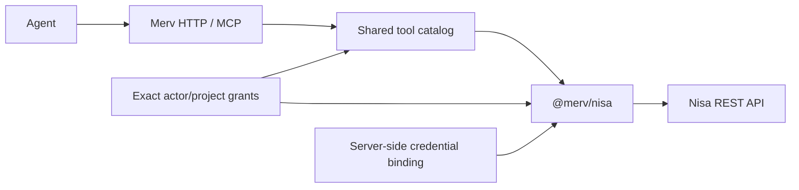

# Nisa literature plugin

Step 7 implementation, checked 2026-09-13. The installed Nisa CLI is
`0.3.0`; the inspected sibling source is `Nisa@3489d7d`. All 177 local checks
pass, including the complete Nisa-removal scenario alongside an authenticated
sandbox fixture. The real Nisa gate requires a renewed login; the prepared
Fable review requires explicit packet-disclosure approval. Source inspection
and fixture results do not establish successful deployed integration.

## Two tools through the existing catalog

`@merv/nisa` owns the Nisa REST adapter and a static catalog created with
`tools.createCatalog(id)`. With the default ID, its tools are
`mount__nisa__search` and `mount__nisa__paper`. Generic registry, API, and loader
code do not recognize Nisa or import its implementation. The plugin uses the
existing Tools, Access, and Credentials interfaces; Nisa does not need to
implement MCP for these tools to appear through Merv's HTTP and MCP surfaces.



| Tool     | Merv input                                                                                      | Upstream request                                           |
| -------- | ----------------------------------------------------------------------------------------------- | ---------------------------------------------------------- |
| `search` | One `query` string, optional `max_results` from 1 through 20 and `offset` from 0 through 10,000 | `POST /api/sdk/search`, always with literal `enrich:false` |
| `paper`  | `arxiv_id`: a modern, unversioned arXiv ID such as `1706.03762`                                 | `GET /api/sdk/paper/<arxiv_id>`                            |

The first adapter intentionally exposes this smaller input surface. Upstream
also supports multiple search queries, author/date filters, and some older paper
identifiers. Those capabilities are not part of these two Merv tool schemas.

Both tools return `{ data, sources }`. `data` preserves the original decoded
upstream response, including result order, snippets, citation metadata, and
pagination fields. `sources` contains `{ arxivId, title, url }` records with
stable `https://arxiv.org/abs/<id>` references. The adapter does not replace the
upstream response with a generated summary. Legacy underscore IDs such as
`cs_0001001` remain unchanged in `data` and `sources[].arxivId`; only the
generated reference URL normalizes the separator to `cs/0001001`.

Search `count` is the number of papers on the current page, not a total hit
count. Preserve `offset`, `limit`, `truncated`, and optional `pagination_hint`.
The optional `index_latest_pub_month` describes index freshness; an empty page
does not establish that the literature contains no papers on that topic.

## Upstream authentication and local authority

Upstream search uses `Authorization: Bearer <token>` and accepts either an OAuth
JWT or an `rr_sk_...` API key. Upstream paper metadata is public: its route has
no authentication decorator. Merv nevertheless requires an explicit Access
grant **and** a configured credential binding for both tools. This is a local
integration policy, not a claim that the upstream paper route requires login.
The current Nisa CLI also resolves a credential for both routes through its
shared HTTP client.

Grants use the raw tool names `search` and `paper`. Bindings select the exact
Merv actor, project, and integration ID; a shared catalog does not grant shared
upstream authority. Resolve server-side credentials for each invocation so
revocation and rotation affect new calls. The inbound Merv bearer is never an
upstream Nisa credential.

Copy the ordinary application configuration and update its existing Access and
Credentials entries; do not add duplicate providers. Add the Nisa entry. For
example, these three entries select a synthetic project and actor:

```json
{
  "plugins": [
    {
      "id": "access",
      "name": "@merv/access",
      "config": {
        "grants": [
          {
            "projectId": "literature-demo",
            "actorId": "reader-demo",
            "mountId": "nisa",
            "tools": ["search", "paper"]
          }
        ]
      }
    },
    {
      "id": "credentials",
      "name": "@merv/credentials",
      "config": {
        "bindings": [
          {
            "id": "nisa-reader-demo",
            "projectId": "literature-demo",
            "actorId": "reader-demo",
            "mountId": "nisa",
            "secretRef": "env:MERV_NISA_UPSTREAM_TOKEN"
          }
        ]
      }
    },
    {
      "id": "nisa",
      "name": "@merv/nisa",
      "config": {
        "id": "nisa",
        "apiOrigin": "https://api.rapidreview.io",
        "timeoutMs": 10000,
        "maxResponseBytes": 2097152
      }
    }
  ]
}
```

This is a configuration fragment, not the complete application. Keep the
ordinary State, Scope, Tools, HTTP, and other required entries. Supply the
upstream secret only to the Merv host process using the referenced environment
variable; no token belongs in the JSON configuration or an agent prompt. An
explicit API-key binding can instead reference `env:RAPIDREVIEW_KEY`.

The Nisa configuration defaults to ID `nisa`, API origin
`https://api.rapidreview.io`, a 10-second timeout, and a 2 MiB response limit.
The allowed timeout range is 25–60,000 ms and the response limit is 1 byte–8 MiB.
The timeout covers the whole response body. Requests do not follow redirects or
retry automatically. The plugin does not invoke the CLI, read ambient CLI
profiles, refresh OAuth credentials, or inherit unrelated shell authority.

## Verified upstream source

Paths below are relative to the sibling `Nisa` checkout at `3489d7d`:

- `project/backend/sdk_routes.py:287` registers `/api/sdk`.
  Lines 556–557 register authenticated `POST /search`; lines 638–654 add
  reference fields and return the direct result. Lines 224–241 implement the
  legacy enrichment compatibility path, which literal `enrich:false` disables.
- `project/backend/auth.py:130–175` accepts Bearer JWTs or `rr_sk_` API keys.
  The decorator can be disabled by the server's `AUTH_REQUIRED=false`
  development configuration; no deployed bypass is assumed here.
- `project/backend/sdk_routes.py:846–884` defines public paper metadata and its
  404 response. Fields include `arxiv_id`, `title`, `authors`, `abstract`,
  `year`, `citation_count`, `url`, `categories`, `cluster`, and `pagerank`.
- `project/backend/agents/tools/string_search.py:65–115,224–261,340–369`
  documents and constructs the pagination envelope and search results. Papers
  include `arxiv_id`, `title`, `year`, `authors`, `citation_count`, `score`, and
  `snippets`; the SDK route adds `url`, `source`, and `why`.
- `project/new_cli/papyrus-rs/crates/backend-client/src/lib.rs:394,425,629–637`
  confirms the CLI calls these REST routes and uses a shared Bearer client.
- `project/new_cli/papyrus-rs/crates/config/src/lib.rs:11,59–80` defines the
  default origin and configured profile paths. The standard files are
  `~/.nisa/config.json` and `~/.nisa/credentials.json`.
- `project/new_cli/papyrus-rs/crates/auth/src/lib.rs:19–39,64–70,219–246`
  defines the saved credential fields, `RAPIDREVIEW_KEY` environment option,
  and OAuth freshness check.

No MCP server implementation or endpoint reference was found in the inspected
backend, Rust CLI, or Python SDK source. This is a source observation, not a
claim that every deployed endpoint was probed. REST is the verified supported
interface for this adapter.

## Verification

```sh
npm run test:nisa
npm run test:nisa-unload
npm run test:nisa-live -- --check
```

The controlled whole-application scenario passes 29 → 27 → 29 tools. Both Nisa
tools withdraw before an admitted search finishes, native task/review/feed work
continues, and the independent sandbox retains its existing authenticated
connection. Restoration preserves complete paper records and creates no
duplicate tool registration. [Controlled report](../verification/step-07-controlled-nisa-unload.json).

The live harness uses an actual MCP SDK client connected to the configured Merv
application. It is not a fresh model-agent proof. It allows exactly one bounded
`flash attention` search and one returned-paper lookup through Merv, plus public
sandbox catalog discovery. No authenticated sandbox call is authorized by this
harness. Reports retain only aggregate checks and public arXiv references.

Choose `--use-env-nisa-key` to use an explicitly configured `RAPIDREVIEW_KEY`,
or `--use-saved-nisa-token` to use the existing saved OAuth access token. Saved
mode requires the configured API origin to equal `https://api.rapidreview.io`
and `expires_at` to exceed current time by 300 seconds. It reads an owned
regular credential file; it does not alter permissions, choose a stored API key,
refresh tokens, mint keys, or initiate login. Nisa's CLI does not guarantee
0600 permissions, so the harness does not invent that requirement.

Two live harness attempts stopped on expired saved OAuth before making any
network requests. Between those attempts, one separate normal CLI paper
preflight exited 1 and did not leave a fresh access token. Its response and
error payload were suppressed, so the refresh failure cause is not claimed.
The real-service proof remains pending a renewed login or explicitly supplied
API key. [Preparation record](../verification/step-07-live-nisa-preparation.json).

The prepared [Claude Fable review](reviews/step-07-fable.md) was rejected by
automatic approval review before launch. No packet was sent. The review and
real-service proof remain separate open acceptance conditions; Step 8 has not
started.
