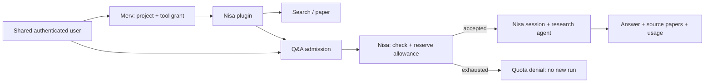

# Making Nisa easier to compose

Read-only architecture assessment, 2026-09-13. Canonical source:
`/Users/guraltoo/Documents/dev/proj/experiments/Nisa`, clean `main@3489d7d`.
The root README still calls the umbrella product Papyrus. Papyrus-named sibling
folders are older worktrees; at least the search-staging worktree still points
to the former Papyrus Git directory. No worktree repair was needed for this review.

This is a proposal, not an implemented migration. The two approved Fable debate
rounds are complete; [the actual exchange and disposition](reviews/nisa-plugin-design-fable.md)
record agreement and remaining disagreement. The user subsequently specified
shared authentication/accounts and agentic Q&A with Nisa-owned quota. That
addition was inspected locally after the debate and is not attributed to Fable.
The existing Merv Step 7 live Nisa gate remains open.

## Recommendation

Make Nisa own two clearly separated capabilities in the plugin: **literature
retrieval** and **agentic Q&A**. Both use the shared authenticated account.
Retrieval returns papers directly. Q&A admits a bounded research operation
against Nisa's account policy and returns its answer, sources and usage.

Nisa owns its model execution, quota admission, usage accounting and sessions.
Merv owns project/agent tool grants and its local plugin lifecycle. A Nisa-owned
MCP interface lets Merv use generic Mounts configuration; selected Python service
contracts and resource ownership make Nisa's internals independently usable.
Those are separate outcomes with separate tests.

Preserve the existing Python retrieval algorithms, separate Tantivy service, and
Rust CLI. A TypeScript rewrite is not required. First extract only the metadata
and retrieval composition needed for the first useful slice; do not rewrite
every singleton or introduce one plugin per function. Put the common Nisa tool
interface in the plan because the user wants a shared plugin mechanism. Prove
parity before replacing Merv's working REST adapter.

## Proposed tool catalog

The user narrowed the catalog to three independently enabled groups. Names below
are proposals, not a claim that the tools are already registered.

| Group           | Tools                                  |
| --------------- | -------------------------------------- |
| Discover papers | `search`, `semantic_search`, `related` |
| Read and cite   | `paper`, `excerpts`, `pdf`, `cite`     |
| Agentic Q&A     | `qa.ask`, `qa.get`, `qa.cancel`        |

The initial set is six tools: `search`, `paper`, `excerpts`, `qa.ask`, `qa.get`,
and `qa.cancel`. Account/quota inspection and saved-collection tools are out of
scope for now. Nisa still enforces quota internally when accepting Q&A; removing
the inspection tools does not remove admission or usage accounting.

## What the source establishes

| Existing seam or coupling                                                                                                                                            | Consequence for composition                                                                                                                                                            | Source                                                                                                                                                                                                                                                                                                                                                                                                               |
| -------------------------------------------------------------------------------------------------------------------------------------------------------------------- | -------------------------------------------------------------------------------------------------------------------------------------------------------------------------------------- | -------------------------------------------------------------------------------------------------------------------------------------------------------------------------------------------------------------------------------------------------------------------------------------------------------------------------------------------------------------------------------------------------------------------- |
| The SDK route and agent tools already share `string_search`; `_one_tantivy_call` separates the index request from merge/pagination.                                  | Extract and inject dependencies around these existing functions; preserve ranking behavior.                                                                                            | [SDK route](/Users/guraltoo/Documents/dev/proj/experiments/Nisa/project/backend/sdk_routes.py:621), [search implementation](/Users/guraltoo/Documents/dev/proj/experiments/Nisa/project/backend/agents/tools/string_search.py:292)                                                                                                                                                                                   |
| Tantivy already runs behind a FastAPI service with a startup/shutdown lifespan.                                                                                      | Keep the existing process boundary; an internal provider can wrap it.                                                                                                                  | [search lifespan](/Users/guraltoo/Documents/dev/proj/experiments/Nisa/project/backend/search_server/search_server.py:124)                                                                                                                                                                                                                                                                                            |
| Importing the main server registers agent/chat/SDK/list/page routes and normally loads datasets, graph data and tiles.                                               | A small retrieval host cannot simply import the full server and claim independence.                                                                                                    | [composition](/Users/guraltoo/Documents/dev/proj/experiments/Nisa/project/backend/server.py:158), [startup](/Users/guraltoo/Documents/dev/proj/experiments/Nisa/project/backend/server.py:933)                                                                                                                                                                                                                       |
| Importing `agents.tools.string_search` first initializes `agents`, whose exports import the agent factory and eager static tool registry.                            | Merely moving Flask routes into another file does not remove model/rendering dependencies.                                                                                             | [package initialization](/Users/guraltoo/Documents/dev/proj/experiments/Nisa/project/backend/agents/__init__.py:3), [factory imports](/Users/guraltoo/Documents/dev/proj/experiments/Nisa/project/backend/agents/agent_defs.py:13), [tool registry](/Users/guraltoo/Documents/dev/proj/experiments/Nisa/project/backend/agents/tool_registry.py:7)                                                                   |
| Metadata and semantic clients live in module caches; configuration is read from environment/dotenv.                                                                  | Provider instances need their own settings, resources and close methods to support two corpora or identities in one process.                                                           | [data loader](/Users/guraltoo/Documents/dev/proj/experiments/Nisa/project/backend/data_loader.py:76), [semantic clients](/Users/guraltoo/Documents/dev/proj/experiments/Nisa/project/backend/agents/tools/semantic_search.py:41)                                                                                                                                                                                     |
| Python SDK `search` explicitly sends `enrich:true`; Rust documents direct search; the server also retains a User-Agent compatibility path for implicit enrichment.   | A reusable lookup must have an explicit no-research contract. Retain older SDK behavior under a compatibility interface instead of silently changing it.                               | [Python SDK](/Users/guraltoo/Documents/dev/proj/experiments/Nisa/project/sdk/src/rapidreview/__init__.py:27), [Rust client](/Users/guraltoo/Documents/dev/proj/experiments/Nisa/project/new_cli/papyrus-rs/crates/backend-client/src/lib.rs:391), [compatibility path](/Users/guraltoo/Documents/dev/proj/experiments/Nisa/project/backend/sdk_routes.py:224)                                                        |
| Rust has a real `SessionAdapter` trait, but `BackendClient` constructs its auth/HTTP clients; Python domain objects use a global `get_client()`.                     | Reuse the adapter idea while making the retrieval client accept an explicit credential source, transport and deadline. A CLI login manager is one adapter, not a library prerequisite. | [Rust adapter](/Users/guraltoo/Documents/dev/proj/experiments/Nisa/project/new_cli/papyrus-rs/crates/adapter-core/src/lib.rs:14), [client construction](/Users/guraltoo/Documents/dev/proj/experiments/Nisa/project/new_cli/papyrus-rs/crates/backend-client/src/lib.rs:47), [Python singleton](/Users/guraltoo/Documents/dev/proj/experiments/Nisa/project/rapidreview-client/src/rapidreview_client/client.py:125) |
| Authentication writes a principal onto Flask request context; API-key verification checks identity and updates last-use metadata. Paper metadata is public upstream. | Separate authentication from operation policy, preserve route-specific authority, and keep Merv's grants and upstream credentials distinct.                                            | [auth boundary](/Users/guraltoo/Documents/dev/proj/experiments/Nisa/project/backend/auth.py:130), [key verification](/Users/guraltoo/Documents/dev/proj/experiments/Nisa/project/backend/auth.py:58), [paper route](/Users/guraltoo/Documents/dev/proj/experiments/Nisa/project/backend/sdk_routes.py:846)                                                                                                           |

These are static source findings, not new runtime tests or measurements of the
deployed service. No Nisa service was started and no Nisa credential was read.

## The smallest useful internal boundaries

These are proposed capability names, not existing Cordis plugin declarations.
Arrows below mean “depends on.” An optional capability should be absent from the
composition when unused, rather than making every consumer depend on it.

```mermaid
flowchart TB
  retrieval["Literature retrieval: search + paper"] --> metadata["Paper metadata"]
  retrieval --> keyword["Keyword index client"]
  keyword --> tantivy["Existing Tantivy service"]
  semantic["Optional semantic search"] --> metadata
  semantic --> embeddings["Embedding provider"]
  semantic --> vectors["Vector index"]
  overlay["Optional graph overlay"] --> graph["Graph data"]
  research["Optional research execution"] --> retrieval
  research --> models["Model provider"]
  research --> sessions["Sessions, persistence and events"]
  bridge["Optional local / sandbox tools"] --> leases["Session capabilities and bridge leases"]
```

The most useful shared providers are **paper metadata**, **identity and operation
policy**, and, within research execution, **sessions/persistence/events**. Keyword
and vector indexes are narrower resources. Avoid a single “Nisa database”
capability that forces paper lookup, chat history, vector search and map tiles to
share availability. Reuse a physical database where appropriate while exposing
separate contracts and lifetimes.

Do not split every tool into a plugin. Initially, search and paper can be one
literature capability with two provider interfaces. Separate semantic search
when its embedding/vector dependencies need independent configuration. Treat
map overlays as optional enrichment: metadata lookup should work without them.
Research execution has a different lifetime and deserves its own boundary.

## Shared identity and agentic Q&A

The user has decided that Merv and Nisa will share authentication and user
accounts. Treat that as the integration target: both services recognize the same
verified account subject. Nisa derives the user from authenticated context, not
from an agent-supplied `user_id`. Merv still applies its project and tool grants.
The current TypeScript prototype issues local actor tokens, so shared login is
not already established by its existing tests. [Current Merv identity implementation](/Users/guraltoo/Documents/dev/proj/experiments/Merv/merv-typescript/packages/scope/src/index.ts:40).

Proposed request flow, with the allowance and research state owned by Nisa:



There is substantial existing Q&A machinery. `POST /api/chat/message` accepts a
message and queues an agent turn; session state, event streaming, run details
and interrupt endpoints exist. Reuse them behind a small Nisa-owned operation
interface. The current message response supplies a session ID, not a stable
operation ID correlating one question to its final result. Existing new-session
retry deduplication is temporary, so a plugin must not claim durable idempotency
without adding it. [Message admission](/Users/guraltoo/Documents/dev/proj/experiments/Nisa/project/backend/agents/general_routes.py:460),
[deduplication](/Users/guraltoo/Documents/dev/proj/experiments/Nisa/project/backend/agents/general_routes.py:513),
[state and run APIs](/Users/guraltoo/Documents/dev/proj/experiments/Nisa/project/backend/agents/general_routes.py:1711).

**The missing quota guarantee is on Nisa's side.** The inspected implementation
limits anonymous users and explicitly reports signed-in users as unlimited.
Its anonymous counters count recorded run-start events, return zero on database
failure, and do not atomically reserve account allowance before ordinary chat
work is queued. The per-run usage ledger and per-research spend guard are useful
existing pieces, but neither is a persistent account admission policy.
[Signed-in policy](/Users/guraltoo/Documents/dev/proj/experiments/Nisa/project/backend/agents/routes.py:603),
[counter behavior](/Users/guraltoo/Documents/dev/proj/experiments/Nisa/project/backend/agents/anon_quota.py:30),
[chat quota check](/Users/guraltoo/Documents/dev/proj/experiments/Nisa/project/backend/agents/general_routes.py:490),
[usage ledger](/Users/guraltoo/Documents/dev/proj/experiments/Nisa/project/backend/agents/usage.py:37).

For any finite account quota, admission should atomically reserve the allowance
and record the operation under `(account, requestId)` before dispatch. A repeated
request with the same payload returns that operation; a changed payload
conflicts. Nisa decides the unit, limit, reservation and settlement policy; no
numeric quota or billing model is inferred here. For a hard limit, an unavailable
quota store must not silently authorize unlimited work. Crashes and uncertain
starts need reconciliation of the existing operation, not automatic replay.
This admission check is internal to Nisa and needs no exposed quota tool.

The smallest proposed Q&A tools are:

| Capability                                | Contract                                                                                                                                                                                        |
| ----------------------------------------- | ----------------------------------------------------------------------------------------------------------------------------------------------------------------------------------------------- |
| `qa.ask(question, requestId, sessionId?)` | Authenticate the shared account, enforce the selected Q&A profile and session access, reserve allowance, and return a correlated operation handle. A short bounded wait may include the answer. |
| `qa.get(operationId)`                     | Return status, partial/final answer, structured source/context-paper records, usage and session/run references. Recheck access; observation must not start another turn.                        |
| `qa.cancel(operationId, requestId)`       | Request cancellation of that operation. Report requested versus terminal state accurately; never let a stale request cancel a later turn.                                                       |

Tool names above are proposals, not currently registered tools. A session-wide best-effort
interrupt is not yet an operation-scoped cancellation guarantee. The adapter
must retain complete answer/source evidence, rather than copying the CLI's
regex-only modern arXiv IDs or its default deletion of successful sessions.
[Interrupt implementation](/Users/guraltoo/Documents/dev/proj/experiments/Nisa/project/backend/agents/general_routes.py:1758),
[CLI result and cleanup](/Users/guraltoo/Documents/dev/proj/experiments/Nisa/project/new_cli/papyrus-rs/crates/cli/src/main.rs:2701).

Q&A needs an explicit **research tool profile** on Nisa. The current general
agent also includes execution and other product tools; an empty local-filesystem
capability list alone does not remove remote sandbox powers. Bind the permitted
tools and subagents to the Q&A session/operation, and do not reuse a broader cached
general agent for a narrower request. Account identity and sufficient quota do
not choose the agent's toolset. Start with the literature/web reading tools
needed to answer questions. [General agent definition](/Users/guraltoo/Documents/dev/proj/experiments/Nisa/project/backend/agents/agent_defs.py:53).

Removing the plugin withdraws Merv's tools and closes its own waits/connections.
Already accepted Q&A remains Nisa-owned and can be observed after reattachment.
An explicit cancellation operation is separate. Persisted sessions and
transcripts do not by themselves establish restart-resumable execution; a dead
worker must yield an honest interrupted/uncertain outcome or a separately
implemented recovery path.

## Ordered integrated slices

1. **Small retrieval composition plus compatibility fixtures.** Reuse Tantivy
   and existing ranking/pagination. Inject metadata and an optional graph lookup;
   move only the selected retrieval imports out of the eager agent package.
   Keep the full server and legacy SDK behavior compatible. New direct operations
   always disable enrichment. Test semantic JSON parity, real HTTP over controlled
   metadata/index/auth fixtures, auth enabled, absent model/map/bridge imports,
   two fixture metadata providers, and search failure without loss of paper lookup.
   Publish effective limits and freshness through these fixtures, not a new schema
   platform. Give new resource owners explicit creation/close behavior; Merv's
   admission/drain mechanism already exists and should be reused.
2. **Nisa-owned retrieval MCP, fully mounted in Merv.** Expose search and paper
   over the same operations and contracts. Complete identity, result, protocol
   and unload parity through generic Mounts plus a second client. Keep the REST
   adapter until the separately authorized real Nisa proof succeeds. A second
   client is a compatibility check, not a prerequisite for product demand.
3. **Wire the shared account identity.** Both applications must resolve the same
   verified subject while preserving Merv project/agent grants and Nisa session
   access. Test two accounts concurrently and reject substituted user/session
   IDs. Use the common authentication system; do not make a user maintain a
   separate account merely for the plugin. This is an implementation dependency
   of user-scoped Q&A, not a claim about the current prototype's actor tokens.
4. **Integrate Nisa's Q&A admission and operation contract.** Add finite-quota
   policy where required, atomic reservation, stable operation/idempotency mapping,
   and the selected research tool/subagent profile around existing session/run
   machinery. Exercise it through Nisa's own API first. All surfaces using that
   finite account policy must share the admission function. With one remaining
   unit, concurrent requests across sessions/workers admit one; duplicate request
   IDs retain one operation/reservation, changed payloads conflict, and failed
   admission starts no model work. Settle or reconcile allowance exactly once.
5. **Enable Q&A through the plugin and verify the complete path.** Add separately
   granted ask/get/cancel tools to the Nisa-owned catalog. Test shared identity,
   quota denial, retained answers/citations/usage, uncertain-start handling and
   scoped cancellation. Remove Merv's plugin during an accepted question, then
   reattach and retrieve that same operation without re-running it. Native Merv
   work and the independent sandbox connection must continue. Keep transport
   waits bounded; no synchronous search timeout should define a research session's
   lifetime.

If the first retrieval composition starts requiring broad agent/runtime changes,
ship a small REST-backed Nisa-owned MCP facade first and record internal
independence as unfinished. Do not use an arbitrary edited-file count as the
switch criterion. Shared authentication work may already be supplied by its own
project; consume that completed contract rather than reimplementing it here.
Semantic search, excerpts and graph features can be added independently when
needed; the quota-aware Q&A path is now explicitly in scope by user direction.

These are design slices for the Nisa extension. They do not silently close the
current Merv Step 7 real-service gate or mark the later shared-identity migration
complete.

## The tests that establish plugin friendliness

- **Dependency absence:** run keyword/paper retrieval without research, model,
  rendering, map and bridge implementations available to import.
- **Instance isolation:** construct two services with different corpora and
  credentials; interleave requests and verify no global client/cache bleed.
- **Transport parity:** the same contract fixtures pass through the direct
  operation, REST and MCP, including errors, IDs, filtering, pagination and
  explicit no-enrichment behavior. Preserve legitimate legacy compatibility.
- **Lifecycle:** withdraw admission, bound/drain an in-flight request, close only
  owned resources, then recreate without duplicate listeners or tools. Verify
  unrelated services continue. Do not claim aborting an HTTP client forcibly
  cancels an upstream Python thread or durable job.
- **Authority:** concurrent callers retain distinct principals and permissions;
  hidden tools remain forbidden by direct invocation. Never publish the whole
  internal tool registry merely because those callables exist.

## What Cordis and MCP contribute

Cordis controls Merv's local plugin dependency and disposal graph. A remote
Nisa service owns its own dependencies, processes and accepted work. Nisa can
adopt explicit Python service composition first; a future TypeScript control
layer is an option, not a requirement of the remote boundary.

MCP provides discoverable tool schemas, structured results and catalog-change
notifications. Those protocol features do not supply Nisa's internal dependency
injection, operation policy or durable-job cancellation. Use the protocol
revision actually supported and tested by both endpoints. The current Merv
SDK's ceiling is 2025-11-25; this is not a claim about the newest available
revision. [MCP tool specification](https://modelcontextprotocol.io/specification/2025-11-25/server/tools).

## What the Fable debate changed

The two actual rounds are recorded in [the debate and disposition](reviews/nisa-plugin-design-fable.md).
Fable argued for a retrieval profile and metadata seam first, initially dropping
MCP. The rebuttal narrowed contract work to executable fixtures and defended a
Nisa-owned interface because common plugin integration is the user's goal.
Fable accepted a conditional MCP step and corrected several source-evidence,
authentication and lifecycle overclaims. We agree on preserving Python/Rust,
small initial seams and compatibility; the root recommendation schedules MCP
rather than waiting for proof of demand from another product.

The final plan does not repeat already implemented Merv lifecycle work, require
live production responses before local characterization, or use a fixed module
count to decide architecture. The shared-auth and Q&A clarification arrived
after round2 completed and was inspected locally; Fable did not review the new
quota/session source material. No additional source packet or third call was
sent. No Nisa runtime code or data changed during this assessment.
