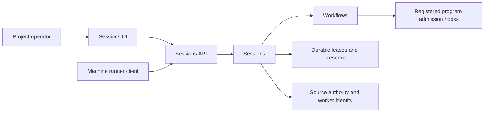

# Runner control plane

Workflows selects eligible assignments. Sessions reserves them, tracks runner
presence and applies project dispatch controls. The optional `sessions-api` and
`sessions-ui` adapters expose those operations through the existing API and UI.
There is no additional scheduling provider and no Sessions dependency on Tasks,
Reviews or Feed.

This diagram shows responsibility and requests, not Cordis dependencies. The
[dependency inventory](architecture/current-dependencies.json) records actual
`inject` declarations.

## Assignment selection

`Workflows.dispatchCandidates(source)` returns source-authorized metadata for
leaseable nodes: instance and revision, program and state, worker role, label,
fixed execution policy hash, registration generation and workspace declaration.
Read-only nodes sort first, followed by stable creation/ID order.

The domain program decides whether this source may take the assignment. Required
work-item dependencies and recipe availability still apply. Candidate discovery
does not render the assignment, load artifact contents, resolve reference values
or record work starting. A candidate is a hint; issuing a lease rechecks current
authority, ownership and revision transactionally before freezing the packet.

Sessions removes already-leased targets and applies runner/platform capacity and
launch-failure backoff. Offered leases reserve capacity before activation. An
automatic lease requires a fresh source-bound runner registration. An explicit
manual offer retains its existing semantics and does not require automatic
dispatch to be enabled.

## Stuck work and dispatch holds

Every failed attempt on one instance revision is counted in one `session_dispatch_holds`
row, across runners and platforms: a session closed as `host_failed`, `crash_loop`,
`workspace_failed` or `launch_failed`, an offer that lapsed before any process
activated it (`offer_expired`), and an offer that could not be built, which leaves no
session and is recorded after its lease transaction rolled back. Authority refusals,
lost races and refusals of the lease request itself (a session secret that was already
used) are not counted: they say nothing about the target. At Sessions config `maxLaunchFailures` (default 5) the row is
**held**: the target is filtered out inside the committing lease transaction, a runner whose
only remaining work is held is answered `retries_exhausted`, and one
`session.dispatch_held` event is recorded. The thirty-second backoff between attempts is
unchanged. See [the launch retry cap](BUDGETS_AND_LIMITS.md).

A hold gates **automatic dispatch only**. An explicit `POST /sessions/offer` is a deliberate
act by a write-permission source and still leases a held target; if that session fails, the
failure counts like any other. A hold names one revision, so ending or revising the record
is the decision not to run the work. The decision to run it again is
`session.release_hold {instanceId, expectedRevision, reason, requestId}`: a project admin
who is not a leased worker, checked in the transaction, idempotent by `requestId` (the same
id with different input is `request_conflict`), refused with `hold_not_found` (404) when
nothing is counted against the target and `hold_not_held` (409) while it is still being
retried. It zeroes the count, clears the hold and records `session.hold_released`.
Switching dispatch off and on does the same for every target of the project.

A runner's presence carries `decisionSince` beside `lastDecision` and `lastDecisionAt`: the
moment the current run of the same answer began. It is per runner, so a runner that
alternates platforms with different answers restarts it.

`session.stuck` is one read tool, for anyone who may read the project and never for a
leased worker. It derives, in one transaction and without writing, everything that stopped
moving. Each item carries `since`, `forSeconds`, `code`, `why` and `next`; the words are
advice, and every guard is the transaction's that leases, closes or releases. Items come in
the order below, then by `since` and instance, capped at 200 with `truncated`; `counts`
covers all of them, and `total` leaves out `dispatch_failing`, which needs nobody yet.
`GET /sessions/status` and the `ui.home` sessions row carry the same `stuck: {total, counts}`.

| Kind                | Reported when                                                                                                                                                                                                                                                              | `since`                               | `next` says                                                                                                                                   |
| ------------------- | -------------------------------------------------------------------------------------------------------------------------------------------------------------------------------------------------------------------------------------------------------------------------- | ------------------------------------- | --------------------------------------------------------------------------------------------------------------------------------------------- |
| `session_idle`      | An active session has made no tool call for `idleNoticeSeconds` ([alive is not progressing](SESSION_LEASES.md#alive-is-not-progressing)).                                                                                                                                  | Its last activity                     | Leave it, or halt it with `POST /sessions/halt`; when it closes by itself, or that it never does.                                             |
| `dispatch_held`     | A held target is still waiting with no live session. `code` is the last failure, `why` its message, `attempts` the count.                                                                                                                                                  | `heldAt`                              | Fix the cause and call `session.release_hold`, or end or revise the record.                                                                   |
| `dispatch_failing`  | A waiting target has failed attempts below the cap.                                                                                                                                                                                                                        | Its first failure                     | Nothing yet: it is retried after the backoff.                                                                                                 |
| `work_deferred`     | Three machines in a row released this target as `preparation_deferred`: the place its history lives was away, busy or full. Nothing counts it and no hold forms; `code` is the cause.                                                                                      | The oldest of those three closes      | Look at `code.status`: its `store`, `operations` and `mirror` say whether Code is unavailable, busy or full. The offers resume by themselves. |
| `work_blocked`      | Another plugin published a blocker for the work, so its owner refuses to lease it and it is never a dispatch candidate. `code` and `why` are the blocker's, for example `code_merge_required`. Read from Workflows' own rows, so it is reported with that plugin unloaded. | When the blocker first took that code | The blocker's own recovery action.                                                                                                            |
| `ready_quiet`       | A dispatchable step, an operator's included, has had no session for `quietReadySeconds` (default 21600). `code` is `queued`, `budget_exceeded`, `usage_unavailable` or `awaiting_operator`.                                                                                | The record's last revision change     | Read the other items, the budget, or `workflow.status_and_next` for an operator's step.                                                       |
| `dispatch_disabled` | Work is queued and automatic dispatch is off.                                                                                                                                                                                                                              | When dispatch was last switched       | An admin enables dispatch.                                                                                                                    |
| `no_live_runner`    | Dispatch is on, work is queued, no authorized runner was seen in 45 seconds, and Fleet does not rent for the project.                                                                                                                                                      | The newest runner's last heartbeat    | Start a runner.                                                                                                                               |
| `runner_refusing`   | A live runner has answered `settings_pending` or `platform_disabled` for `refusalSeconds` (default 300) while work is queued.                                                                                                                                              | `decisionSince`                       | Restart the runner or publish its settings with `PUT /sessions/runners/:id/settings`.                                                         |

`ready_quiet` measures from the record's last revision change, so a step released after a
long session is quiet at once. A target that already has a `dispatch_held` or
`dispatch_failing` item is not also reported as quiet, and while dispatch is off the one
`dispatch_disabled` item stands for every queued step that a runner would take.

## Pause and halt

Automatic dispatch starts **off** for every project. Enabling it allows a
registered machine to request work; it does not start a local process by itself.
With `ownMachines` a project's automatic work goes only to its own runners: Fleet sees
no demand there and its machines lease nothing new, while a session one holds runs to
release. Projects that were already on when this setting arrived keep their own machines.

| Control          | New automatic assignments                               | Existing sessions                              |
| ---------------- | ------------------------------------------------------- | ---------------------------------------------- |
| Enable dispatch  | Allowed if the source, runner and workflow are eligible | Continue                                       |
| Pause dispatch   | Refused                                                 | Continue                                       |
| Halt one session | Other assignments remain enabled if previously enabled  | Selected session closes permanently            |
| Halt project     | Disabled in the same transaction                        | All current project sessions close permanently |

Closing retires the leased worker, retaining its source account/key and prior
work. Durable domain events release exact ownership handles for a successor.
A machine-side runner must observe closure and stop its child; the server cannot
prove that a process on another machine has stopped merely by closing a lease.

## HTTP and browser controls

These routes use ordinary authenticated source credentials, never an agent's
MCP-only session secret. Operator controls require project administration.

| Method and route                     | Purpose                                                                      |
| ------------------------------------ | ---------------------------------------------------------------------------- |
| `GET /sessions/status`               | Sanitized project session history, runner presence and caller-eligible queue |
| `PUT /sessions/dispatch`             | Set `{ enabled?, ownMachines? }`; the admin who set it last directs Fleet    |
| `POST /sessions/halt`                | Disable dispatch and halt project sessions                                   |
| `POST /sessions/:id/halt`            | Halt one project session                                                     |
| `POST /sessions/runners/heartbeat`   | Register or refresh this source's machine inventory and capacity             |
| `PUT /sessions/runners/:id/settings` | Set desired platform enablement, model, effort and parallelism               |
| `POST /sessions/lease`               | Select and reserve one eligible assignment for a registered platform         |

The existing offer, attach, heartbeat, release and exact-source inspection routes
are described in [SESSION_LEASES.md](SESSION_LEASES.md). Project status and halt
are separate project-authorized operations: a human operator can inspect and stop
machine-key jobs without impersonating the key that issued their leases.

Runner settings contain bounded platform metadata. Executable paths, arbitrary
arguments, bearer credentials and shell commands cannot be installed through
these HTTP settings. Local launch profiles will own executable configuration.
Settings acknowledgement reports what the machine says it has applied; the
server still enforces current desired limits when issuing work.

The Sessions page uses `ui.read` for its data and authenticated HTTP for operator
controls. It shows dispatch, connected runners, leases, workspace attachments and captured commits, and available work.
Removing `sessions-ui` removes that page; removing `sessions-api` removes its
HTTP controls. Neither adapter owns durable records or adds agent tools.

## Workspace declarations

Workspace rules are part of the fixed execution policy owned by each assignment
type. They are not separate task-type plugins.

| Mode         | Intent                                                                                                                  |
| ------------ | ----------------------------------------------------------------------------------------------------------------------- |
| `none`       | Scratch space without a repository checkout                                                                             |
| `ephemeral`  | Temporary checkout from central or an explicitly named reference                                                        |
| `persistent` | Per-instance checkout, with declared retention, optional per-base identity and a reserved `advancesCentral` declaration |

Namespaces must be safe single path segments. A referenced base names an entry in
the frozen execution references; it must never silently fall back to central if
missing. A read-only assignment cannot declare central publication. The machine
Runner implements [Git resolution, preparation and capture](WORKSPACES.md), plus
the fixed [Code commit protocol](CODE_OPERATIONS.md).
Declaring `advancesCentral` does not itself publish a commit; the reviewed
publication protocol remains open.

Omitted workspace policy means `none` through `effectiveWorkspace()`. That default
is not materialized into old manifests, so existing pinned policy hashes and Task
versions remain valid. New explicit declarations participate in policy hashing.

## Worker code operations

The independent Code provider depends on State, Scope and Sessions. Its tool
adapter exposes `code.commit` and `code.operation`; its HTTP adapter exposes
source-owned command retrieval and completion. It does not schedule assignments
or launch another process. The existing machine Runner polls the durable queue
and executes a fixed commit operation against its owned checkout.

Only a live writable session with an explicit `code.commit` grant and an attached
Git workspace can queue a request. The worker supplies an expected HEAD, message
and request ID, never a path or Git command line. Runner reports an immutable
operation receipt before the worker's handoff; final stopped-worker capture is
a separate Session result. Read-only workers cannot request commits.

Command retrieval and completion use the original source credential, not the
worker credential. Already-dispatched commands remain recoverable after lease
closure, so lost replies cannot strand an unknown outcome. Closed queued work
is cancelled; recovery never reactivates the worker. The Code page displays
operation status through its optional UI adapter. See [CODE_OPERATIONS.md](CODE_OPERATIONS.md).

## Remaining runner work

The [machine Runner](MACHINE_RUNNER.md) now consumes these controls through HTTP
with durable launch intent, private secret derivation, owned process groups,
offline deadlines and controller restart reconciliation. Native Codex profiles
support bounded local shell work and enforce read-only assignment policy.

Git base resolution, persistent/ephemeral checkouts, fixed live commit requests,
immutable operation/capture receipts and acknowledged cleanup are integrated. Sessions accepts attachment and final metadata
from the exact source/runner/host through its HTTP adapter; it owns no filesystem
paths or Git operations. A final report may arrive after lease closure without
reviving that lease. Domain Events delivers the captured result to interested
programs. See [workspace ownership and recovery](WORKSPACES.md).

`code.propose`, general merges, durable reviewed publication, cross-machine Git object transport, machine pairing,
source rotation, editable operational settings, trace delivery and telemetry remain
open. The historical native Git capture acceptance uses one machine and a
synthetic managed workflow; it predates Code operations and does not establish
those remaining capabilities. New Code acceptance is recorded separately.
