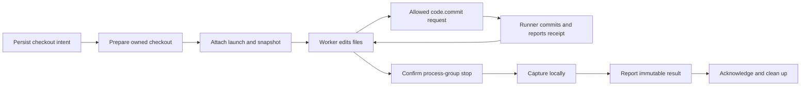

# Runner Git workspaces

Runner prepares a private Git checkout for a frozen workflow step, preserves its final work, and reports an immutable snapshot to Sessions. A live writable worker can request a named commit through `code.commit` when its fixed tool policy permits it, then read the receipt through `code.operation`. The independent Code service queues that request; the existing Runner executes the fixed Git operation. Final WIP capture still happens after the process group stops. Neither operation publishes code to a central branch. See [Code operations](CODE_OPERATIONS.md).

## Configuration and responsibility

Start from [config/runner.git.example.json](../config/runner.git.example.json). Its machine configuration adds:

```json
{
  "workspace": {
    "repository": "/absolute/path/to/source-repository",
    "baseRef": "HEAD"
  }
}
```

The source must be an existing local repository. The CLI resolves relative repository paths against the configuration file. `baseRef` selects the initial commit when the private copy is first created; changing this configuration for an existing ledger is refused. The source credential remains in the environment variable named by `credentialEnv`.

Machine configuration supplies the repository. A workflow's immutable execution policy selects how to use it. Existing workflows that omit `workspace` continue to receive scratch directories; repository configuration alone does not change their policy.

| Component     | Responsibility                                                                                                                  |
| ------------- | ------------------------------------------------------------------------------------------------------------------------------- |
| Workflows     | Persist the versioned workspace policy and freeze named commit references with the assignment.                                  |
| Sessions      | Bind source, worker, target, policy and runner; accept the attachment and one final workspace result.                           |
| Code          | Persist commit requests, their immutable runner receipts and caller-scoped operation status.                                    |
| Runner        | Own the private repository, checkout reservation, process, fixed commit execution, local capture and retryable result delivery. |
| Native worker | Read or edit assigned files under the declared sandbox, request allowed commits and perform its allowed MCP handoff.            |

The workspace manager is an internal Runner component, not another Cordis plugin or a server State dependency.

## Workspace policies

| Mode                           | Checkout and lifetime                                                                                                                                                                              |
| ------------------------------ | -------------------------------------------------------------------------------------------------------------------------------------------------------------------------------------------------- |
| `none`                         | One scratch directory per local launch; no Git configuration, attachment or result is needed. Scratch files are currently retained after completion.                                               |
| `ephemeral`                    | A detached checkout for that launch, from the selected commit. `retain: false` removes the checkout after capture acknowledgment.                                                                  |
| `persistent`, `perBase: false` | A branch and checkout identified by namespace, project and workflow instance. A successor resumes the previous head and retains the original base. A different explicit reference base is refused. |
| `persistent`, `perBase: true`  | Separate branch/checkouts for the namespace, project, instance and full base OID. Changing the base creates a separate lineage.                                                                    |

Git policies include `namespace`, `base` and `retain`. Persistent policies also include `perBase` and `advancesCentral`. For example, a writable step can declare this `workspace` field inside its execution policy:

```json
{
  "mode": "persistent",
  "namespace": "code",
  "base": "central",
  "perBase": false,
  "retain": true,
  "advancesCentral": false
}
```

`readOnly` belongs to the enclosing execution policy. A verifier can use an ephemeral checkout with `base: "reference:code"` and `readOnly: true`, provided `execution.references.code` contains the frozen commit OID.

There are two base forms:

- `central` resolves the **machine's private** `refs/merv/central`, initialized once from the configured `baseRef`. It is not a server-authoritative project head and does not follow subsequent source-branch changes.
- `reference:name` requires a frozen scalar reference containing a full lowercase 40- or 64-character Git commit OID already available in the private repository. Missing, list-valued, abbreviated or unavailable references fail. There is no implicit fallback to `central`.

### Which workflows declare a Git workspace

A workspace belongs to a workflow **version**, because a published execution policy is immutable. The choice is made once, at creation, and nothing is ever upgraded into Git.

| Work                                          | Writable checkout                                                 | Reviewer checkout                                                 |
| --------------------------------------------- | ----------------------------------------------------------------- | ----------------------------------------------------------------- |
| Git experiment (`experiment@2/4/6`)           | `running`: persistent shared `experiments`, base `central`        | `experiment_review`: ephemeral read-only, `reference:code`        |
| Based Git experiment (`experiment@7`)         | `running`: persistent shared `experiments`, base `reference:base` | as above                                                          |
| Git experiment, derived base (`experiment@8`) | `running`: `reference:base`, driver `code.v2`                     | as above                                                          |
| Git task (`task@3`)                           | `in_progress`: persistent shared `tasks`, base `central`          | `in_review`: ephemeral read-only `task-reviews`, `reference:code` |
| Based Git task (`task@4`)                     | `in_progress`: persistent shared `tasks`, base `reference:base`   | as above                                                          |
| Git task, derived base (`task@5`)             | `in_progress`: `reference:base`, driver `code.v2`                 | as above                                                          |
| Consolidation                                 | its own persistent checkout (see `docs/CODE_OPERATIONS.md`)       | —                                                                 |

`task.create` and `experiment.create` take `workspace: "git"`; omitted means scratch, and every earlier task and experiment is unchanged. Without `baseTaskId`, new Git work starts on `task@3` / `experiment@6` with the runner's `central` base until the project is bound and imported. Hosted projects select `task@5` / `experiment@8` and the `code.v2` driver; existing work retains its version. A Git task's producer is granted `code.commit` and `code.operation` explicitly and delivers that operation's `commandId` (see `docs/STRUCTURED_TASK_EVIDENCE.md`). After a returned review the successor lease re-enters the same `tasks` checkout at the previous head. The reviewer's `reference:code` is the delivered commit's head, never the branch tip: a close-time WIP capture added above the delivered commit is not under review.

### The derived base

`task@5` and `experiment@8` use `reference:base` and `code.v2` for both producer and review checkouts. Code derives the base from `dependsOn` prerequisites in its own repository ([the Git model](GIT_MODEL.md)):

- a prerequisite accepted with code contributes exactly its reviewed commit, and nothing beneath it is looked at;
- a prerequisite that succeeded without code is looked through, to what it depended on;
- a prerequisite on a workspace version that has no verifiable acceptance (it succeeded before acceptances existed, while Code was unloaded, or in another repository) blocks, as does a code-less success whose own prerequisites are unfinished: `code_base_pending`;
- no commit at all gives the project's imported main; one commit, reached by however many paths, is the base; several commits share a retained merge plan. Conflicts create one reviewed `task@6` per base. `code_merge_required` means automatic merging is disabled.

The base is pinned inside the transaction that acquires the first lease — a task's first producer, an experiment's first planner or, if the design was written by hand, its first running worker — and is immutable: a returned task, a revised plan and a main that has moved since all reuse it. The frozen `references.base` is read from that pin and from nothing else, so reading an assignment never derives or writes. Work whose base cannot be derived is refused at lease admission, so it is never a dispatch candidate, never launched and never counted as a launch failure; Code publishes why as a blocker, which `workflow.status_and_next` gates on, the overview lists under `blocked` and `session.stuck` reports as `work_blocked`. An interactive producer has no checkout and therefore no `base`.

A legacy-local acceptance needs its accepted commit imported before hosted work can use it. Until then Code publishes `code_base_pending` with an import recovery sentence; the work is never launched.

### Building on a delivered commit

This is the older explicit form, kept on `task@4` and `experiment@7`. A Git task or Git experiment created with `baseTaskId` runs on `reference:base`, frozen to the head that task delivered. The base must be a Git task and must also be one of the new work's `dependsOn` prerequisites, so it has been accepted (`done`, which is terminal) before any checkout is prepared; the OID a shared persistent slot fixes at its first launch therefore never moves. Only an accepted Git task's delivered commit can be a base: an experiment capture, a consolidation or an arbitrary OID cannot. There is no fallback to `central`; an unresolvable base answers `task_base_unavailable` or `experiment_base_unavailable`.

The delivered objects exist only in the private repository of the runner machine that produced them, rooted under `refs/merv/commands/`. The review of a Git task, and any work based on its commit, must therefore run on that machine; elsewhere the runner refuses the launch with `workspace_base_missing`. This also limits legacy Git experiments; hosted versions instead download their exact checkpoint from Code.

`advancesCentral` is retained in the versioned declaration but causes no publication in this implementation. Even `true` supplies no central-update authority or receipt. Programs must not treat captured code as published code.

The source is cloned once into a private bare repository without local hardlinks, alternates, or a retained source remote. The original repository is not changed. No fetch or network clone runs. The configured local source must remain available for current manager validation; importing newer source commits and transferring objects between machines remain open work.

Persistent branches start with `codex/merv/`. Shared persistent, per-base persistent and ephemeral checkouts occupy separate directory roots, so valid policy changes cannot nest one checkout inside another. Git-unsafe namespace components are encoded without collisions; full base OIDs distinguish per-base lineages.

## The `code.v2` driver

A workspace policy may name a `driver`. The key is opaque to Workflows and Sessions: a policy without it is byte-identical to what it always was, and one that names a driver is offered only to a runner whose heartbeat lists that name among its `capabilities` (`runner_incompatible` otherwise, for the automatic lease and for a hand offer at attach). `task@5`, service-owned `task@6` and `experiment@8` name `code.v2`, whose checkouts come from the repository Code keeps on the server rather than from a repository on the machine. Policies that name none use the runner's legacy manager.

The driver belongs to Code and lives beside the runner's ledger under `code-v2/`, with its own tables (`code_v2_repositories`, `code_v2_workspaces`, `code_v2_transfers`); it never touches the runner's repository or tables, needs no local source and holds no GitHub credential.

- **Prepare.** The driver asks Code for the session's manifest, which only reads: exactly the newest commit Code admitted for a writer (a resumed unit continues on any machine, including the trailing work the last session left), exactly the referenced commit for a reviewer. It downloads a bundle in parts, telling Code which commits its cache already holds; should that claim be wrong the import fails and the one retry claims nothing. The cache is a bare repository without a remote. A writer's checkout stands on the local branch `merv/work/<unit>`, put on exactly the named head; a reviewer's is detached and removed afterwards.
- **Commit.** `code.commit` builds the same deterministic commit as the runner's own driver, but keeps it aside under `refs/merv/pending/*`, uploads it under the writer fence and moves HEAD only when Code has admitted it. A commit Code quarantines leaves the checkout exactly as it was and fails the command with `code_capture_quarantined`; the agent removes what was found and commits again under a new request. An interrupted upload continues from the byte Code says it holds.
- **Final capture.** After the process has stopped, what is uncommitted becomes one `merv: capture <session>` commit. It is journalled before Code hears of it, so a restart hands over that same commit and never builds another. The session's result names the head Code acknowledged: when the final capture is quarantined or its generation was fenced, that is the last admitted head, and the refused work stays in the machine's checkout and in Code's `held/` directory.
- **Deferral.** When Code, its store or the network cannot serve, the driver raises a deferral with a cause (`code_unavailable`, `transport_unavailable`, `store_busy`, `base_pending`) instead of a failure of the launch. The runner gives the lease back as `preparation_deferred` with that cause: nothing counts it, no hold can form from it, and the target is offered again after the usual backoff. A deferral during a commit or a final capture is simply retried on the next cycle, because the machine still owes that handover.
- **Publication.** None of this touches GitHub. Code publishes `refs/merv/work/**` and `refs/merv/accepted/**` itself, asynchronously, long after the handoff is complete; a machine holds no credential for it and never waits for it.

## Ownership, capture and cleanup

The local launch ledger and workspace tables use the same private SQLite database. Repository identity, checkout reservation and prepare intent are durable before Git creates a checkout. A persistent slot belongs to one exact launch until capture and cleanup finish. A successor cannot reuse an active, uncertain or unacknowledged checkout.



Attach rechecks current session admission before spawn and does not activate the workflow. The first authenticated worker MCP operation activates it. Runner uses its stable launch ID as `hostRef`; retries or another runner cannot replace that attachment.

## Commits while the worker is alive

`code.commit` accepts an expected full HEAD OID, a message and a replayable request ID. Code checks current session authority and the fixed tool declaration before queueing the command. Runner claims commands with the original source credential, confirms the live local process and exact checkout ownership, and refuses read-only, expired or replaced workers. A Git workspace declaration alone does not grant this tool.

The local command journal precedes Git writes. A private per-attempt index freezes the tree; parent, message and timestamp determine the same commit object on retry. Updating the owned HEAD and recording the receipt ref happen in one Git ref transaction guarded by the current launch/epoch owner ref. The original source repository and private central ref remain unchanged. The normal checkout index is synchronized without resetting later working-file edits.

Capture permanently replaces the owner ref with a closed marker before final HEAD work. Delayed commit or initial ownership transactions cannot regain access after closure or successor acquisition. Applied receipts can still be recovered and reported after the process stops. An ambiguous Git outcome remains pending until a receipt proves success or the closed fence proves the command did not apply. A lost server dispatch reply is recovered even if the worker closes before the runner journals it. Command and final-capture acknowledgments both precede checkout release.

A commit receipt identifies this operation's parent, tree, head, repository, workspace, base and statistics. It is separate from the final Session workspace result: later worker edits or stopped-worker WIP capture do not change it. The server retains authenticated observations; it does not independently inspect the Git objects.

## Final capture

Capture requires locally confirmed termination. Server-side lease closure alone is insufficient. Writable capture stages Git changes and creates a WIP commit when needed, with a fixed Runner author and the session ID in its message. Changed files larger than 50 MiB are refused before that commit; unchanged historical large files do not block new small changes. This is a per-file bound, not an aggregate repository limit. Git-ignored outputs are not automatically included.

Read-only capture never creates a commit. A changed HEAD, dirty index or dirty worktree is refused and preserved for investigation. Checkout identity, expected branch and private Git administration paths are checked on preparation/resume and capture. Unsafe private Git configuration, symlinked ownership paths and foreign checkouts fail closed. Normal tracked file symlinks remain Git data.

The final local snapshot is durable before reporting. A lost reply retries the same result rather than recapturing a later branch head. Each launch retains its own final snapshot even after a persistent successor adds commits. Statistics describe changes from the retained base to that head; they can include earlier work on a persistent branch.

After server acknowledgment, `retain: false` removes the checkout. Persistent branches, Git objects, launch history and captured metadata remain; a later persistent lease can recreate its checkout at the retained head. `retain: true` keeps the checkout too. Failed reporting keeps the reservation occupied, preventing a successor from overwriting work while receipt delivery remains unresolved.

## Restart and failure behavior

A replacement controller reconnects to the existing process guardian and replays matching preparation without resetting files. If Git created a valid owned checkout but the ready-state commit was interrupted, the manager validates and resumes it. Unverified partial checkouts are preserved rather than adopted, pruned or deleted. An unstarted terminal launch can cancel that preparation and release its remote lease; using that lineage again may require manual investigation.

Runner captures a confirmed finished process before fetching fresh server state. A network outage or source refusal therefore does not discard local WIP. Reporting still requires the original authenticated source authority. Source-key revocation, changed membership or a prolonged outage can leave a retained result awaiting authorized reconciliation; this slice adds no credential-rotation bypass.

A lost attach reply remains ambiguous. Runner closes the remote lease before deciding that no attachment exists, preventing a delayed attach from racing with local checkout release. It can then report the exact attached result even for a closed session. Closing or reporting never reactivates the worker.

An unreachable guardian leaves the launch `uncertain`; its checkout and local capacity stay reserved. No saved PID or remote lifecycle state proves that a process tree stopped. See the [process ownership contract](../packages/runner/README.md).

## Server result contract and trust boundary

Source-authenticated `POST /sessions/:id/attach` carries `runnerId`, `hostRef` and the Git workspace attachment. After capture, `POST /sessions/:id/workspace-result` carries the same runner/host identity and the final workspace object. Session workers cannot use these source-control routes.

Both snapshots contain:

```ts
interface SessionWorkspace {
  repositoryId: string;
  workspaceId: string;
  mode: 'ephemeral' | 'persistent';
  branch: string | null;
  baseOid: string;
  headOid: string;
  stats: {
    commitCount: number;
    filesChanged: number;
    insertions: number;
    deletions: number;
  };
}
```

Sessions exposes `workspace: { attachment, result }`, with `result: null` until reporting. Identity, mode, branch and base must match the attachment. A read-only result must retain the attached head. An identical final-result replay succeeds; a different result conflicts. The result and its `session.workspace_result` event commit together with source, worker, workflow version, state, revision and policy provenance. Late results remain per-session facts and do not overwrite a global instance pointer.

These are **source-authenticated Runner observations**. The server validates authority, schema, identity and replay consistency; it does not fetch Git objects, independently calculate the diff, or prove ancestry. The receipt acknowledges capture; it does not authorize approval or publication.

## Current limits and validation

Native support consists of sandboxed file editing/read-only inspection, policy-granted commit requests through Code, and host-side Runner WIP capture. The worker is not granted arbitrary private Git metadata writes, merge commands or ref updates. The `command` profile is a trusted executable without an equivalent verified sandbox and refuses read-only leases. Private files and process groups do not isolate hostile programs sharing one OS user.

There is no standalone `code.propose` or automatic retention pruning. Legacy assignments retain the machine-local observation contract above. Hosted `code.v2` assignments use Code's repository and bundle transport with admission and ancestry verification; service resolution and stale consolidation rounds use the policy-granted `code.merge` protocol. Only a reviewed consolidation@5 proposal and a human-authorized PR merge can publish connected main. Its server verification and release requirements are described in [CODE_OPERATIONS.md](CODE_OPERATIONS.md).

The historical workspace-capture checkpoint passed all **490 repository tests**, including 12 focused local Git workspace tests and synthetic HTTP/MCP workspace integration. Backend and UI typechecks/builds passed. This count predates Code operations; later integrated checks are recorded separately.

Native acceptance also passed on 2026-09-15: `scripts/live-runner-workspace.ts` launched exactly two fresh Codex agents through a synthetic managed workflow, `work → capture → verify → done`. The writer edited its sandboxed file, Runner captured the commit, and the read-only verifier inspected that exact frozen commit. The source repository stayed unchanged; both process groups stopped and both workspace records closed. The local report is `/private/tmp/merv-native-git-live-20260915-02/report.json`.

This proves the native file-edit/capture/verification path on one machine with one private object store. It does not exercise the actual Reviews plugin, research consolidation, central publication or cross-machine object transfer.

The Code foundation separately passed 20 local Git tests and two synthetic HTTP/MCP integration tests, covering deterministic crash recovery, delayed ownership/ref transactions, live-worker receipts, actual Reviews attribution and lost dispatch/acknowledgment recovery. Those tests use synthetic executable workers. The historical native capture run above is not evidence for the new native Code path; see [Code verification](CODE_OPERATIONS.md) for its own acceptance status.

Run `npm run test:runner` for the Runner suite, or `node --import tsx --test tests/runner-workspaces.test.ts` for local Git lifecycle tests. Native acceptance launches real agents and is a separate, explicit operation.
