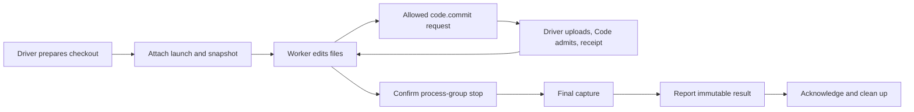

# Runner Git workspaces

All new tasks and experiments use managed Git, without requiring GitHub; see [Always-on Git](ALWAYS_GIT.md). A runner has no repository of its own: every Git checkout comes from Code's `code.v2` driver, which needs only `/usr/bin/git`, no local source repository and no GitHub credential. Work that declares no workspace runs in a scratch directory. A live writable worker can request a named commit through `code.commit` when its fixed tool policy permits it, then read the receipt through `code.operation`; the final capture happens after the process group stops. Neither publishes code. See [Code operations](CODE_OPERATIONS.md).

## Configuration and responsibility

| Component     | Responsibility                                                                                                            |
| ------------- | ------------------------------------------------------------------------------------------------------------------------- |
| Workflows     | Persist the versioned workspace policy and freeze named commit references with the assignment.                            |
| Sessions      | Bind source, worker, target, policy and runner; accept the attachment and one final workspace result.                     |
| Code          | Derive and pin bases, serve checkouts, admit uploads under the writer fence, and keep commit requests and their receipts. |
| Runner        | Own scratch directories, the process and retryable result delivery; the named driver owns checkout, commits and capture.  |
| Native worker | Read or edit assigned files under the declared sandbox, request allowed commits and perform its allowed MCP handoff.      |

The runner's former local repository (its `workspace` configuration, Code's legacy-local driver and the `git.local` capability) was removed on 2026-10-06. A runner configuration that still names `workspace` is refused. Frozen policies of older versions that name no driver (`task@3`/`task@4`, `experiment@6`/`experiment@7`) are offered to no runner; their records stay readable.

## The two Git workspaces

Every current task and experiment version declares its Git steps with Code Work's `codeWorkspace()`, which produces exactly two shapes:

| Purpose | Policy                                                                                                                                       | Used by                                                             |
| ------- | -------------------------------------------------------------------------------------------------------------------------------------------- | ------------------------------------------------------------------- |
| Work    | `mode: "persistent"`, `base: "reference:base"`, `perBase: false`, `retain: true`, `advancesCentral: false`, `driver: "code.v2"`              | a task's producer (`in_progress`), an experiment's `running` worker |
| Review  | `mode: "ephemeral"`, `base: "reference:code"`, `retain: false`, `driver: "code.v2"`, with `readOnly: true` on the enclosing execution policy | a task's reviewer (`in_review`), an experiment's results reviewer   |

Each also carries the owner's `namespace`. A work checkout is one per unit: a successor lease (a returned task, a resumed experiment) continues on any machine from the newest head Code admitted for that unit, on the base pinned at the first lease. A review checkout is the exact frozen commit under review, `execution.references.code`, never the branch tip, so a close-time capture added above a delivered commit is not under review; it is removed after the review. Planning and design steps run in scratch directories. `perBase` and `advancesCentral` remain in the declaration only because published policies are immutable; neither changes what the driver does, and nothing is published from a checkout.

A reference base must be a full lowercase 40- or 64-character commit OID; missing, list-valued or abbreviated references fail, with no fallback.

### The derived base

A writer's `reference:base` is the base Code derives the base from `dependsOn` prerequisites in its own repository ([the Git model](GIT_MODEL.md)):

- a prerequisite accepted with code contributes exactly its reviewed commit, and nothing beneath it is looked at;
- a prerequisite that succeeded without code is looked through, to what it depended on;
- a prerequisite on a workspace version that has no verifiable acceptance (it succeeded before acceptances existed or in another repository) blocks, as does a code-less success whose own prerequisites are unfinished: `code_base_pending`;
- no commit at all gives the project's imported main; one commit, reached by however many paths, is the base; several commits share a retained merge plan. Conflicts create one reviewed `task@6` per base.

The base is pinned inside the transaction that acquires the first lease — a task's first producer, an experiment's first planner or, if the design was written by hand, its first running worker — and is immutable: a returned task, a revised plan and a main that has moved since all reuse it. The frozen `references.base` is read from that pin and from nothing else, so reading an assignment never derives or writes. Work whose base cannot be derived is refused at lease admission, so it is never a dispatch candidate, never launched and never counted as a launch failure; Code publishes why as a blocker, which `workflow.status_and_next` gates on, the overview lists under `blocked` and `session.stuck` reports as `work_blocked`. An interactive producer has no checkout and therefore no `base`.

## The `code.v2` driver

A workspace policy may name a `driver`. The key is opaque to Workflows and Sessions: a policy without it is byte-identical to what it always was, and one that names a driver is offered only to a runner whose heartbeat lists that name among its `capabilities` (`runner_incompatible` otherwise, for the automatic lease and for a hand offer at attach). Every current task and experiment version, and service-owned resolution tasks, name `code.v2`, whose checkouts come from the repository Code keeps on the server rather than from a repository on the machine. Policies that name none are offered to no runner.

What a runner advertises:

- each driver it composed, by name (`code.v2`);
- `runner.N`, what its protocol tolerates: `runner.1` ignores fields a server adds to lease, settings and session replies; `runner.2` also says it has no repository of its own. Older runners advertised `git.local` for one; nothing offers work for it any more.

A managed (hosted) runner advertises only its drivers, because its capabilities must equal its enrolment; its image release is the proof of what it tolerates.

The driver belongs to Code and lives beside the runner's ledger under `code-v2/`, with its own tables (`code_v2_repositories`, `code_v2_workspaces`, `code_v2_transfers`); it never touches the runner's repository or tables, needs no local source and holds no GitHub credential.

- **Prepare.** The driver asks Code for the session's manifest, which only reads: exactly the newest commit Code admitted for a writer (a resumed unit continues on any machine, including the trailing work the last session left), exactly the referenced commit for a reviewer. It downloads a bundle in parts, telling Code which commits its cache already holds; should that claim be wrong the import fails and the one retry claims nothing. The cache is a bare repository without a remote. A writer's checkout stands on the local branch `merv/work/<unit>`, put on exactly the named head; a reviewer's is detached and removed afterwards.
- **Commit.** `code.commit` builds the same deterministic commit as the runner's own driver, but keeps it aside under `refs/merv/pending/*`, uploads it under the writer fence and moves HEAD only when Code has admitted it. A commit Code quarantines leaves the checkout exactly as it was and fails the command with `code_capture_quarantined`; the agent removes what was found and commits again under a new request. An interrupted upload continues from the byte Code says it holds.
- **Final capture.** After the process has stopped, what is uncommitted becomes one `merv: capture <session>` commit. It is journalled before Code hears of it, so a restart hands over that same commit and never builds another. The session's result names the head Code acknowledged: when the final capture is quarantined or its generation was fenced, that is the last admitted head, and the refused work stays in the machine's checkout and in Code's `held/` directory.
- **Deferral.** When Code, its store or the network cannot serve, the driver raises a deferral with a cause (`code_unavailable`, `transport_unavailable`, `store_busy`, `base_pending`) instead of a failure of the launch. The runner gives the lease back as `preparation_deferred` with that cause: nothing counts it, no hold can form from it, and the target is offered again after the usual backoff. The runner defers for two causes of its own: `driver_absent`, when the named driver is not composed on this machine, and `checkout_busy`, when its own manager's slot is still held by a launch that is running or settling. A cause or code that is not a lower-case word (`^[a-z][a-z0-9_]{0,63}$`) is sent as `code_unavailable` / `workspace_deferred`. A deferral during a commit or a final capture is simply retried on the next cycle, because the machine still owes that handover.
- **Publication.** None of this touches GitHub. Code publishes `refs/merv/work/**` and `refs/merv/accepted/**` itself, asynchronously, long after the handoff is complete; a machine holds no credential for it and never waits for it.

## Scratch directories and capture order

The runner's own workspace manager keeps only scratch directories: one per launch, or on a work host one per work item, which carries over between its steps. A scratch directory is occupied until its launch has provably stopped and been captured; a successor behind a live or settling owner is deferred `checkout_busy`, behind an `uncertain` one refused and counted. See the [Runner](../packages/runner/README.md) for its ledger and process ownership.


```mermaid
flowchart LR
  P[Driver prepares checkout] --> A[Attach launch and snapshot]
  A --> W[Worker edits files]
  W --> Q[Allowed code.commit request]
  Q --> M[Driver uploads, Code admits, receipt]
  M --> W
  W --> S[Confirm process-group stop]
  S --> G[Final capture]
  G --> R[Report immutable result]
  R --> K[Acknowledge and clean up]
```

Attach rechecks current session admission before spawn and does not activate the workflow. The first authenticated worker MCP operation activates it. Runner uses its stable launch ID as `hostRef`; retries or another runner cannot replace that attachment. Capture requires locally confirmed termination; server-side lease closure alone is insufficient. A commit receipt is separate from the final workspace result: later edits or the final capture do not change it.

## Restart and failure behavior

A replacement controller reconnects to the existing process guardian and replays matching preparation without resetting files. If Git created a valid owned checkout but the ready-state commit was interrupted, the manager validates and resumes it. Unverified partial checkouts are preserved rather than adopted, pruned or deleted. An unstarted terminal launch can cancel that preparation and release its remote lease; using that lineage again may require manual investigation.

Runner captures a confirmed finished process before fetching fresh server state. A network outage or source refusal therefore does not discard local WIP. Reporting still requires the original authenticated source authority. Source-key revocation, changed membership or a prolonged outage can leave a retained result awaiting authorized reconciliation; this slice adds no credential-rotation bypass.

A lost attach reply remains ambiguous. Runner closes the remote lease before deciding that no attachment exists, preventing a delayed attach from racing with local checkout release. It can then report the exact attached result even for a closed session. Closing or reporting never reactivates the worker.

An unreachable guardian leaves the launch `uncertain`; its checkout and local capacity stay reserved until the launch is proven gone (a reboot, or no command pinned a minute after it was first found unreachable). No saved PID or remote lifecycle state proves that a process tree stopped. See the [process ownership contract](../packages/runner/README.md).

## Server result contract and trust boundary

Source-authenticated `POST /sessions/:id/attach` carries `runnerId`, `hostRef` and the Git workspace attachment. After capture, `POST /sessions/:id/workspace-result` carries the same runner/host identity and the final workspace object. Session workers cannot use these source-control routes.

Both snapshots contain:

```ts
interface SessionWorkspace {
  repositoryId: string;
  workspaceId: string;
  mode: 'ephemeral' | 'persistent';
  branch: string | null;
  baseOid: string;
  headOid: string;
  stats: {
    commitCount: number;
    filesChanged: number;
    insertions: number;
    deletions: number;
  };
}
```

Sessions exposes `workspace: { attachment, result }`, with `result: null` until reporting. Identity, mode, branch and base must match the attachment. A read-only result must retain the attached head. An identical final-result replay succeeds; a different result conflicts. The result and its `session.workspace_result` event commit together with source, worker, workflow version, state, revision and policy provenance. Late results remain per-session facts and do not overwrite a global instance pointer.

These are **source-authenticated Runner observations**. The server validates authority, schema, identity and replay consistency; it does not fetch Git objects, independently calculate the diff, or prove ancestry. The receipt acknowledges capture; it does not authorize approval or publication.

## Current limits and validation

Native support consists of sandboxed file editing/read-only inspection, policy-granted commit requests through Code, and host-side Runner WIP capture. The worker is not granted arbitrary private Git metadata writes, merge commands or ref updates. The `command` profile is a trusted executable without an equivalent verified sandbox and refuses read-only leases. Private files and process groups do not isolate hostile programs sharing one OS user.

There is no standalone `code.propose` or automatic retention pruning. `code.v2` assignments use Code's repository and bundle transport with admission and ancestry verification; service resolution uses the policy-granted `code.merge` protocol. Publication to GitHub and its release requirements are described in [CODE_OPERATIONS.md](CODE_OPERATIONS.md).

Run `npm run test:runner` for the Runner suite, `tests/runner-workspaces.test.ts` for scratch and work-host directories, or `tests/runner-code-driver.test.ts` for `code.v2` checkouts. Native acceptance launches real agents and is a separate, explicit operation.
