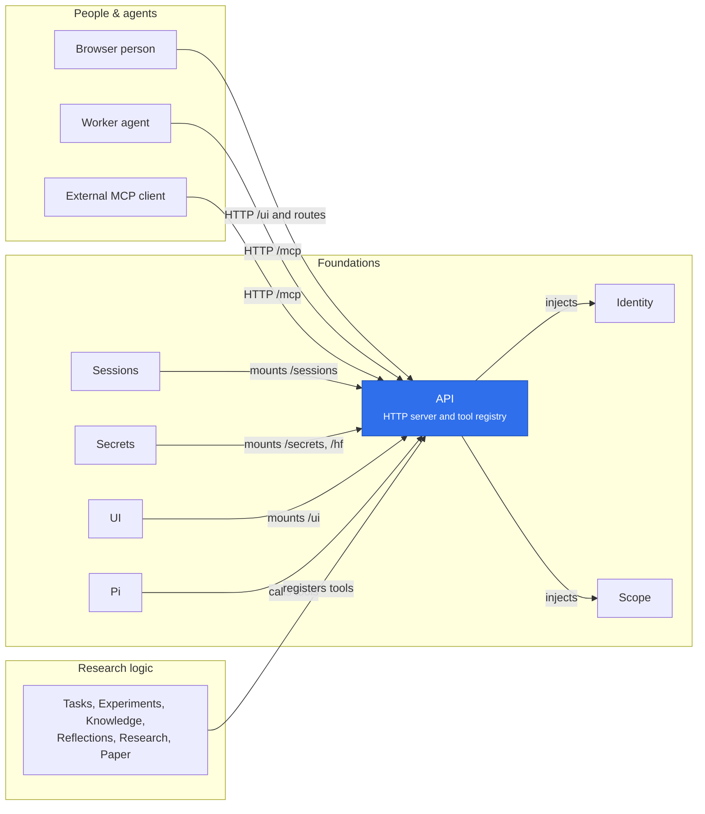

# @merv/api

Merv's front door. The package holds two plugins: `@merv/api/tools-plugin` (config row `tools`) injects `scope` and provides `tools`, the registry every plugin registers its tools in; `@merv/api` (config row `api`) injects `scope`, `tools` and `identity` and provides `api`, the HTTP server. The server answers `/health`, `/auth/config`, `/tools` and `/mcp` itself, and other plugins mount their own routes on it. Read-only tools run in a State snapshot when State is loaded.

## Where it sits

People and agents reach Merv only through the API: Identity verifies a browser's token and Scope decides what each caller may do. Plugins plug in by mounting routes and registering tools, and the same registry serves `/mcp`, `/tools` and Pi's in-process calls.

## Surface

- HTTP: `/health` and `/auth/config` (public), `/tools`, and the MCP endpoint `/mcp`.
- `ctx.api`: `mount(prefix, handler)`, `credential(namespace, …)`, `start`, `stop`.
- `ctx.tools`: `register`, `list`, `call`, `invoke`, `registerSessionPolicy`, `registerCallerRules`, `contributeInstructions`, `contributeContext`.
