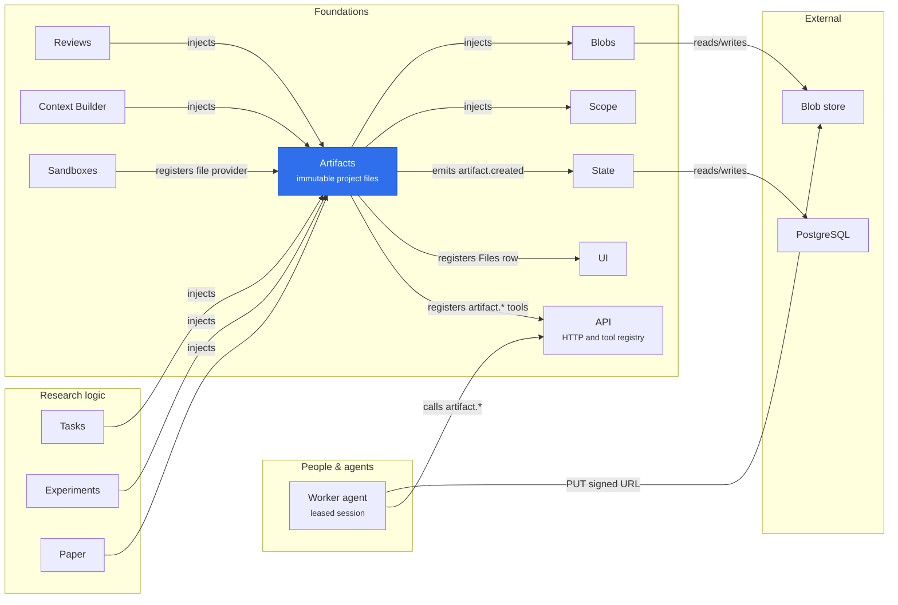

# @merv/artifacts

Artifacts stores a project's immutable files: a document or binary of up to 2 MB in one call, and a file of up to 512 MiB uploaded through a signed URL when the blob store supports it. Tasks, Reviews, Experiments, Paper, Context Builder and the other research plugins cite and read them by artifact id. The core injects `state`, `scope` and `blobs`, provides `artifacts`, and records an `artifact.created` event for each new file. A plugin may register a file provider for collection members that live elsewhere, as Sandboxes does for its legacy captures.

## Where it sits

Artifacts is the evidence layer under research work: the research plugins and Reviews hold only artifact ids, and Artifacts holds the bytes and checks the caller's project on every read. A worker stores a large file in two steps, `artifact.upload_begin` and a `PUT` to the signed URL, then `artifact.upload_complete` verifies the bytes and retains the artifact.

## Surface

- Service `ctx.artifacts`: `create`, `get`, `getMany`, `getAll` (any number of ids), `list`, `executionOutputs` (what the calling session worker created), `read`, `download`, `createCollection`, the `upload*` steps, `registerFileProvider`, and `registerReadRule`: an owner's rule over what a session worker may read (Reflections withholds the other lenses' reports from a lens's agent while its wave reflects).
- Tools (`@merv/artifacts/tools`): `artifact.create`, `artifact.upload_begin`, `artifact.upload_resume`, `artifact.upload_complete`, `artifact.get`, `artifact.read`, `artifact.list` and `artifact.storage_status`.
- Row (`@merv/artifacts/ui`): Files, at `/artifacts`.
- Client (`@merv/artifacts/upload-client`): the `artifact-upload` CLI command's uploader.
