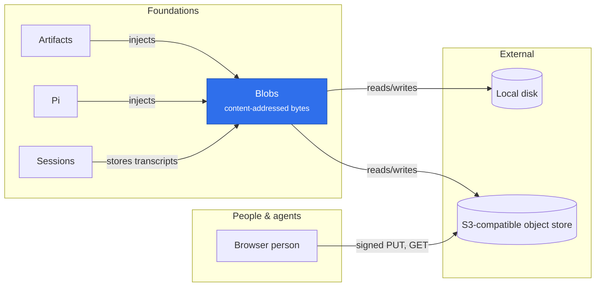

# @merv/blobs

Blobs is Merv's content-addressed byte store. It provides `blobs`: `put` stores bytes under a namespace (the project) and returns their SHA-256 hash, and `get` returns them only after checking that hash. The `disk` backend keeps files under a local root and suits development; the `s3` backend talks to an S3-compatible object store named by `MERV_BLOB_*` variables and adds signed upload and download URLs, so files up to 512 MiB move between a client and the store without passing through Merv. It needs no other plugin.

## Where it sits

Artifacts is the main user: small files go through `put` and `get`, and large ones get a signed URL so the browser uploads and downloads them straight from the object store. Sessions keeps transcripts and conversations there whenever Blobs is loaded, and Pi reads its conversation checkpoints back.

## Surface

- `ctx.blobs`: `put(namespace, bytes)` and `get(namespace, hash)`, up to 2,000,000 bytes.
- S3 backend only: `upload`, `download` (signed URLs valid for one hour) and `stored`.
