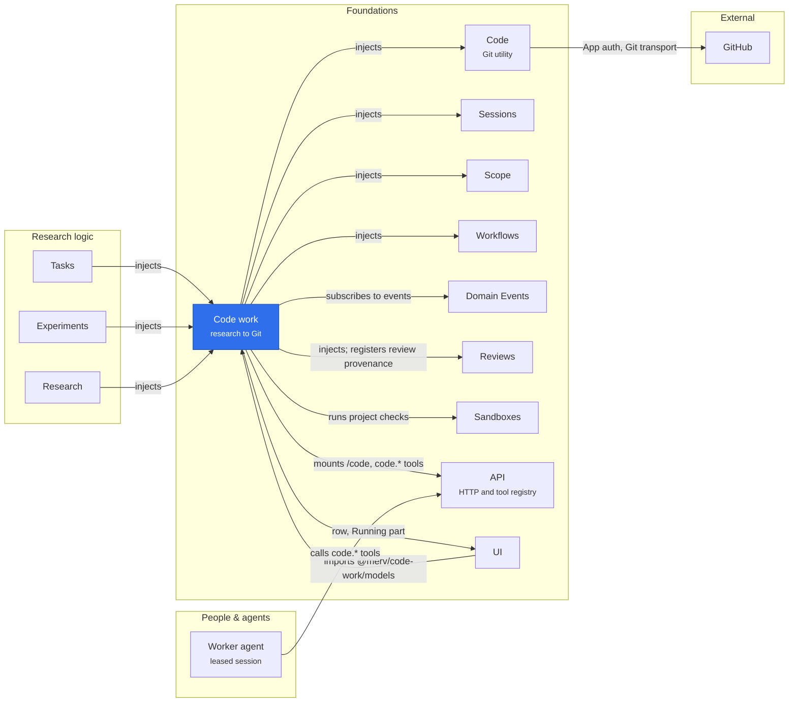

# Code work integration

This adapter connects research decisions to the [Code utility](../code/README.md).
Research owners decide dependencies, accepted outcomes, review requirements and publication
obligations. The adapter translates those decisions into exact code pins, retained evidence,
dependency blockers, conflict-resolution work and publication operations.
It never makes Code itself depend on a research service.

It provides `ctx.codeWork`; Tasks, Experiments, Research and Knowledge require it. It requires
Reviews, which every acceptance and publication reads; Sandboxes is an optional collaborator. A
missing plugin never grants acceptance or erases an existing Git obligation.

| Module                  | Dependencies    | Interface                                                                      |
| ----------------------- | --------------- | ------------------------------------------------------------------------------ |
| `@merv/code-work/tools` | CodeWork, Tools | `code.*` tools                                                                 |
| `@merv/code-work/ui`    | CodeWork, UI    | Repository connection, selected base, retained operations, Home's person moves |
| `@merv/code-work/api`   | CodeWork, API   | The `/code/*` machine and GitHub routes                                        |

The API adapter mounts `/code`, with GitHub's OAuth callback public. Unloading CodeWork withdraws those routes, which then answer 503, without stopping the API.

## Where it sits

Code work is the one bridge between research decisions and Git: Tasks, Experiments and Research bind to it when it is present, and it alone drives Code. Through Domain Events it initializes each new project, asks Code to open and end a session's writer generation as its workspace attaches and closes (Code owns writers and their generations), and reconciles research state on every workflow transition.

## Composition

Every composition loads Code and CodeWork: Tasks, Experiments, Knowledge and Research require
CodeWork, and CodeWork requires Code and Reviews. Code builds its repository journal and mirror;
CodeWork opens them with its callbacks (what imported history changes, which sessions hold a
workspace) and runs imports and the `/code/v2` workspace protocol on them.

GitHub's default branch and the branch selected for Merv are different settings. The selected
branch is the project's base, whatever its name. Each running unit keeps its exact starting
commit, so changing the project base cannot rewrite work already pinned to an older commit.
Connection, retained server history, accepted changes and remote publication remain visible
as distinct states. Connecting a repository is not approval to merge a research outcome.

It has no settings: several accepted commits are always merged into one base on the server.

Review provenance is read through the Reviews service rather than its private tables.

The adapter owns research unit declarations, dependency-derived pins, acceptance bodies and
hashes, reviewed rounds, resolution provenance, and publication obligations. Its records
compose Code's generic workspace and retained-commit API; Code receives commit identities
and durable repository holds, without interpreting research workflow state. The unit policy
holds its durable records rather than extending them, and reads each unit through them with
its publication enforcement and derived base. `@merv/code-work/models` holds the portable read
models, among them publications and capture refs, which the browser and Experiments import.

See the [ownership boundary and upgrade behavior](../../docs/CODE_WORK_BOUNDARY.md).
