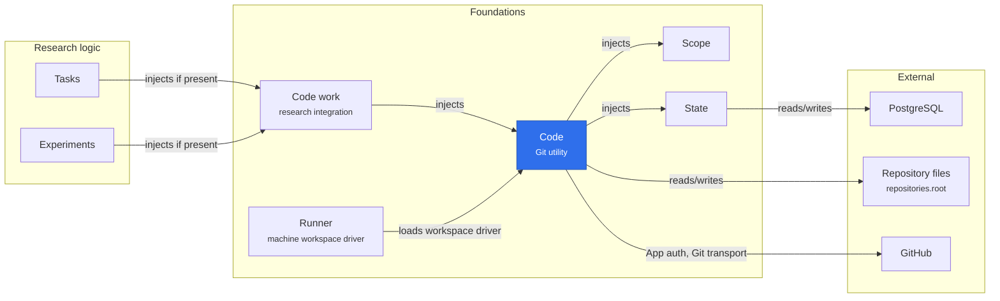

# Code

Code is an optional Git utility. It retains exact commits, project repository bindings,
workspace inputs and writer generations; owns repository files and Git
execution; and provides optional GitHub authentication and transport. It depends only on
**State and Scope**. It does not load Workflows, Reviews, Sessions, or research policies.

The core service is `ctx.code`. Its repository, workspace and writer APIs are technical building
blocks. Callers retain commits under opaque keys and pin workspace inputs inside their own
transaction. Retention keys preserve every commit across repository transfers and rebinding.
Core checks integrity and concurrency; it does not decide research acceptance, scheduling,
review requirements, or which experiment's work belongs in a project.

The optional [Code work integration](../code-work/README.md) provides those connections
and the user-facing tools, machine API and UI. Research can run without either plugin.
GitHub is separately optional: a local repository does not require a GitHub connection.

## Where it sits

Code sits at the bottom of the Git path: only Code work injects it, and research plugins reach Git through Code work, never through Code. Code keeps the facts, the repository files and the GitHub connection; whether a commit is accepted is decided above it.

## Composition and ownership

| Component          | Responsibilities                                                                                   | Required services                                      |
| ------------------ | -------------------------------------------------------------------------------------------------- | ------------------------------------------------------ |
| `@merv/code`       | Repository ownership, retained Git facts, fencing, GitHub connection                               | State, Scope                                           |
| `@merv/code-work`  | Research dependencies, evidence, review provenance, workspace handoff and publication coordination | Code, State, Scope, Sessions, Workflows, Domain Events |
| Code work adapters | Existing `code.*` tools, `/code/*` controls and Code UI                                            | CodeWork plus Tools, API or UI                         |

The utility owns repository locks and the GitHub client. The integration releases its own
operations when unloaded. Technical changes to bindings and writers notify optional
projections within the same transaction; failure rolls back both the fact and projection.
Unloading a projection never deletes facts. Persistent repository holds preserve transfer
and rebinding restrictions when an integration is unloaded. Reattachment rebuilds derived
research state.

`repositories.root`, `quotaBytes` and `reservedFreeBytes` belong to the core configuration.
`finalizeGraceSeconds` also belongs to Code, so every writer uses the same timeout.
Import maintenance, drain timing, automatic base merging and mirroring belong to the
integration's `repositories` configuration. Disaster backup and restoration belong to
[deployment operations](../../docs/RECOVERY_SNAPSHOTS.md), outside both plugins. Historical migration text and retained workflow evidence remain unchanged. A separate generic
storage migration creates technical workspace, commit retention and repository hold records;
standalone Code never interprets acceptance or reviews.

The machine [Code workspace driver](src/driver/index.ts) supports isolated checkouts and
cross-machine handoff. The [Runner](../runner/README.md) loads it only when enabled;
`workspaceDrivers: []` supports execution without Code or Git. The
[local repository driver](src/driver/local.ts) serves a runner configured with a `workspace`
repository of its own: a private bare copy of it, checkouts, captures and `code.commit` receipts.

See [Code operations](../../docs/CODE_OPERATIONS.md),
[GitHub connections](../../docs/GITHUB_REPOSITORIES.md), and the
[ownership boundary and upgrade behavior](../../docs/CODE_WORK_BOUNDARY.md).
