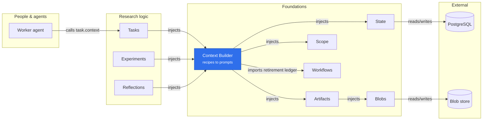

# Context Builder

Provides `contextBuilder`; requires State, Scope and Artifacts. There are no context-adapter plugins and no new context-specific tool adapter. Existing Tasks owns task-type definitions and registers their recipes directly.

## Where it sits

Context Builder sits below the research plugins that hand agents a prompt: each registers its own recipes, and an agent's `task.context` call ends here as a package rendered from Artifacts and saved through State. The builder holds no task, review or experiment rules of its own.

A type definition contains a name, immutable version, assignment kind (`work` or `review`) and a declarative recipe: instructions, ordered sections, required/optional inputs, output instructions, a character budget and `format: 2`, the item renderer. A definition without `format` is refused with `recipe_format_retired` (owner, 2026-09-28): the frozen renderers are gone, and the rows of format-less versions stay in `context_recipes`. Registering returns a lifecycle-bound preview/build/replay handle and disposer. Disposing a handle, or closing the builder, refuses new calls; a call already running finishes or fails atomically. Replacing a published recipe requires a new version. Reinstalling an identical version is supported. Registering a version already stored only reads it, so a restart opens no write transaction. `preview` and `replay` run in the caller's transaction when given one or inside one; otherwise they read in a read-only snapshot, and `preview` reads artifact bytes after it closes, so neither takes State's writer lock. A render looks up the metadata of each artifact its inputs name once.

Build inputs identify the subject/revision/current review claim and give each named section a list of items. Unknown inputs fail. Budgets count JavaScript string characters, not model tokens. The source manifest lists every artifact the build resolved, embedded or not, by its ID, title, media type, hash and size; a package saved before the manifest was narrowed keeps the full artifact rows it recorded, and replay returns it as saved. No arbitrary filesystem paths, HTTP fetches or executable templates are evaluated, and document content is identified as source material.

`@merv/context-builder/artifact-item` exports the pure `artifactItem`, an artifact as an item named by its title and read again with `artifact.read`, which Tasks, Experiments and Reflections build their artifact items with.

Each item has an ID, a title, a text or artifact body, an `embed` rule, a priority and optional note and retrieval `refs`; its ID, title and note are folded to one line and clipped, and two IDs equal after that fail. A required section needs at least one item. Every item is either listed by one line, which gives its metadata, note and refs, or embedded as one block, headed by its metadata and note, in a tilde fence longer than any run of tildes in its body. `always` items are embedded or the build fails: bytes that are not UTF-8 fail `context_encoding` and any read error propagates. A missing blob or a storage outage fails the build whenever a document's bytes are read; a missing or foreign artifact always fails. `never` items are only listed. `fit` items, the default, replace their lines with their bodies in rank order (priority, then section, then item) while they fit; an artifact is read only when its media type is `text/*` or `application/json` and its shortest text could fit, and one whose bytes are not UTF-8 or permanently unreadable (`artifact_size` or `blob_corrupt`) keeps its line; missing bytes (`artifact_bytes_missing`) and outages propagate. Among `always` and `fit` items, `always` first, a later item with the same sha256 as an earlier one says `same content as` that item instead of repeating the body. When the lines do not all fit, the lowest-ranked are cut, keeping `always` items and the top item of each required section, and each section with cuts says how many and which tools retrieve them. `omitted` lists, in declaration order, the items cut and the `fit` items whose bodies did not fit. A line depends only on metadata, so the layout is exact in characters and the prompt never exceeds `maxChars`.

`build` saves a preview under a request ID: it accepts only a preview object its own registration returned, unchanged and rendered for the same caller, so it is an in-process call that is never offered over HTTP or MCP. A successful build persists an immutable context package, its rendered prompt, actor/project identity, source manifest, recipe hash/version, subject revision, optional claim ID and content hash. Package persistence, command deduplication and the `context.built` event commit together. A request ID is unique per project and actor, across every recipe. Reusing a request ID returns the package already saved for it when the recipe and subject match, whatever inputs are passed; a different recipe or subject fails `request_conflict`, except that a package saved by a retired format-less version of the same type replays from any registered version of it, so work started before the retirement keeps its saved contexts. An owning registration can `replay` the previously saved package by the same subject/request ID after rechecking current domain permissions; this verifies recipe identity and subject, preserving snapshots across deployment or progress changes. Tasks does this only after current assignment checks. A new request ID creates fresh context. Old packages remain historical records, not permission to act on an obsolete claim.

Where a render runs is its caller's choice, and today every production render runs in a writer transaction, so the artifact bytes it reads hold State's writer lock. Moving each is its owner's change, through the seams above: `preview` without a transaction reads bytes after its snapshot closes, and `build({ requestId, preview })` saves in a short transaction. Tasks `task.context` checks the assignment, replays, previews and builds in one transaction; it can read the assignment, `replay` and its inputs in a snapshot, `preview` without a transaction, then check the assignment again, `replay` and `build` in a short writer transaction. Workflows `begin` renders its packet in the transaction that records the start; it can render after commit only for a program whose assignment callback reads nothing `begin` writes, which Workflows verifies per program. A leased render (Workflows `offerLease`, called by Sessions) reads the lease rows the program's `acquire` hook writes in the same transaction, which a snapshot opened earlier cannot see; moving it means committing the lease, rendering from it in a snapshot, then checking and freezing it in a second transaction, a Workflows and Sessions redesign, so until then leased renders keep the writer lock. Experiments no longer reads the metrics exhibit while assigning, since its format-2 recipes only list it. Only once all of these have moved can Artifacts assert that no bytes are read in a writer transaction (`state.ambient` set and `state.readScope` false); until then a preview given a writer transaction is the path being removed.

The builder authorizes `preview`, `build` and `replay` only by the caller's current access to the project; a recipe's assignment `kind` is for its consumer, and each consumer checks that the caller may do that work or review before it renders. Tasks validates current assignment ownership, workflow revision and reviewer claim inside the same transaction before invoking the builder. It exposes `task.context` over HTTP/MCP. Other domain plugins can register recipes through the same service; the builder contains no task-, review- or experiment-specific selection rules.

Each consumer registers only the versions that can still render, and says which in its own README. `tests/context-golden.test.ts` checks that the builder renders exactly the versions the app registers and pins the prompts each renders; its fixture's keys are the current list. Unregistered recipe versions stay in `context_recipes` as history, as do the packages built with them unless their owner's retirement deleted them (context_builder migrations 2 and 3).
