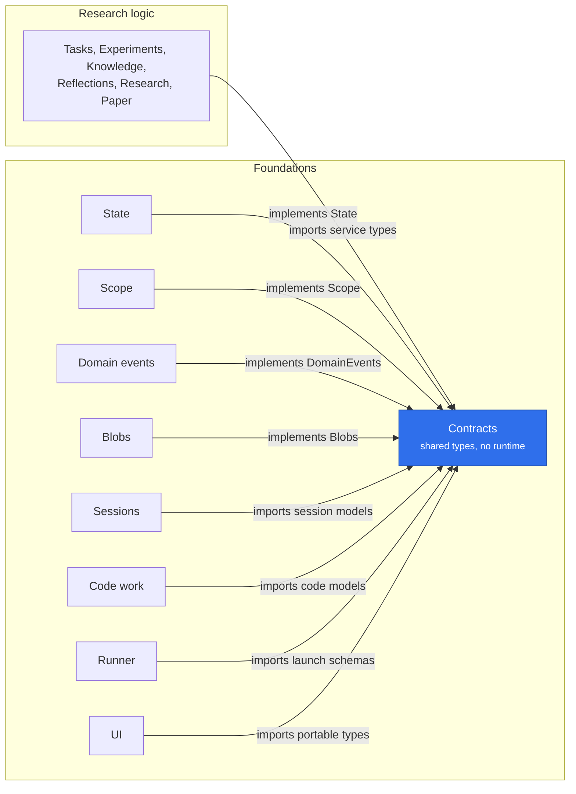

# @merv/contracts

Contracts is the shared types and helpers package, not a plugin: it provides no service and starts nothing. It declares the services on the Cordis `Context` (`state`, `domainEvents`, `contextBuilder`, `blobs`, `scope`, `artifacts`, `workflows`, `reviews`, `composition`), so a plugin types against an interface rather than another package. It also holds the shared vocabulary: `MervError` and `check`, `Caller`, `within` and `forRead` for placing reads, `recorded` for appending events, `leaseReleaseConsumer`, and the zod schemas and models for code, sessions, workflows and the UI manifest. `@merv/contracts/types` is portable data with no server runtime, which the browser bundle imports too.

## Where it sits

Every package in `packages/` imports Contracts; the picture shows the two sides of that. Providers implement the service interfaces it declares, and everyone else, research logic included, codes against those interfaces and shared models instead of against each other.

## Surface

- Service interfaces and the `Context` augmentation: `State`, `Transaction`, `DomainEvents`, `EventConsumer`, `Blobs`, `Scope`, `Artifacts`, `Workflows`, `Reviews`, `ContextBuilder`.
- Errors and checks: `MervError`, `check`, `requiredEnv`.
- Reads and events: `within`, `forRead`, `recorded`, `leaseReleaseConsumer`.
- Subpath modules (`@merv/contracts/<file>`): `types`, `code-work-models`, `workflow-guidance`, `running`, `ui-manifest`, `agent-stream` and others.
