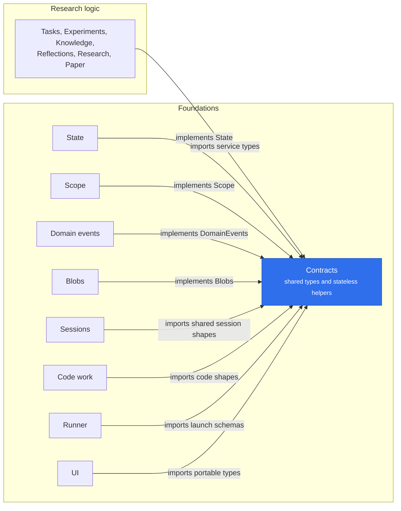

# @merv/contracts

Contracts is the shared types and helpers package, not a plugin: it provides no service, starts nothing and owns no table. It declares the services on the Cordis `Context` (`state`, `domainEvents`, `contextBuilder`, `blobs`, `scope`, `artifacts`, `workflows`, `reviews`, `composition`), so a plugin types against an interface rather than another package.

It does carry runtime, but only small, stateless helpers that several plugins need alike and no single plugin owns: `MervError` and `check`; input copying and parsing (`plain`, `parsed`, `RESERVED_KEYS`, `envName`); `canonical` and `digest`; transaction placement (`within`, `forRead`, `inTransaction`); event and receipt helpers (`recorded`, `receipted`, `leaseReleaseConsumer`, `sourceCaller`, `delegationEnd`); the execution-policy binding builders; and the zod schemas for the wire shapes that cross plugins (code transfers, workspaces, session inputs, the UI manifest, Running keys). Anything with one owner lives with that owner: dispatch admission in `@merv/workflows/execution`, dependency rows in `@merv/workflows/dependency-rows`, the model ledger in `@merv/fleet/model-ledger`, batch artifact reads on the Artifacts service, and the session and Code Work read models in `@merv/sessions/models` and `@merv/code-work/models`. `@merv/contracts/types` is portable data with no server runtime, which the browser bundle imports too.

## Where it sits

Every package in `packages/` imports Contracts; the picture shows the two sides of that. Providers implement the service interfaces it declares, and everyone else, research logic included, codes against those interfaces and shared models instead of against each other.

## Surface

- Service interfaces and the `Context` augmentation: `State`, `Transaction`, `DomainEvents`, `EventConsumer`, `Blobs`, `Scope`, `Artifacts`, `Workflows`, `Reviews`, `ContextBuilder`.
- Errors and checks: `MervError`, `check`, `requiredEnv`, `plain`, `parsed`.
- Reads and events: `within`, `forRead`, `recorded`, `leaseReleaseConsumer`.
- Subpath modules (`@merv/contracts/<file>`): `types`, `workflow-guidance`, `running`, `ui-manifest`, `agent-stream`, `code` and others. A plugin's portable `/models` module may name them for types.
