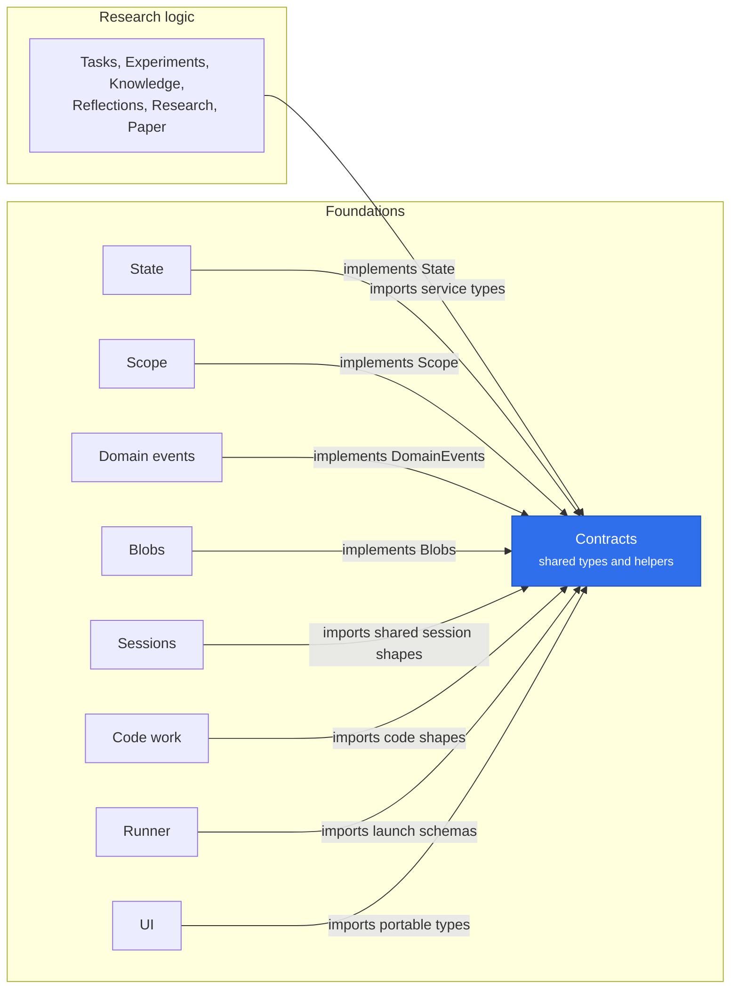

# @merv/contracts

Contracts is the shared types and helpers package, not a plugin: it provides no service, starts nothing and owns no table. It declares the services on the Cordis `Context` (`state`, `domainEvents`, `contextBuilder`, `blobs`, `scope`, `artifacts`, `workflows`, `reviews`, `composition`), so a plugin types against an interface rather than another package.

It owns no table and no migration: the retirement ledger it once held is Workflows' (`@merv/workflows/retired-instances`). What runtime it carries is shared by several plugins and owned by none:

- Errors, checks and input: `MervError`, `check`, `requiredEnv`, `envName`, `plain`, `parsed`, `RESERVED_KEYS`, `pathSegment`, and text helpers (`visible`, `clip`, `visibleMarkdown`, `markdownSection`).
- Hashing: `canonical`, `digest`, `sha256Hex`, `newId`.
- Transaction placement: `within`, `forRead`, `inTransaction`.
- Helpers that run SQL on the caller's own table, in the caller's transaction: the command receipts (`receipted`, `replayed`), the lease release helpers (`releasedLease`, `releaseLeaseRow`, `leaseReleaseConsumer`, which also ask Reviews to release a claim), and `withoutTriggers`, which builds migration text.
- Event provenance: `recorded`, `eventSource`.
- The caller rules over the shared `Caller`: `isDirectHuman`, `requireHuman`.
- `effectiveWorkspace`, the default of an execution policy's workspace, which Code and the runner run, and they may depend on Contracts alone.
- `outbound.ts`: `fetchJson`, `outboundFailure` and `Slots`, which bound concurrent outside calls in memory, for Web, Nisa, Sandboxes, Fleet and Sessions.
- The zod schemas of wire shapes that cross plugins (code transfers, workspaces, session inputs, the UI manifest, Running keys).

Anything with one owner lives with that owner: the retirement ledger, `CheckedTransitions` and the execution-policy builders (`target`, `reference`, `literal`, `grant`) in Workflows (`/retired-instances`, `/rules`), the delegation rules `sourceCaller` and `delegationEnd` in `@merv/scope/rules`, dispatch admission in `@merv/workflows/execution`, dependency rows in `@merv/workflows/dependency-rows`, the model ledger in `@merv/fleet/model-ledger`, batch artifact reads on the Artifacts service, and the session and Code Work read models in `@merv/sessions/models` and `@merv/code-work/models`. `@merv/contracts/types` is portable data with no server runtime, which the browser bundle imports too. A component runs only the index at runtime; any subpath module it names for types alone.

## Where it sits

Every package in `packages/` imports Contracts; the picture shows the two sides of that. Providers implement the service interfaces it declares, and everyone else, research logic included, codes against those interfaces and shared models instead of against each other.

## Surface

- Service interfaces and the `Context` augmentation: `State`, `Transaction`, `DomainEvents`, `EventConsumer`, `Blobs`, `Scope`, `Artifacts`, `Workflows`, `Reviews`, `ContextBuilder`.
- Errors and checks: `MervError`, `check`, `requiredEnv`, `plain`, `parsed`.
- Reads and events: `within`, `forRead`, `recorded`, `leaseReleaseConsumer`, `withoutTriggers`.
- Subpath modules (`@merv/contracts/<file>`): `types`, `workflow-guidance`, `running`, `ui-manifest`, `agent-stream`, `code-store` and others. A plugin's portable `/models` module may name them for types.
