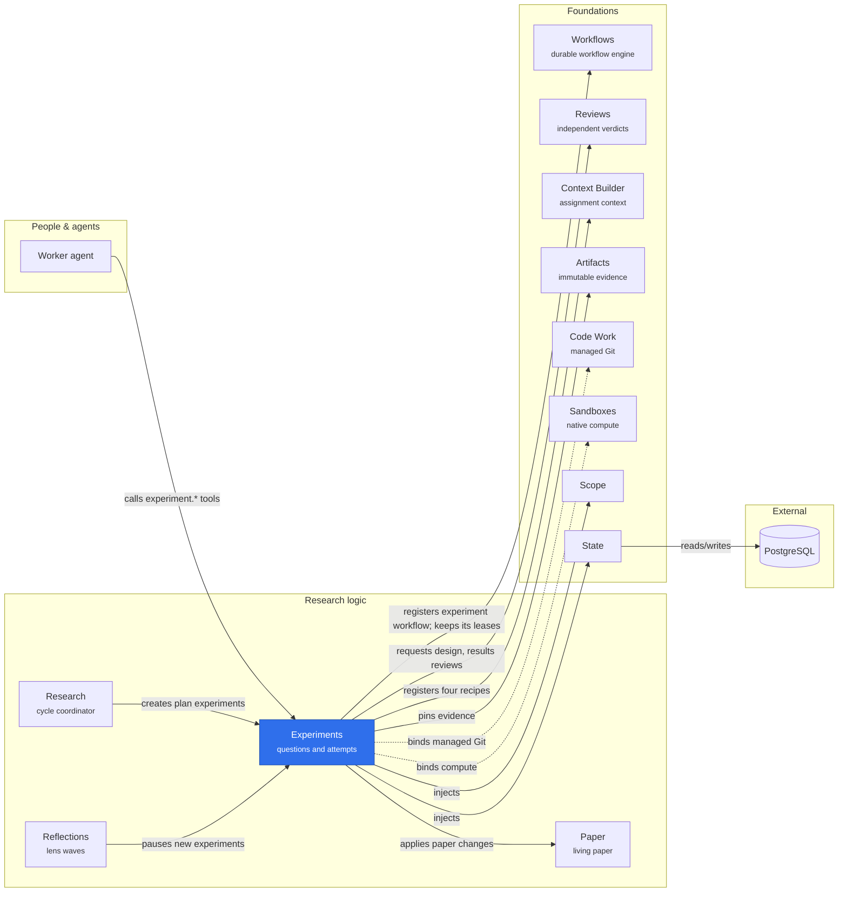

# Experiments

Experiments owns research questions, attempts, evidence selections and the two
independent review gates. It registers two current contracts, `experiment@36`/`40` (small/large uploads), on which Sandboxes attaches native compute. Their numeric versions identify immutable implementation contracts, not experiment attempt numbers. Four context recipes, `EXPERIMENT_RECIPES`, describe planning, design review, execution and results review. The retired `experiment.plan@1` and `@2` stay in `context_recipes` as history; their packages were deleted with their work items.

## Where it sits



Experiments carries a research question through planning, a run and two independent reviews on its own `experiment` workflow. Those reviewers' paper changes land in Methods and Results through Paper, and Research creates the experiments an approved reflection plan names; dotted arrows are optional bindings.

Other stored versions remain read-only history. Their attempts, submissions, evidence, verdicts and pinned workflow graphs are retained, but their old runtime implementations are not registered. They cannot dispatch, accept attachments or transitions, or acquire new review claims, and they do not occupy a current execution slot. No old record is upgraded into another contract. Creating a current experiment starts planning; it does not launch a process or decide whether a scientific claim is true.

| Entrypoint                | Requires                                                                  | Provides                                                        |
| ------------------------- | ------------------------------------------------------------------------- | --------------------------------------------------------------- |
| `@merv/experiments`       | State, Scope, Artifacts, Workflows, Reviews, Context Builder, Paper, Code | `experiments` service and owned workflow/context/review routing |
| `@merv/experiments/tools` | Experiments, Tools                                                        | Six experiment tools                                            |
| `@merv/experiments/ui`    | Experiments, UI                                                           | Experiment inventory and detail page                            |

The tools are `experiment.create`, `experiment.list`, `experiment.get_state`,
`experiment.attach`, `experiment.transition` and `experiment.exhibit`.
Current gates and next actions come from
`workflow.status_and_next`; assigned context comes from `workflow.assignment`.
Independent reviewers claim and submit through the existing `review.start` and
`review.submit` tools.

Experiments owns no compute. It records `computeEpoch` (`attempt:state`) in the workflow data,
and Sandboxes attaches native compute to the leased assignment: `execute` while running, `check`
in planning and both reviews. See
[compute as an assignment capability](../../docs/COMPUTE_CAPABILITY.md).

```text
planned → design_review → running → experiment_review → complete
              │                         │
              └── planned               ├── planned (new attempt)
                  (new attempt)         └── running (same attempt)
```

Both `needs_changes` and `fail` are review returns. Design rejection permits
only `planned`, which may be omitted. A negative attempt review must explicitly
choose `returnTo: "planned"` or `"running"`. A pass must omit `returnTo`.
Owner actions `abandon` and `mark_failed` are separate terminal transitions and
require a reason. `retry_running` preserves the attempt, exact approved plan
and first execution start.

Mutations use strict schemas and actor/project-scoped request receipts. Attach
also requires the current `attemptIndex`; attach and transition require
`expectedRevision`. Repeating the same normalized request returns its original
committed response, while changed input conflicts. Current Scope authority is
required even for replay. Records, events and receipts compose in one State
transaction, including the owned review transition.

Evidence is retained through Artifacts before attachment. Planning accepts
`plan` and `feasibility`; execution accepts `result` and `report`. Each input file is
nonempty UTF-8, at most 64,000 bytes. Draft document sections may be unfinished,
but included figures must already resolve to scoped retained image artifacts.
Results explicitly distinguish finite JSON from qualitative text. Submission
and exit guidance share the same document/exhibit gates; guidance creates
no evidence or events. The generated exhibit and sealed review selections are
immutable.

Sessions consumes the program's generic lease hooks, so Experiments has no
direct dependency on Sessions or Runner. A lease freezes context, the Project Introduction, recovery associations, figures,
prior assessments and artifact grants. The replacement
worker may reuse exact retained result inputs, but must author its own
verified plan or report. Ordinary owner production is blocked while a worker
owns that revision. Review independence uses the actual producing and reviewing
actors; two independent worker leases may have the same delegation source.

The optional UI shows state, attempts, evidence, approved plan, review history,
guidance and a metrics preview. Production mutations
remain available through tools. Feed can display committed experiment events
without being a dependency. Unloading the provider withdraws its routing,
workflow/context registrations and dependent adapters; durable records remain.

```text
packages/experiments/
├── package.json
├── README.md
└── src/
    ├── index.ts              # Service: records, commands, evidence sealing, review routing, Running board
    ├── program.ts            # Workflow, recipes, execution policy, lease hooks and review checks; the service's base class
    ├── program.postgres.ts   # Published lease-table migrations, through their move into wf_leases
    ├── storage.ts            # Owned table rows and migration registration
    ├── storage.postgres.ts   # Published record-table migrations
    ├── models.ts             # Record and command DTOs
    ├── types.ts              # Service contract and Cordis capability
    ├── input.ts              # Strict shared tool/core schemas and safe JSON boundary
    ├── evidence.ts           # Document, figure and metrics validation
    ├── running.ts            # Running page cards and sidebars
    ├── tools.ts              # Experiment tool registrations
    └── ui.ts                 # Optional UI registration
```

Knowledge now owns metadata inventory, exact reference resolution and immutable
terminal corpus capture. Reflection waves and code consolidation remain separate
implementation work.
This program does not publish code.

New experiments always use managed Git; see [Always-on Git](../../docs/ALWAYS_GIT.md). Planning and design review use scratch space; execution uses a persistent private checkout on the Code-derived base, and results review uses a read-only checkout pinned to the producing session's exact final capture. Dependencies select accepted inputs through Code Work. Experiments does not import Sessions or Runner and does not publish code. Old scratch, central-base and `baseTaskId` implementations are retired; their stored records remain readable.
