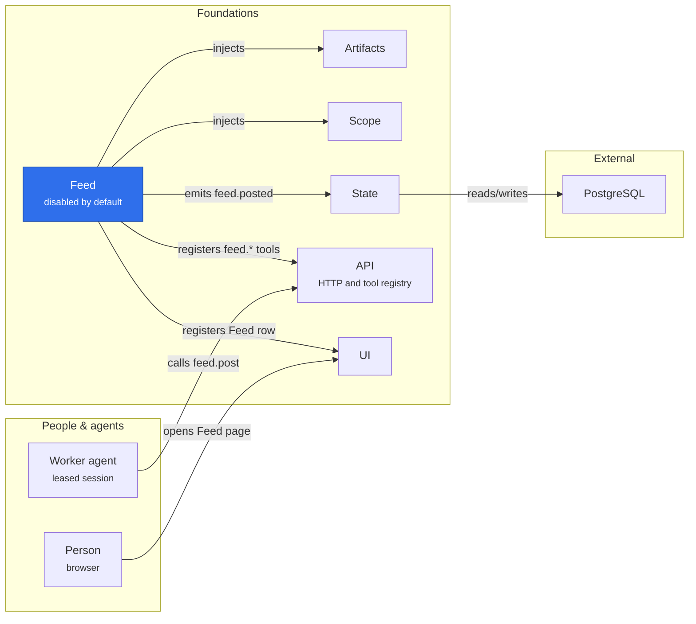

# Feed

An independent Cordis service for immutable project messages and durable activity. `feedPlugin` requires only `state`, `scope`, and `artifacts`, and provides `feed`. It has no workflow, task, or review integration.

## Where it sits

The default composition disables Feed: `feed`, `feed-tools` and `feed-ui` are all `disabled` in `config/default.json`, so nothing above is loaded until an operator enables them. When enabled, Feed is a side channel beside the research work: a post cites artifacts and appears in the project's activity, and no workflow, task or review reads it.

## Posts and activity

Posts retain their exact body, author, timestamp, and up to ten distinct artifact references. Attachments are checked through the Artifacts contract and can belong to any author in the same project. A post, its activity event, and its request record commit atomically. A request ID is scoped to actor and project; identical retries return the original post, and changed inputs conflict. Permission is checked again before every retry.

Operators, producers, and reviewers can post. Readers can inspect posts and activity. The service does not grant a reviewer artifact-writing or workflow-changing permissions.

`list` returns posts in ascending sequence order, with an exclusive `after` cursor and a default page size of 50 (maximum 100). `activity` exposes project-scoped durable events using their separate event ID cursor. Actor administration events (`actor.*`) are visible only to project operators, matching the actor-directory access boundary. For other actors, activity skips complete pages containing only hidden administration events so pagination can still reach subsequent visible events.

The optional `feedToolsPlugin` contributes `feed.post`, `feed.get`, `feed.list`, and `feed.activity`. Unloading the service removes its runtime consumers and tools; stored posts and artifact content remain for a later reinstall.

Public interfaces and the Cordis `Context.feed` declaration are owned by `@merv/feed/types`. Consumers import this entry with `import type`; the core reexports the same public types for convenience. The shared contracts package has no dependency back to Feed.
