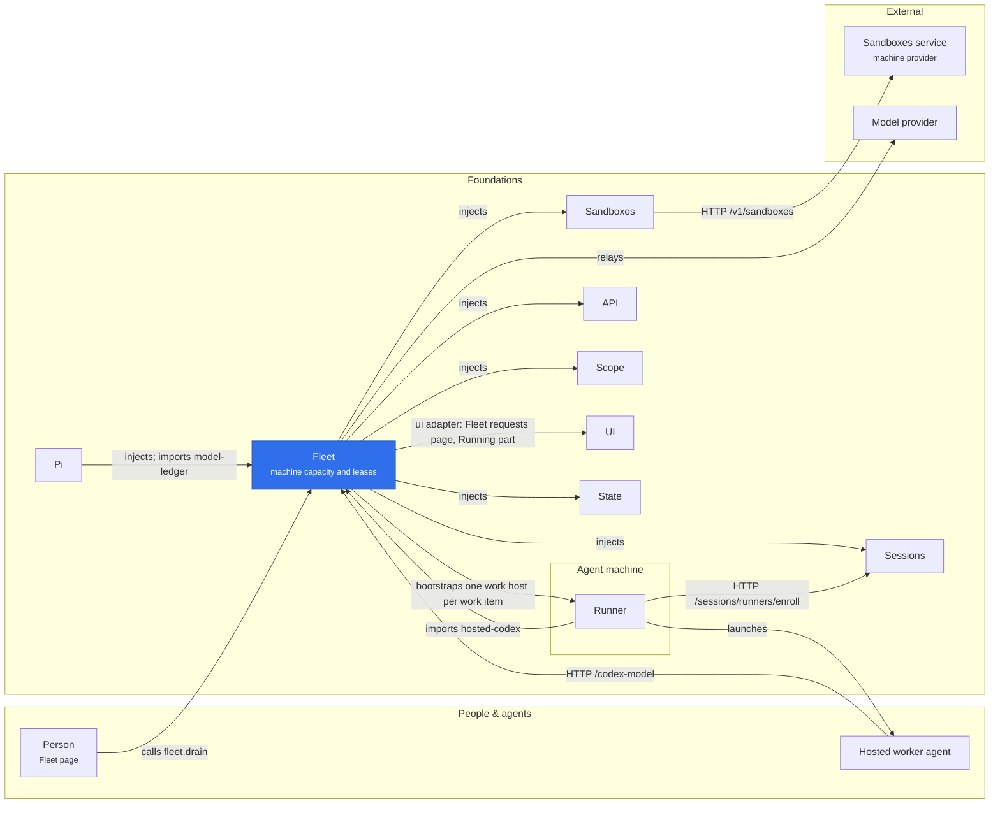

# Fleet

Fleet is a default-disabled, server-side capacity and sandbox lifecycle service. It does not run research work or expose allocation requests as agent tools; its list, get, drain and halt tools answer with the same redacted view as its page, without an allocation's source, person or launch ids. A trusted owner registers to validate authority, provide stable bootstrap bytes, and report when capture or checkpoint work has finished: Pi registers `pi-host` whenever it is enabled, and the optional workflow adapter registers `workflow`.

## Where it sits

Fleet decides how many machines may run and keeps their leases: it rents them through Sandboxes and hands each a bootstrap with which its runner enrolls in Sessions. The workers hold no model key, so hosted Codex calls Fleet's `/codex-model` relay, which holds it for them.

An allocation uses one immutable runtime profile and one stable create and launch key. Global and per-project limits count every allocation that has left the queue until the sandbox provider reports `stopped`, Fleet can prove no machine is left, or the lease of a stopped machine has passed. A queued request gives up at its deadline; once reserved, the machine gets the full allocation timeout. `drain` prevents new admission and launch while renewing a running sandbox until its owner finishes or the deadline expires. One failed call keeps a launched machine's phase, and its worker's admission, while its lease lasts.

The workers Fleet launches hold no model provider key. `fleet.modelRelay(config)` builds the relay that holds it for them (`src/model-relay.ts`): a feature supplies its route, bearer, grant, accepted bodies and spend hooks, then mounts the relay's handler public on the API and closes it with the mount. Pi does this for `/pi-model`, and the workflow adapter for hosted Codex at `/codex-model`. The model ledger (`@merv/fleet/model-ledger`, pure rules) holds the upstream endpoint, `personKey` (whose day a call counts toward) and `dailyTokens`; Pi and Fleet each keep their own daily table with it.

Every workflow machine is a work host: the adapter rents one machine per work item (owner `work:<instance>`), and it serves every step of that item, the item's reviews included, each step in a fresh session with its own credential, deadline (`stepSeconds`, two hours) and billing. The host is rented under the item's owner for two hours and ten minutes in all, and its runner leases only its own item. Between steps the supervisor resets the assignment identity (kills its processes and clears its home and temp) while the step's working directory carries over. A step's host takes the next step only after its runner acknowledged the previous one's release and its capture and transcript settled; a host that has settled and waits five minutes without a next step, a host whose acknowledgement is two minutes overdue, and one that claimed nothing before its enrollment lapsed, are stopped. The hosted release proves each image can be a work host before switching to it (the workflow gate in `scripts/hosted-runner/linux-workflow-gate.py`); there is no per-step mode and no approval list.

The workflow adapter is the one grant authority for hosted Codex's model. Sessions only says which session a bearer or session id holds (`managed.boundSession`: live, or closed by its own handoff and when). Fleet grants that session the model and effort of `hostedCodexPlatform`, which its runner enrolled with, while the session is live or within `codexHandoffGraceMs` of its own handoff, and charges it to the person the allocation was rented for. `@merv/fleet/hosted-codex` (pure rules) holds that profile, its capabilities and the grace; the runner imports the grace from it.

Fleet writes a `createAttempted` marker before contacting the provider. A request from a project without a connection or grant is refused, and a stopped allocation with no attempt is released without renting a machine. A refusal of the first create (a 4xx other than 408, 409 or 429) proves no machine exists, so the allocation is released with `runtime_refused`. Other create failures retry the same idempotency key. Once stopped, an allocation with no machine handle makes one last same-key create to recover and delete a machine made before a lost reply (never under a changed profile), then waits out the lease: Fleet renews nothing after stop, so when `releaseBy` passes the provider has reaped any such machine and the slot is freed. The same bound frees every stopped machine: its first stop sets `releaseBy`, a machine the provider reports as deleting is not stopped again, one it still reports up is asked again at most once a pass until `releaseBy`, and its slot is freed when the provider reports it stopped or when `releaseBy` passes, whichever is first. This also frees a stopped allocation whose provider keeps refusing to inspect or delete its machine. Fleet checks its machines each poll interval, and every second only while one is starting, stopping or due for a retry.

The service does not prove a runner is alive from the Sandboxes launch receipt. The owner observes runner enrollment and completion. Fleet admission requires a confirmed launch, current source authority, matching epoch and profile, and `run` intent. Shutdown fences admission, requests cleanup, and leaves pending provider deletion for a later controller to reconcile. Closing leaves to the successor the allocations of kinds never registered in this process, a kept owner's running work in every phase, and any stopped allocation without a machine handle, such as a create whose reply was lost. Fleet stops the work of a kind with no registered owner only from five minutes after Fleet starts, so a restart does not stop work whose owner registers late. Protected runtime sandboxes never appear in the project's Sandboxes rows, and the sandbox tools refuse them.
