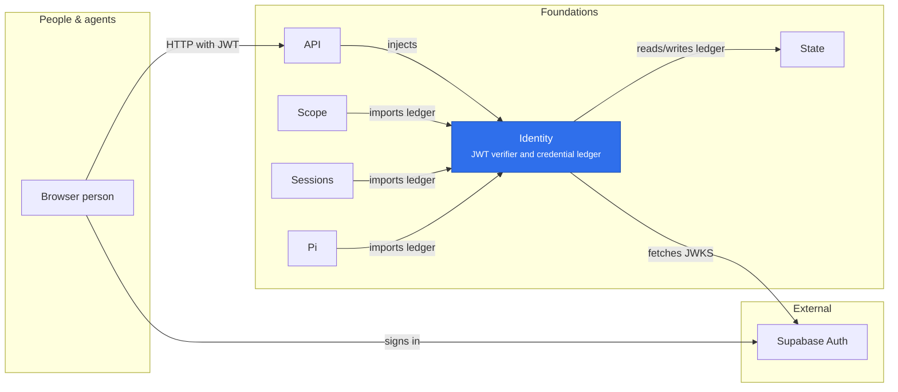

# Identity

Identity owns authentication: Supabase JWT verification and the shared hash-only
credential ledger exposed by `@merv/identity/credentials`. Scope owns authorization;
Sessions and Pi own agent, execution and runtime lifecycles. Credential subjects
reference those existing records. Identity has no project membership or agent roster.

## Where it sits

Identity has two users. The API injects the verifier to turn a browser's Supabase token into an `{issuer, subject}`; Scope, Sessions and Pi import `@merv/identity/credentials` and run the shared ledger in their own State transactions.

## Verifier

The plugin needs no other capability; it provides `ctx.identity` with `verify` and
`configuration` only. In `jwks` mode it accepts ES256, RS256 and EdDSA (Ed25519)
tokens from the issuer's fixed key endpoint. It keeps the last good key set and
refreshes it in the background every five minutes, so no request waits on a refresh
while that set is usable. Fetches are single-flight, bounded to 64 KiB and five
seconds, and retried at most every 30 seconds; a token with an unknown key id joins
or starts one refresh. A set that could not be refreshed for 24 hours is no longer
trusted, and verification fails closed until a fetch succeeds. Keys of other types
and entries carrying private fields are ignored; a response with no usable key
leaves the last good set in place. `hs256` mode is an exclusive alternative.

## Credential ledger

Lifecycle owners issue, renew and revoke credentials inside their existing State
transactions. Each owner constructs its own `CredentialStore(state, clock)` and calls
`initialize()` before its own migrations; Identity holds no store. Only trusted
in-process code can renew a key; there is no bearer-based renewal endpoint. Owners
recheck both Identity validity and current domain authority when a prepared call
executes.

Ownership rules:

1. Identity owns the `identity_credentials` table, its trigger and migrations,
   `tokenDigest`, input validation and the one validity rule: not revoked, and
   neither the expiry nor the hard deadline reached. Identity never changes a row
   on its own initiative. Rows are never deleted, revocation is final, expiry only
   moves forward and `hard_deadline` never changes.
2. Each kind belongs to one owner, which is why `authenticate` takes no owner. Scope:
   `actor`, `user-key`. Sessions: `session-agent`, `session-execution`,
   `managed-enrollment`, `managed-control`. Pi: `pi-worker`, `pi-model`. A new kind
   needs an entry here.
3. Only a row's `owner` renews or revokes it; another owner gets 403.
4. A credential that will be renewed must be issued with a `hardDeadline`; renewing
   one without a deadline is refused. Renewal moves expiry forward only, up to the
   deadline; an earlier or equal expiry returns the row unchanged.
5. No owner reads or writes `identity_credentials` with raw SQL. Owners keep
   `token_hash` in their own tables only as a join key and use `credential.tokenHash`
   from `issue` or `authenticate` rather than re-hashing.
6. Owners re-check their own domain state (actor active, membership, session status)
   alongside `authenticate` or `authenticateHash`, in the same transaction.
7. `subject` is whatever unit the owner wants to revoke together with
   `revokeSubject`.

`revoke` is idempotent and keeps the first revocation time; it also revokes an
expired row, and a hash that was never issued or adopted returns `undefined`.
`read` returns a hash's row, live or not, so an owner can see what it revokes.

The ledger alone decides whether a hash can authenticate: a hash an owner's own
tables hold but the ledger does not never authenticates, and no boot pass adopts
such hashes (the Scope and Sessions boot loops were removed in Identity R2, after
production showed none were left to adopt). `adopt` remains for owners that derive
a token themselves (Pi). It inserts a row if it is absent and returns the stored
row; for an existing row it changes nothing, so it never revokes, extends, revives or
re-owns a credential, and a mismatched owner, subject or kind is refused with 409.
Revocation goes through `revoke`. Scope keys adopted earlier kept their existing
expiry, including explicitly nonexpiring keys. Continuing agent keys have a 30-day lifetime and a
source-authorized rotation route. Execution, managed-runner and Pi credentials are
bounded by their owning lifecycle.

Services instantiate the same credential implementation against the shared State;
they do not maintain separate ledgers. Old credential columns remain for historical
references and migration compatibility. An older image that ignores Identity is
not a safe rollback after Identity-only rotation or revocation; follow the recovery
guidance in [Pi operations](../../deploy/PI_OPERATIONS.md).
