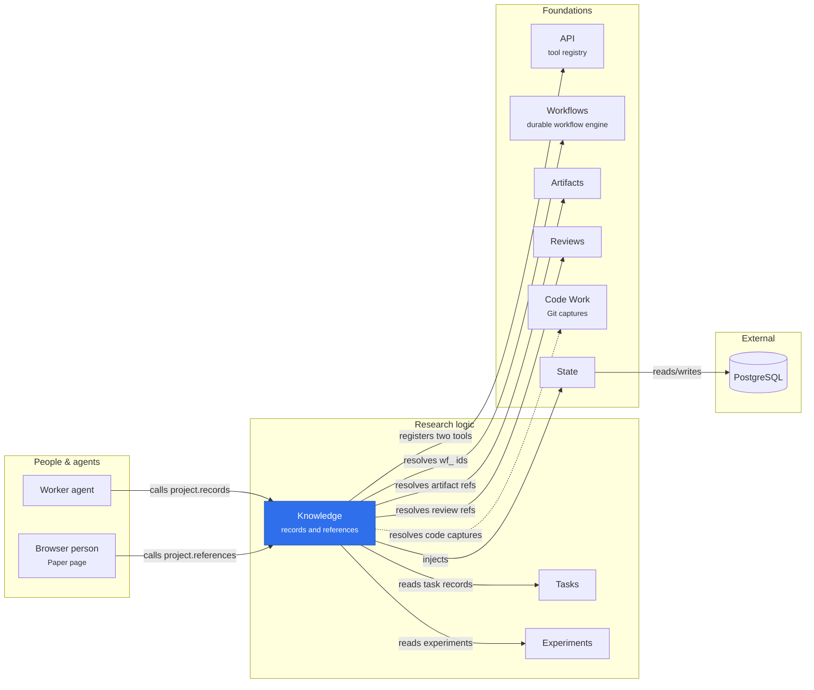

# Knowledge

Knowledge provides current project research records and scoped reference
resolution. Tasks, Experiments, Artifacts, Reviews and Code continue to own their
source records. Research claims were retired: each one was converted into a
Markdown text artifact titled `Claim: …`, which resolves like any other artifact.

## Where it sits



Knowledge is a read-only index over records other plugins own: it lists the project's tasks and experiments and resolves typed references against the services that hold them. Reflection waves and research cycles resolve through their workflow records, so it needs neither Reflections nor Research; the dotted arrow is an optional binding.

| Entrypoint              | Requires                                                   | Provides                                |
| ----------------------- | ---------------------------------------------------------- | --------------------------------------- |
| `@merv/knowledge`       | State, Scope, Tasks, Experiments, Artifacts, Reviews, Code | `knowledge` service                     |
| `@merv/knowledge/tools` | Knowledge, Tools                                           | `project.records`, `project.references` |

`project.records` returns the current Scope project record, including its
Introduction and all task/experiment metadata. It performs no
artifact-body reads, prompt rendering, session reconciliation, exit evaluation
or workflow mutation. Gate and next-action guidance stays in Workflows.

`project.references` resolves up to 200 input references in order. Supported
explicit forms are `task:ID`, `experiment:ID`, `reflection:ID`, `research:ID`,
`artifact:ID`, `review:ID`, `code-commit:ID` and
`session-final:ID`; supported record-ID prefixes also work, and a `wf_` ID names
its task, experiment, reflection wave or research cycle. Results distinguish
resolved, missing and unsupported. No lookup falls back to another project. A resolved code
reference can describe a pending observation rather than ready Git evidence.

## Service

```ts
knowledge.records(caller, tx?);
knowledge.resolve(caller, refs, tx?);
```

The provider implements neither a Reflection workflow nor a published
baseline, coverage/debt rules or literature maintenance. It does not assess
claims or grant central Git publication.

## Retired corpus snapshots

The corpus capture that the retired `reflection@1` used (`knowledge.capture`,
`knowledge.get`, the selection behind them and `researchReferences`) is removed.
The `knowledge@2` migration deleted every `knowledge_snapshots` and
`knowledge_commands` row; nothing read them. `knowledge@3` drops both tables and
their guards. The migrations stay registered, because production pins them.

```text
packages/knowledge/
├── package.json
├── README.md
└── src/
    ├── index.ts    # Transactional records and the exact resolver
    ├── types.ts    # Public contracts and Cordis capability
    ├── input.ts    # Bounded data-only inputs and canonical serialization
    ├── storage.ts  # Migrations of the retired snapshot tables
    └── tools.ts    # Two metadata-read tools
```

The Paper page uses `project.references` for reference lookup. The former
`/knowledge` address redirects to Paper in the browser; it needs no Knowledge UI
registration.

Unloading Knowledge withdraws its tools; source services and retained State
records remain. Reads fail clearly while an injected provider is unavailable.
See [research inputs](../../docs/RESEARCH_INPUTS.md),
[Python correspondence](../../docs/CORPUS_PARITY_REFERENCE.md), and
[focused tests](../../tests/knowledge.test.ts).
