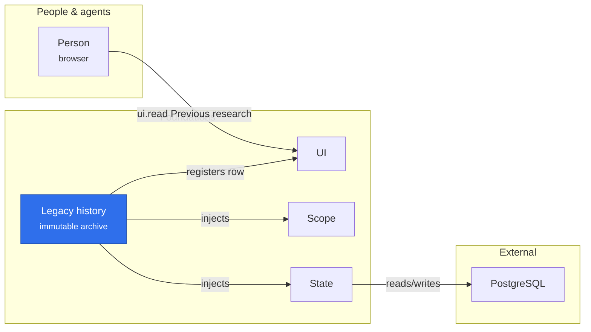

# @merv/legacy-history

Legacy history is the read-only archive of research imported from the previous server: its projects, claims, experiments, tasks, reflections, papers, artifacts, reviews, feed posts, workflow history and the other records of that schema. Its tables refuse every update and delete, and it offers no agent tool and no live workflow. The core injects `state` and `scope` and provides `legacyHistory`; its UI adapter shows one imported source as the Previous research page. The deployment composes both only when `MERV_TS_LEGACY_SOURCE_ID` names that source.

## Where it sits

Legacy history stands apart from the live research plugins: nothing injects it but its own UI adapter, and the only way in is a person reading the Previous research row, which Scope checks against the caller's project.

## Surface

- Service `ctx.legacyHistory`: `summary`, `list` and `detail` for one imported source.
- Row (`@merv/legacy-history/ui`): `legacy-history` at `/legacy-history`, shown when the project has records. Its `ui.read` takes `{ action: 'summary' }`, `{ action: 'list', type }` or `{ action: 'detail', type, id }`; a detail adds links to the record's media files.
