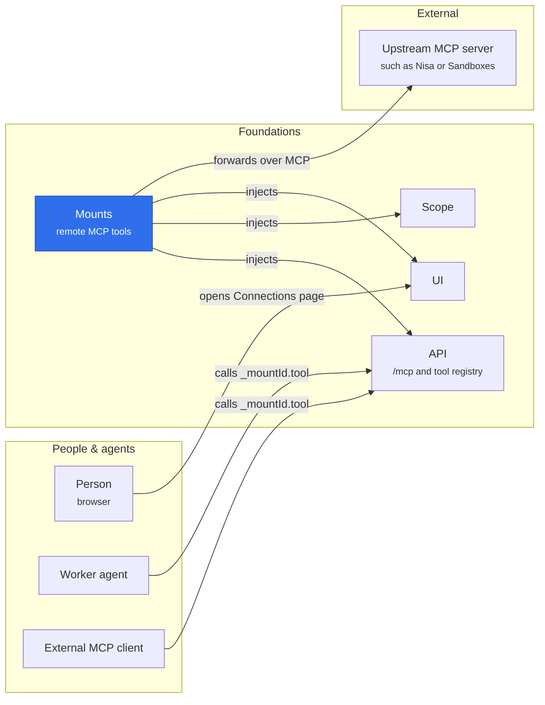

# Mounts

Mounts publishes an explicit selection of an external MCP server's tools as `_<mountId>.<tool>` and forwards each call over a connection that belongs to the caller and carries that caller's own credential binding. Its only Cordis dependencies are Tools and Scope. Production does not compose it.

## Where it sits



Mounts turns selected tools of an upstream MCP server into Merv tools, so agents and MCP clients call them through the ordinary registry under Scope grants, and each call travels on the caller's own connection and credential. Production does not compose it.

## Configuration

```json
{
  "mounts": [
    {
      "id": "research",
      "url": "http://127.0.0.1:4000/mcp",
      "tools": ["search", "paper.get"],
      "discovery": { "actorId": "actor_example", "projectId": "project_example" }
    }
  ],
  "bindings": [
    {
      "id": "research-example",
      "actorId": "actor_example",
      "projectId": "project_example",
      "mountId": "research",
      "secretRef": "env:MERV_RESEARCH_TOKEN"
    }
  ]
}
```

`tools` lists raw upstream names, and grants use those names; `qa.ask` on mount `nisa` is published as `_nisa.qa.ask`. Selecting a tool grants nothing: each caller also needs an exact Scope tool grant and a binding here. A binding selects one (project, actor, mount) and names its secret as `env:NAME`; the value stays in the server environment. Optional binding `headers` are fixed nonsecret `x-*` selectors. `timeoutMs` (default 5000, at most 60000) bounds each upstream request. `reconnectMs` (default 60000) is the discovery interval. The entry's Config schema checks all of this before `apply`: a bad entry fails with a Cordis `ValidationError` whose issues never echo a value, and nothing is published. Bindings moved here from the retired `@merv/credentials` plugin; there is no `ctx.credentials` service.

Loading the entry does not wait for upstreams; `status()` reads `connecting` until a mount's first round ends. **To toggle a mount or rotate a binding, reload the `mounts` entry** (`app.setEnabled('mounts', …)` or a config update). A reload withdraws the tools and ends the connections of **every** mount in the entry.

## Discovery

Each mount has one discovery connection, which lists tools and listens for `tools/list_changed`. Rounds run one at a time: at load, on a notification, and `reconnectMs` after the previous round, whether it succeeded or failed. A trigger during a round reruns it once. A round reads `tools/list` pages until it has every selected name, at most 20 pages, each bounded by `timeoutMs`; a repeating cursor ends at the limit with `remote_catalog_limit`.

- The mount publishes the selected tools the upstream offers now. A missing one is withdrawn alone, and status reads `ready` with `mount_missing_tool`.
- An unchanged catalog is not republished: no schema compile and no drain of admitted calls.
- A failed round keeps the last catalog published and reads `disconnected` with its error code, or `failed` if nothing was ever published. A stale tool fails per call. Any failed round ends the discovery connection; the next round opens a new one.

Without `discovery`, listing sends no credential. With it, listing uses that actor's binding, and each round first requires the actor to read the project: an actor who lost access fails the next round with `forbidden`, and the discovery session ends. Discovery needs no tool grants, and its binding never carries a call. Its secret is read once per discovery connection.

## Calls

The registry admits every call (the caller's grant through Scope, and a session's arguments) immediately before the handler. Each caller lane (project, actor) of a mount has its own connection, carrying the binding selected for that caller; an agent session uses its authority actor's binding. Connections are never shared across actors, even when two bindings hold the same secret: isolation is why lanes exist. A warm call goes straight upstream with no State access. A call that waited (binding selection or connection setup) re-checks the grant, and a session's arguments, first, so a revocation during that wait never crosses.

The secret is read, and checked not to be a Merv credential, once per connection; a rotated environment secret applies from the next connection. Call connections open no notification stream and end after five idle minutes. Ending a connection sends the MCP DELETE, capped at one second, then closes it. **Upstream MCP session state does not survive an idle close, a transport fault or a reload**, so an upstream must key durable state by account, not by MCP session.

The warm path trusts the registry's admission. Handlers taken from `Tools.list()` are trusted in-process code, as native handlers already are. No operation is retried. Every request refuses redirects: a binding authorizes the configured endpoint, never a redirect target.

## Errors and status

Codes and texts are fixed: no upstream text, header or secret reaches a caller or the status.

| Code                               | Meaning                                                                                                             |
| ---------------------------------- | ------------------------------------------------------------------------------------------------------------------- |
| `remote_error` (502)               | The upstream answered with a JSON-RPC error: `Remote tool refused the request (<code>)`. A call's connection stays. |
| `remote_credential_rejected` (502) | The upstream returned HTTP 401 or 403. The connection is retired.                                                   |
| `remote_timeout` (504)             | A request took longer than `timeoutMs`. The connection is retired.                                                  |
| `remote_unavailable` (502)         | Any other transport fault, local ones included; the connection is retired. Also a call reaching an unloaded mount.  |

Merv codes reach callers and the status unchanged, among them `forbidden`, `credential_forbidden`, `credential_unavailable`, `tool_forbidden`, `session_invocation`, `invalid_schema`, `invalid_remote_result`, `remote_catalog_duplicate`, `remote_catalog_limit` and `mount_missing_tool`. Upstream codes −32000 and −32001 cannot be told apart from the SDK's local ConnectionClosed and RequestTimeout, so they retire the lane and report `remote_unavailable` or `remote_timeout`.

`ctx.mounts.status()` gives each mount's ID, endpoint origin, published tool count, optional `errorCode` and state (`connecting`, `ready`, `disconnected`, `failed` or `stopped`), never a path, query string, header or credential. The `@merv/mounts/ui` adapter adds the Connections page, degraded while any mount is not `ready` or has an error code.

Unloading withdraws every mounted tool before its first await, waits for admitted calls, refuses later ones and ends every connection with its DELETE. It never rejects.

The public surface is the plugin, `@merv/mounts/types` and `@merv/mounts/ui`; the other modules are internals that only tests import. `npm run test:mounts`, `npm run test:credentials` and `npm run test:mount-unload` run the fixture regressions and a whole-application removal against a local MCP server with synthetic credentials.
