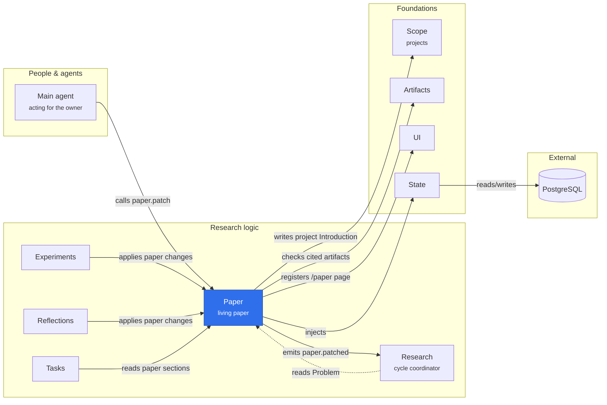

# @merv/paper

Paper stores the living project paper: four documents, Problem, Literature, Methods and Results, with citations and immutable revision history. It creates no workflow, assignment or lease. The owner's main agent edits any document with `paper.patch`; scientific reviewers in Experiments and Reflections land their Methods and Results changes inside their own review transaction. The Problem is the source of the project Introduction that every assignment carries. See [Living paper](../../docs/LIVING_PAPER.md).

## Where it sits

Paper is the one document the research cycle reads and writes: reviewers in Experiments and Reflections revise Methods and Results through it, and Tasks reads it into each assignment. A Problem patch rewrites the project Introduction and wakes a research cycle still defining; the dotted arrow is Research's optional binding.

## Surface

- `@merv/paper`: the `paper` service. It requires State, Scope and Artifacts, and records `paper.patched`, `paper.cited` and `paper.reviewed` events.
- `@merv/paper/tools`: `paper.read`, `paper.patch` and `paper.cite`.
- `@merv/paper/ui`: the `/paper` page.
