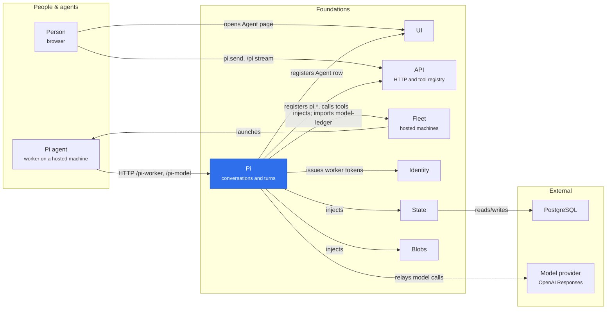

# @merv/pi

Pi is the agent a person talks to on the Agent page. Each conversation is private to its person and acts in the project with exactly that person's permissions; a call only the person may make comes back as a proposal they run with `pi.run`. Turns run on a hosted machine that Pi rents through Fleet. The worker there holds no model key: it takes its turns from `/pi-worker` and reaches the model through Pi's relay at `/pi-model`. The deployment composes Pi only when `MERV_PI_ENABLED` is set (see `deploy/render-config.mjs`).

## Where it sits

Pi sits between the person and a machine it rents from Fleet. A sent message becomes a turn that the worker claims from `/pi-worker`; the worker's model calls go through Pi's relay, and the tools it chooses run on the server through the tool registry as the person who sent the turn.

## Surface

- `@merv/pi`: provides `pi`; injects `state`, `scope`, `fleet`, `tools` and `blobs`, and registers as Fleet's `pi-host` owner.
- `@merv/pi/tools`: `pi.create`, `pi.list`, `pi.snapshot`, `pi.prompt`, `pi.send`, `pi.warm`, `pi.stop`, `pi.run`, `pi.model.set`, `pi.machine.set` and `pi.machine.stop`.
- `@merv/pi/api`: `/pi`, the conversation event stream; `/pi-worker`, the worker's routes, which only its registered `piw_` credential reaches; and `/pi-model`, a public mount whose relay authenticates its `pir_` bearer itself.
- `@merv/pi/ui`: the Agent row at `/agent`, present only when Pi is enabled.
