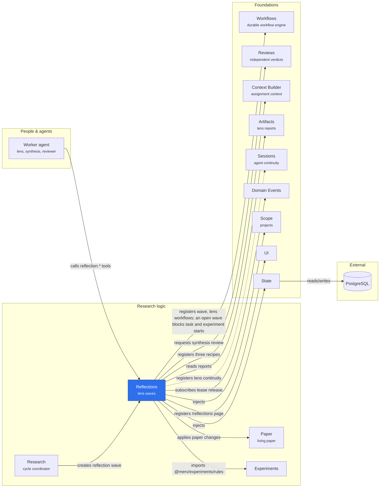

# @merv/reflections

Reflections judges the project's live research. A wave opens five independent lens workflows (evidence, theory, methods, synthesis and next steps), then one synthesis of their reports with a change specification, which an independent reviewer approves or returns. That reviewer also updates the paper's Methods and Results. While a wave is open, new tasks and experiments wait; work already started continues. The pause is the `reflection` definition's `blocksStarts: ['task', 'experiment']`, which Workflows applies to every start, so Reflections calls neither Tasks nor Experiments. See [Reflections over live research](../../docs/REFLECTIONS.md).

## Where it sits

Reflections is the judging step of each research cycle, built from two workflows it registers, `reflection` and `reflection.lens`. Research opens the wave once the cycle's work has finished, and turns the approved change specification into the next cycle's tasks and experiments; the dotted arrow is an optional binding.

## Surface

- `@merv/reflections`: the `reflections` service. It registers `reflection@4` and `reflection.lens@3` with Workflows, the lens, synthesis and review recipes with Context Builder, and the synthesis review owner with Reviews.
- `@merv/reflections/tools`: `reflection.create`, `reflection.list`, `reflection.get`, `reflection.lens`, `reflection.submit_lens`, `reflection.submit` and `reflection.end`.
- `@merv/reflections/ui`: the `/reflections` page, and the open wave at the head of the Running page's work lane.
