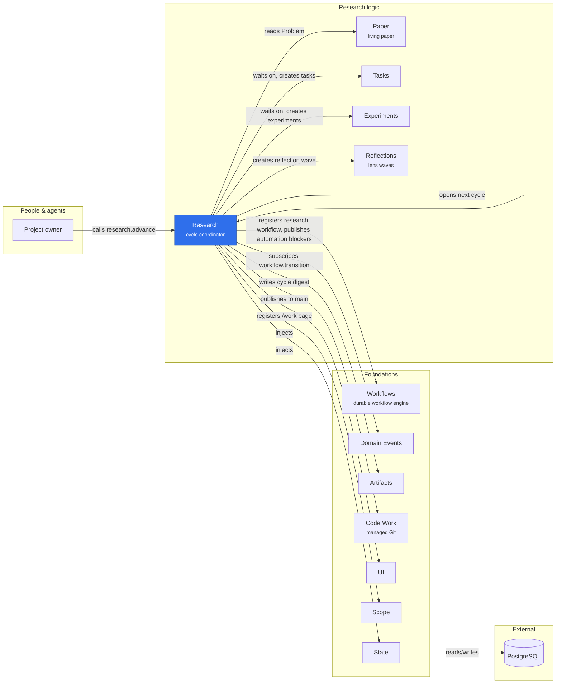

# @merv/research

Research coordinates the outer research cycle over work that other plugins own. A cycle pins the project definition from the paper's Problem, waits for its selected tasks and experiments to finish, and opens a reflection wave. Once the wave is approved, the cycle completes, or first injects one consolidation task that brings its accepted code to main. An approved plan can open the next wave of tasks and experiments and the cycle that waits on them. Research launches no workers. See [Research coordinator](../../docs/RESEARCH.md) and [continuous research](../../docs/CONTINUOUS_RESEARCH.md).

## Where it sits

Research drives the cycle of tasks, experiments and reflections, each of which keeps its own workflow; it registers only `research`. Every plugin it points to is required, and in automatic mode workflow events advance a cycle without the owner.

## Surface

- `@merv/research`: the `research` service. It registers `research@6` with Workflows and subscribes through Domain Events to workflow, code, paper and research events to advance automatic cycles.
- `@merv/research/tools`: `research.create`, `research.list`, `research.get`, `research.lineage`, `research.replan`, `research.end` and `research.advance`.
- `@merv/research/ui`: the `/work` page, framed by its cycle, and the `/research` cycles page. Its part of `ui.home`, which Home and the rail poll, is `research.home`: the open cycles and the newest that ended, so the poll does not grow with every cycle run.
