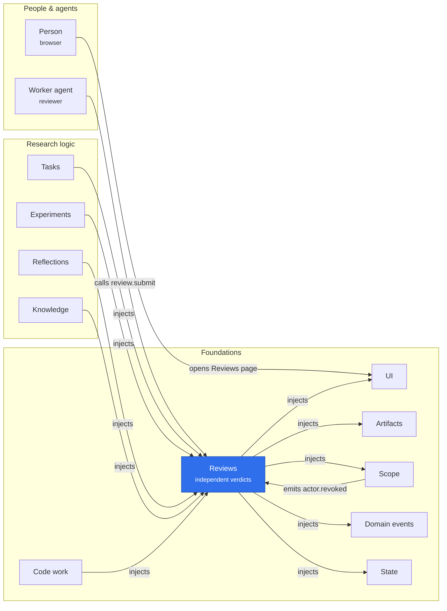

# Reviews

A Cordis service for independent assessment of immutable evidence. Requires `state`, `scope`, `artifacts`, and `domainEvents`; provides `reviews`. It has no dependency on the domains whose work it assesses, nor on workflows.

## Where it sits

Reviews is a foundation the research plugins build on, never the reverse: Tasks, Experiments and Reflections inject it and own how a verdict applies, while a reviewer's `review.submit` lands here first. Scope's `actor.revoked` releases a revoked reviewer's unfinished claims.

A request captures an opaque subject ID/revision, assessment criteria, producer identity, and the exact artifact manifest. `snapshotHash` commits to that snapshot. Artifact IDs resolve to immutable content; the stored manifest preserves the metadata assessed at request time. Output artifacts must belong to the producer; the integrating program explicitly identifies any pinned inputs authored by others. A request also preserves its administrative owner so the authenticated source can administer a worker's submission without replacing its actual author.

`start` checks review permission and producer/reviewer separation, then binds the request to one actor. Repeating a claim by that actor is idempotent. `start` with `override` is the owner override (founder ruling, 2026-09-25): the project's owner — an operator's member actor signed in as themself, never on a key (which agents and workers hold), a worker, a machine actor or an agent's conversation — may claim any requested review past the producer, contributor and directing-authority exclusions. The claim, the row (`owner_override`), both events and every read carry `override: true`; the provenance re-check, criteria, pinned revision and the owning domain's checks still apply, and the owning domain decides which of its own claim rules an owner's claim may skip. `review.get` marks a requested review `overridable` for that person and for their own agent's conversation, which can only propose the claim for the person's Run. `submit` accepts one verdict (`pass`, `needs_changes`, or `fail`) with nonempty notes. A request pins its verdict `formatVersion`: format 2 requires a short synopsis and a numbered finding for each criterion. Met findings cite pinned evidence; waivers record explicit reasons. A pass requires met or waived criteria. Optional structured evidence retains observations and an outcome. Request and verdict operations reject reuse of a request ID with different content. Submitted verdicts and pinned snapshot fields are protected by database triggers.

Methods accept an existing synchronous transaction where relevant. `submit` retains the assessment only. `apply` first authenticates the caller, then finds exactly one active domain owner through `registerSubmitOwner({ id, owns, submit })` and delegates verdict application in the same writer transaction. An owner may add `guidance`, its verdict rules, which `review.start` and `review.get` return with each of its reviews, and `fields`, the extra top-level verdict fields it accepts: Reviews passes them through unread and the owner validates them, while any other unknown field is refused before submission. The domain callback owns its transition and command replay, and its response is returned unchanged. Missing or ambiguous owners are refused before submission, and before a claim: `start` claims only a review exactly one active domain owns; registration changes during selection or submission roll back the operation. Ownership predicates are trusted synchronous metadata callbacks, not a sandbox. No legacy request migration or caller-supplied owner selector is needed.

The optional `reviewToolsPlugin` contributes `review.list`, `review.get`, `review.start`, and the single `review.submit` tool, which calls `apply`. Each owning domain registers its callback from its service lifecycle and withdraws it before its own consumers finish draining, so the generic tool cannot admit new work for that domain during unload. Restoring the domain restores routing without changing stored reviews or successful replay responses. Domains register their own owner without adding dependencies from Reviews to them.

An optional `returnTo` records an explicit return destination with the verdict.
Reviews validates its identifier shape; the owning program validates which
verdicts and destinations are permitted or required. The route participates in
request replay and immutable verdict storage. An owner whose routes are fixed
rejects it. Reads omit the field when absent, preserving old responses.
See [explicit review return paths](../../docs/REVIEW_RETURN_PATHS.md).

The durable `reviews.actor-revoked.v1` consumer releases revoked actors’ unfinished claims. It preserves the review/evidence snapshot, retains claim history, and emits a causal `review.claim_released` event. Unloaded consumers catch up on reactivation. Submitted verdicts remain immutable. `start` returns a fresh `claimId` and generation; `submit` requires that claim ID. Existing started reviews migrate to stable legacy claim IDs. See [the full recovery contract](../../docs/RECOVERY_AND_CONTEXT.md).

Every request uses format 2 (format 1 was retired on 2026-09-22). Reissue preserves the pinned format; recovery preserves the assessment inputs and fences previous claims. See [review assessments](../../docs/REVIEW_ASSESSMENTS.md) for storage, validation, UI/context integration and Python parity.
