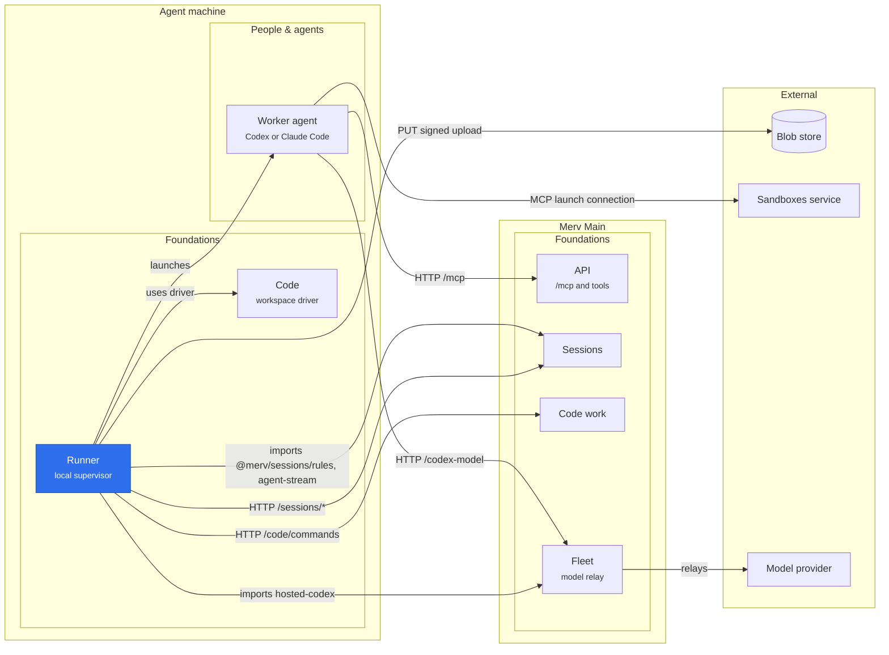

# Runner

The runner turns one Sessions lease into exactly one supervised local agent process, in a workspace a named driver prepared. It keeps that process alive while the session is live and settles each ended launch exactly once. It holds no authority beyond its source (or managed control) bearer. `LocalLedger` and `ProcessHost` run on Darwin and Linux and do not depend on the server's State plugin.

## Where it sits

The runner lives on the agent machine, outside Main's plugin graph: it injects no server service and reaches Main only over HTTP, while the agent it launches calls Merv tools at `/mcp` with the session bearer. Transcripts and conversations go straight to the blob store through the signed uploads Sessions grants.

## Configuration and drivers

The CLI always composes the Code driver (`code.v2`); an older configuration's `workspaceDrivers` key is accepted and ignored. Work whose policy names no driver runs in a scratch directory and needs no Git. The runner itself runs no Git and has no repository of its own: work whose Git policy names no driver is never offered to it, and a configuration naming the removed `workspace` key is refused.

Presence advertises each composed driver as a capability, plus `runner.2`: the runner ignores fields a server adds to lease, settings and session replies (what `runner.1` meant). A managed runner, a work host (`workInstanceId`), advertises only its drivers and `workflow.workhost.1`, because its capabilities must equal its enrolment; it leases only its own work item, one step at a time, and its next step only once the previous one settled, resetting the assignment identity (`resetAssignment`) in between while the step's working directory carries over.

The `WorkspaceDriver` contract owns preparation, capture and close. A driver that runs Code commands also implements `checkpointCommit`, `pendingCommits`, `commitOutcome` and `acknowledgeCommit`; a lifecycle-only driver never polls Code commands, so a policy granting `code.commit` must name a driver that runs them.

## Durable intent and credentials

The private SQLite ledger uses WAL, `synchronous=FULL` and `fullfsync=ON`; its directory is `0700`, its database and logs `0600`. A separate connection holds an exclusive controller lock, which a dead controller releases without blocking guardian updates. The ledger is bound to the server URL, source identity and project, and keeps a random runner ID and a private machine HMAC key. A pending lease request keeps its exact platform from before the HTTP call, and a retry derives the same session secret from its request ID.

Source and session bearers are not stored in the ledger. A launch keeps a projection of its session (never its assignment) and its profile as configured; a profile names secret environment variables but holds none of their values. The source bearer is refused in configuration, in the controller's metadata patches and, by `ProcessHost`, anywhere in a launch command (executable, arguments, cwd, environment, stdin). Command environment and stdin travel only over authenticated local IPC, and the supervisor receives the session bearer, never the source one. Child output redacts the session bearer and recognised secret environment values, including values split across chunks. The machine key and IPC authentication coordinate the runner; they do not isolate hostile processes running as the same OS user.

## Hosted Hugging Face access

After attaching a managed hosted Codex lease, Runner calls the private Sessions
`/huggingface-access` route. It passes the returned temporary capability and
server-configured endpoint only in memory through ProcessHost IPC as `HF_TOKEN`
and `HF_ENDPOINT`. Both inherit into Codex shell commands by name. The capability
is absent from arguments, frozen assignment, configuration, bootstrap and ledger;
supervisor output redaction also covers values split across chunks. Failed access
fetches launch without HF, never falling back to the legacy raw-token route.

The account token stays in Secrets; each proxied request checks current session
and source authority. Agent code can read and misuse its temporary capability,
so redaction is not an exfiltration boundary. Sealed offline reviews, Pi and local
runners receive none. A worker may privately forward its capability to an SSH
process, but it expires with that session. Managed GPU job commands are persisted:
never embed either credential in them. See [Secrets](../secrets/README.md) for
supported operations, revocation limits and the legacy rollout deadline.

## Leasing and cadence

A refusal is `final` when it is a 4xx other than 401, 408 and 429 and its code is not `transaction_conflict` or `invalid_control_response`. A final refusal is that call's answer: it is recorded once and never replayed. Everything else is retried on the next tick. A 401 on a session control is retried, which can loop only while presence still authenticates; a presence or lease 401/403 means the source is revoked and every launch is stopped. A GET 404 is final only because a server answers 503, never 404, while a route's owning plugin is unmounted. One lease request's failure is that request's: later requests and profiles still lease in the same tick.

Presence is sent when its body changes, 15 s after the last success, or after a failed cycle (the server keeps it fresh for 45 s). A declined profile is not asked again for 5 s; a kept request whose answer was lost is always replayed. The session heartbeat is sent only for a slide the server keeps (at least 15 minutes, or any slide to the hard deadline), and the guardian's deadline is pushed only when it grows by over a minute. A managed GET does not reconcile, so a hosted runner learns of any reconcile-driven close (expiry, handoff, a workflow moving on) up to about 60 s later.

An assignment larger than the 800,000-byte command bound (about 0.4–0.7 MB of brief) is released `launch_failed` once and counted; after three a hold forms, until stdin travels by file.

## Launch, restart and proof of death

The ledger records intent before any spawn. A guardian atomically changes `reserved` to `starting` before it creates anything, so duplicate guardians cannot start a second worker, and pins the first command by HMAC; a conflicting replay is refused. One detached guardian owns a private authenticated Unix socket and exactly one child, a group owner that starts the command in its own process group. No process ID is stored. A reservation that no guardian claims within the launch's six-second wait is cancelled by the same SQL predicate.

A guardian that fails before it has an owner (a foreign socket directory, a socket it cannot listen on) ends its claim `stopped` (`socket_failed`), and one whose owner cannot be spawned ends it `exited` (`launch_failed`, 127); a socket file left at its path is removed first. A replacement controller reconnects to a live guardian, which can repair a timeout assessment from its own child's lifecycle. A claimed launch whose guardian cannot be reached stays `uncertain`, keeps its capacity and checkout, and is never respawned, unless it is proven gone:

- **Reboot.** The boot identifier is recorded before the guardian is spawned; a launch claimed in another boot ends `host_rebooted`. An unreadable identifier proves nothing. In a container it is usually the host's, so a container restart with a persisted ledger stays `uncertain` (safe); sandboxes that mint their own (gVisor) prove their own restarts.
- **No pinned command.** A `starting`/`uncertain` launch without one ends `guardian_lost_before_launch` a minute after it was first found unreachable (`lostAt`, since every save rewrites `updated_at`). That is safe because a guardian pins the command before it spawns and cannot pin it on an ended row, and a live guardian with no owner ends the launch itself within 30 s.
- **Anything else** (a guardian killed in the same boot after it pinned its command) needs an operator: confirm that the process group is gone, then end the row by hand.

The group owner enforces its current deadline itself, including when the controller stops polling, and guardian loss also shuts it down: `SIGTERM` to its own group, then `SIGKILL`. Once an owner exists, the guardian records the launch ended only after it has itself group-killed that live, unreaped direct child and observed its exit, checked synchronously with no async boundary ([libuv](https://github.com/nodejs/node/blob/v22.13.1/deps/uv/src/unix/process.c#L101-L174), [process_wrap](https://github.com/nodejs/node/blob/v22.13.1/src/process_wrap.cc#L327-L342), [child_process](https://github.com/nodejs/node/blob/v22.13.1/lib/internal/child_process.js#L269-L295), Node 22.13.1). Keep the guardian free of plugins, async hooks and preloads. The owner's self-cleanup fallback is not a proof. A harness's shell starts jobs in sessions of their own, which a group signal misses: before it signals its group, the owner finds every descendant by parent links (`/proc` on Linux, `ps` elsewhere) and signals them too, so they end before the guardian records the launch ended. On Linux, where `/usr/bin/python3` exists, the owner runs under a small child subreaper that leads its group, so the jobs of an agent that already ended are still found; it reaps them as they end, forwards signals to the owner and exits as the owner did. Elsewhere, or without `ctypes`, such a job, orphaned before the stop, is missed. An owner lost on its own (the OOM killer, say) takes its agent's group and what descends from it with it, and the launch stays `uncertain`. This is supervision, not a sandbox.

## Settling an ended launch

An ended launch owes, in order: one release (its outcome and usage), the capture, owed Code receipts, the workspace result for an attached launch, the closed checkout, and last its transcript. A refused step is recorded and not replayed; a failed one is retried next tick. A launch whose driver is no longer composed is released but not settled, does not occupy capacity, and settles once the driver is back.

**Operators of a runner: every launch's agent output is uploaded to the Merv server's storage as its transcript.** The transcript is one copy of the launch's `stdout.log` for operators ([Sessions](../sessions/README.md#transcripts)), without Claude's partial-message lines (`{"type":"stream_event"…`): the live view reads those from the log, and the whole message is printed after them, so a launch killed mid-message loses that message's partial text. `readTranscript` opens the log without following a link or waiting on a FIFO and keeps it whole up to `MAX_TRANSCRIPT_BYTES` (64 MiB); a longer log keeps its first min(16 MiB, cap/4) bytes and its last bytes, each cut at a line end, around one `{"type":"merv.transcript.truncated","omittedBytes":N}` line. On top of the supervisor's exact scrub it blanks, as `[REDACTED]`, every bearer standing alone (Merv's `mi_`/`mk_`/`ms_` + 43 base64url and `me_`/`mr_` + 64 hex, Pi's and Nisa's `pir_`/`piw_`/`rr_sk_`, and provider keys `sk-…`, `ghp_…`/`github_pat_…`, `AKIA…`; also right after a JSON escape such as `\n`) and the exact source bearer. Other secrets the agent printed (a database URL, a PEM key) are not recognised. A bearer inside URL-encoded text (after `%20` or `%3D`) is not matched; the runner's own bearers are still blanked by the exact sweeps. The result is the same for one log, so a restart derives the same hash. An empty or missing log owes nothing.

- **Declaration**, before each release try: the log is read once and its hash, size, log size and truncation kept in the launch metadata; each release try sends them (no store I/O on the server) so a hosted machine is kept for the upload. A final refusal (a server without the route answers 404 or 403) or an unreadable log is recorded in the metadata and the release goes ahead; nothing here can hold a release.
- **Delivery**, after everything else: each try is one delivery call. Sessions answers stored (recorded, done) or a signed PUT; the log is read again, must hash to the declaration (else `transcript_changed`, no PUT), and the PUT runs in the background, one at a time, with its own headers and no Merv bearer, and a timeout of 60 s plus 1 ms per 128 bytes. The next tick's delivery finds the bytes and records them; a 412 means they were already stored. A failed try waits a minute. Tries are counted in the ledger across restarts; after 10 PUTs one more delivery only confirms, and finds the bytes or ends in `transcript_abandoned`. `stop()` starts no PUT and aborts one in flight, and the next start delivers.
- A launch whose transcript or kept conversation is owed does not occupy capacity; the snapshot's `transcriptPending` says one is owed, and the hosted supervisor waits for it. Final codes are kept in the metadata only; `lastError` shows only retryable ones.

**Continuity.** Only a launch whose session has a continuity key keeps its conversation; every other one runs with `--no-session-persistence` or `--ephemeral`. Claude keeps it in the home that holds its login (`CLAUDE_CONFIG_DIR`, else `~/.claude`). A local Codex launch runs in a home of its own, `codex-home` in its run directory, holding only a link to the machine's `auth.json` (`CODEX_HOME`, else `~/.codex`): Codex also records each thread in its databases and resumes one only where it was recorded. An isolated launch uses `/home/assignment/.codex`, which is wiped before each launch. When a launch whose session has a continuity key ends, before the hosted reset, the runner reads the id the harness printed first (Claude's init `session_id`, Codex's `thread.started` `thread_id`), finds `projects/*/<id>.jsonl` or `sessions/YYYY/MM/DD/rollout-*-<id>.jsonl` (a regular file of the expected owner, no link, at most 64 MiB), blanks every string in it as the transcript is blanked, line by line inside the JSON, and keeps the result as `conversation.jsonl` in the run directory. After every launch, kept or not, nothing of it stays in a shared home: the local Codex home is removed whole, and from Claude's the printed and the restored conversation's `projects/*/<id>.jsonl`, `projects/*/<id>/`, `file-history/<id>` and `session-env/<id>`. The conversation is declared and delivered like the transcript (`conversation_changed`, `conversation_abandoned`). A launch whose session carries `continuity.resume` fetches it through `POST /sessions/:id/resume`, checks its SHA-256, writes it where its harness looks it up (owned by the assignment when isolated) and runs `claude --resume <id>` or `codex exec … resume <id> -`, with the line "You are continuing your earlier work on this unit. Read the current assignment and its context sections: they supersede anything earlier in this conversation (earlier plans, inputs, or feedback you already addressed)." before its prompt. Any failure before the launch (another harness, a failed download, a hash mismatch) launches fresh, records `resumed: {unavailable: <code>}` and logs `resume unavailable: <code>`. A harness that ends having printed no conversation id after one was restored for it, and whose first 64 KiB of `stdout.log` or `stderr.log` says it found none (Codex's "no rollout found", Claude's "No conversation found"), failed to resume: unless the launch was already released, closed remotely or stopped, it is released `preparation_deferred` (`resume_failed`), which nothing counts, and this runner launches that conversation fresh from then on (`resume_failed_before`). Sessions then drops the conversation, so the key's next offer goes to a fresh agent on any machine. Any other ending of a resumed launch is counted as usual.

**Inquiry visits.** A runner advertises `inquiry.1` (a managed runner beside its enrolment's capabilities) and runs a session carrying `inquiry` ([Sessions](../sessions/README.md#inquiries)) as one: sealed like a review of a retained checkout (Codex `--sandbox read-only`, Claude's `Read,Glob,Grep` only, no launch connections, Hugging Face access or internet reads), its conversation restored and resumed with an inquiry's line instead of the work's, and nothing kept: no conversation is declared, and its copy is forgotten as any is. A work visit of its thread may run the same conversation meanwhile in the same Claude home, so Claude forks it (`--fork-session`), the inquiry forgets only its own copy of the restored one (in its cwd's project directory) and the fork, and a work launch keeps its own cwd's copy first. One whose conversation cannot be restored is not launched fresh (a fresh agent would know nothing): it is released `launch_failed` (`inquiry_unresumable`). Its reply closes the session by its own hand (`inquiry_answered`), so the runner stops it as after a handoff, Codex after its minute's grace, and releases with its usage only.

Usage is read from `usage.json` or from the last 1 MiB of the agent's output: Codex's last `turn.completed`, Claude's `result` event. A launch that ends within 10 s is counted `crash_loop`, otherwise `host_failed`, unless its halt named an outcome: a deadline halt is `host_failed`, a failed preparation `workspace_failed` (before attach) or `launch_failed` (after), and a deferred one (`driver_absent`, a driver's own cause) `preparation_deferred`, which nothing counts.

The stop rule: a user-machine runner's `stop()` (Ctrl-C, systemd, an upgrade) releases the launches it ended with no outcome, which closes the session `released` and counts nothing. It flags every unreleased launch before it waits for the current tick, so a launch whose guardian got the same group SIGTERM first is uncounted too, and so is one the user killed by hand whose release was still pending. Hosted (work host) stops, presence or lease 401/403 halts, deadlines, and an agent's own group SIGTERM outside a stop stay counted: `released` has no backoff, so a repeated eviction or a poison 401 would re-offer the same work at once. A hosted Code-driver close that keeps failing holds the machine until Fleet retires it.

## Git workspaces

Every checkout belongs to the driver a policy names, today Code's `code.v2` ([the workspace contract](../../docs/WORKSPACES.md)); it keeps its own tables beside the ledger. The runner keeps only scratch directories, each with a status row in `runner_workspaces`: one per launch, or on a work host one per work item under `assignmentWorkspaceDirectory`, which the configuration accepts only together with `workInstanceId`. A scratch directory is occupied until its launch has provably stopped and been captured, and a launch that finds its path still open under another launch is refused. A work host never meets one, because it runs one launch at a time and capacity counts a launch until its workspace is closed. An existing directory no row records is taken over only when the preceding step of the same work item closed and retained it.

## Runtime resource and tests

`src/supervisor.mjs` holds the dependency-free guardian and group owner; a compiled distribution must copy it beside `process-host.js` (TypeScript does not). `tests/runner-process.test.ts` covers launch deduplication, controller locking, process-tree stop, deadlines, guardian loss and proof of death, and needs permission for Unix sockets and process groups. `tests/runner-lease-path.test.ts`, `runner-settle.test.ts` and `runner-cadence.test.ts` drive the controller against a stand-in server; `tests/runner-workspaces.test.ts` covers scratch and work-host directories.
