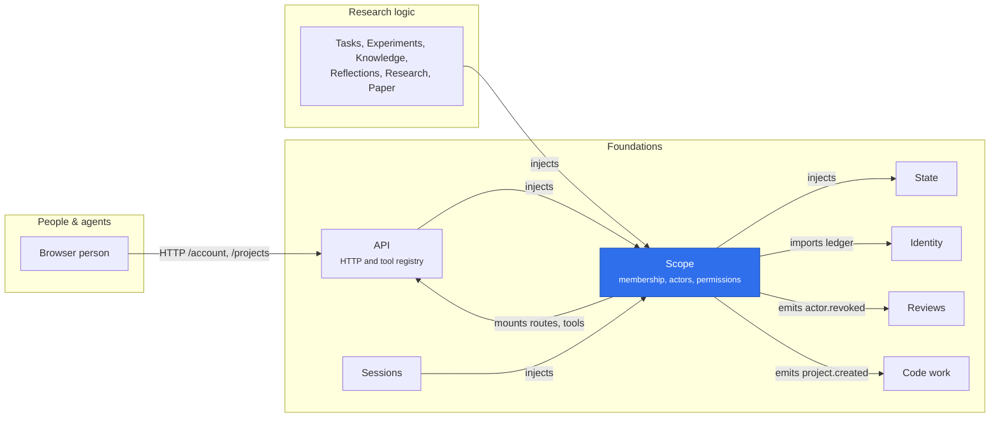

# Scope

Scope owns project membership, actors, actor credentials and user keys, delegation and permissions. Its `toolPolicy` module also owns exact remote-tool grants; session tool enforcement registers with the tool registry instead. Scope injects only State; it does not depend on Sessions, Tools, API or Mounts.

Its adapters publish it: `@merv/scope/tools` and `@merv/scope/api`, which mounts the HTTP routes `/account` (the caller's account and user keys) and `/projects` (projects and memberships) on the API. The browser's Settings → Members page reads these account routes directly; its `/people` compatibility redirect does not require a Scope UI plugin.

## Where it sits



Scope is the authority almost every plugin injects: the API resolves each caller through it, and research logic and Sessions check permissions with it. Its own changes leave as domain events, such as `actor.revoked` for Reviews and `project.created` for Code work.

## Contracts kept on purpose

- **Credential liveness.** Scope's `actor_credentials` and `user_keys` rows are provenance. Identity's credential ledger co-decides whether one is live, and only for a ledger row it records as owned by `scope` with the Scope row's id as subject. A ledger denial surfaces as 401, also inside a permission decision, whose other refusals are 403. Every credential or key revocation (`revokeCredential`, `revokeKey`, and the retirement of a rotated predecessor) also revokes the ledger row (`ledger.ts`); a rotation is refused when the ledger had already revoked its predecessor or never held it. A Scope row whose hash the ledger does not hold never authenticates; boot does not adopt such rows.
- **Bare callers.** A bare `{ actorId, projectId }` names an independent machine or service actor directly. It is trusted in-process authority with that actor's full role and no credential liveness check; transports never build one.
- **Minting limit.** Nothing minted through an expiring actor credential, directly or as a conversation's source, outlives it: `issueActor`, `issueActorCredential` and `rotateCredential` refuse a later or null deadline (`self_expiry_extension`), and an omitted one inherits it. People, bare callers and non-expiring credentials impose no limit.
- **Membership.** Administration names subjects of the operator's own identity issuer only. A role change ends the membership and starts a new one, so every delegation resting on the old one ends. `setAgentRole` trusts its caller to have proven it controls the agent (Sessions checks it). `adoptProject` is a host-authority break-glass for the CLI only.
- **Revoking an actor** deactivates it, which ends every credential of it, and leaves its credential rows as they are.

## Where reads and decisions run

`within` from `@merv/contracts` places each one, in this order:

1. A `tx` the caller passes is used, once asserted.
2. Inside a transaction, a snapshot's open read transaction included, that one is used.
3. A decision with no provider behind it (a person, a key, an actor credential, a bare caller) and a plain lookup read on `state.read`, whatever the permission. They take no writer lock.
4. A decision a provider vouches for (session, conversation, managed runner, service) needs a transaction. A `'read'` decision, and every managed runner's, gets a read-only snapshot transaction: it takes no writer lock, and a provider that tries to write there is refused. Any other permission opens a write transaction, which waits for the writer lock, as does Fleet's `director()` when it checks its review service. Inside a bare `state.snapshot` both kinds get that snapshot's read-only transaction; inside a plain `state.read` the read-only kind gets a read-only snapshot transaction on the read's own connection, and the other a write transaction there.

The listings and caller resolution (`caller`, `projects`, `keys`, `memberships`, `actorCredentials`) run as read decisions do, so outside any scope they take no writer lock, and inside a transaction or snapshot they use it. A repeat `serviceActor` is one read.

## Tool policy

Configure grants on the existing Scope entry:

```json
{
  "id": "scope",
  "name": "@merv/scope",
  "config": {
    "grants": [
      {
        "projectId": "project_example",
        "actorId": "actor_example",
        "mountId": "research",
        "tools": ["search", "paper.get"]
      }
    ]
  }
}
```

Grants default to an empty list. Each exact project/actor/mount/tool combination must be granted, including for operators. Tool names are the raw upstream names, before the mounted prefix is applied; wildcards and role-derived grants are not supported. Grants neither create credentials nor change local project permissions.

`scope.toolPolicy.require()` checks current Scope authority and the grant; `granted()` decides once for a whole listing and answers per mount and tool; an ordinary authentication or permission failure grants nothing, and infrastructure errors propagate. Session callers resolve through their current delegation owner. Revocation and membership changes are checked again on later calls.

Trusted application code can call `scope.toolPolicy.replace(grants)`. Replacement validates and copies the full input before publishing it, so malformed or subsequently mutated inputs cannot change the active grants. Grants remain configuration-backed in memory; reinstalling Scope restores its configured grants rather than runtime replacements.

Session tool calls are admitted by the Sessions provider through the tool registry (`ctx.tools.registerSessionPolicy()`), not through `toolPolicy`. Scope keeps only its session authority slot (`registerSessionAuthority()`), which lets worker actors resolve without a Scope-to-Sessions dependency.

`ToolPolicy` and `ToolGrant` are public types in `@merv/contracts`. The implementation stays in `src/tool-policy.ts` alongside Scope's other internal modules.
