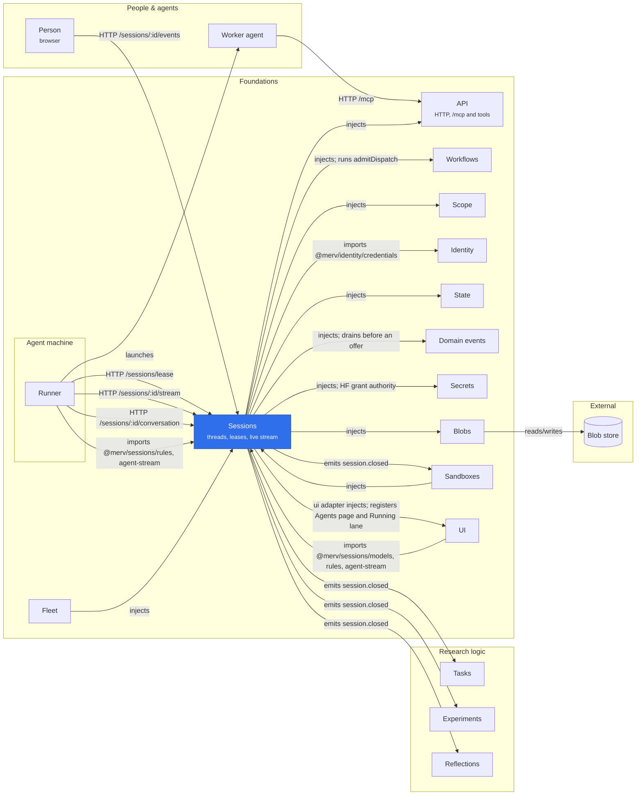

# Sessions

Agent identity, authenticated sessions, and assignment execution lifecycle. The provider injects
`state`, `scope`, `workflows`, `domainEvents` and `blobs`, and registers its session tool policy with `tools` whenever a tool
registry is loaded. It stores [transcripts](#transcripts) and conversations through `blobs`, and is Secrets'
authority for [Hugging Face access](#private-account-credential-delivery) whenever Secrets is loaded. Session and
managed-runner credentials live in Identity's credential store (`@merv/identity/credentials`). What a runner
advertises (`RUNNER_HARNESSES`, the platform and capability schemas, session statuses) is the pure-rules module
`@merv/sessions/rules`, which the runner imports too, as it does `@merv/sessions/agent-stream`: the `AgentEvent` stream, the Claude Code and Codex output readers, and both halves of how Claude Code names a Merv tool (`mcp__merv__…`). The registry refuses session callers while no policy is registered. A policy decision or
prepared invocation belongs to the registration that admitted it: withdrawing or replacing that registration,
even with the same provider, prevents later dispatch, and cleanup still goes to the original provider. A handler
already admitted may finish. Its `@merv/sessions/api` adapter (config row `sessions-api`) injects `sessions` and `api`: it mounts `/sessions` and registers the session (`ms_`, POST `/mcp` only), managed-runner (`mr_`, its control routes only) and enrollment (`me_`) credentials, all withdrawn with it. Its optional `/ui` adapter injects `sessions` and `ui`, and its optional `/tools` adapter injects `sessions` and `tools` for usage, dispatch, observation and session messaging. It launches no processes.

## Where it sits



Sessions is Main's side of every agent machine: the runner leases work, streams the agent's events and declares its conversation over `/sessions`, while the agent calls tools at `/mcp` under the session's policy. A person's page reads the same live stream, and `session.closed` releases the domain leases and compute that named the session. For hosted Codex's model calls, `managed.boundSession` says which session a bearer or session id holds, live or closed by its own handoff; Fleet grants the model, and names the person the calls count toward ([Fleet README](../fleet/README.md)).

The UI adapter's `ui.read` row returns project status without parameters, or agent
activity with `{rowId: 'sessions', params: {agentId}}`. The inspector uses the shared
browser polling hook at four-second intervals, retaining the last successful read
on a refresh failure and pausing further polls while hidden. This read works without
the optional Sessions tools adapter and keeps the same project-reader authorization
and leased-worker denial as the observation HTTP endpoint.

`session.find` resolves a work item's current session. `session.message` queues an operator
message for that session, or for a thread (`threadId`), which its live or next visit reads;
`session.messages` and the worker-only `session.message.ack` retain receipt and an optional
reply, and `session.thread_messages` (`GET /sessions/threads/:id/messages`) reads a thread's.
A worker that needs its owner's decision ends its visit with `session.ask_owner`: uncounted,
its work withheld from dispatch and shown in Needs you until a message to its thread answers. Pending messages are surfaced at the next Merv tool
interaction and fence worker writes until acknowledged. See [session steering](../../docs/SESSION_LEASES.md#steering-an-assigned-agent)
for delivery limits and the distinction between acknowledgment and incorporation.

Every close writes what the session cost to `session_usage`, and budgets only pause automatic dispatch; see [loop limits, usage and budgets](../../docs/BUDGETS_AND_LIMITS.md).

Every thread is opened by an offer, and every session is one visit by a thread. See [threads and their visits](../../docs/AGENT_CONTINUITY.md) for identity semantics and observations.

Workflows owns the fixed policy and generic ownership hooks. Sessions freezes the
assignment, stores only the secret digest, validates source authority, activates
on first accepted MCP use, and closes expired or released workers. Domain plugins
release their exact old handles through durable events. Safe restarts retain the
lease; previously prepared invocations cannot survive a registration replacement.

See [HTTP routes, identity semantics and recovery](../../docs/SESSION_LEASES.md).
Run `npm run test:sessions` from the workspace root. `test:live:sessions` is the
separate real-agent acceptance harness, not a production runner.

[Automatic assignment and project controls](../../docs/RUNNER_CONTROL_PLANE.md) include default-off dispatch, pause/halt, source-bound runner presence, desired platform settings and transactional capacity checks. Workflows supplies metadata-only candidates; Sessions owns durable lease selection and retry receipts. `npm run test:live:dispatch -- /private/tmp/UNIQUE_DIRECTORY` exercises automatic HTTP assignment with two fresh agents.

## Private account credential delivery

Hugging Face access is for a managed machine whose validator says its image brokers it (`huggingFace` on the managed validator; Fleet says so for hosted Codex), and not for a read-only step that keeps its workspace. Every other session receives `{access: null}`.

`POST /sessions/:id/huggingface-access` accepts only `{runnerId, hostRef}` from the managed supervisor bearer. It checks the current allocation, bound project, runner, source, attached host and live workflow lease before resolving an account through Scope. A personal key follows its owner; a service follows its immutable validated voucher. Where an account resolves, Secrets issues `{access: {token, endpoint}}`: a read-only capability for its Hugging Face broker, expiring at the session's hard deadline, never the account token. Sessions binds it to this session, runner, allocation and host in a binding opaque to Secrets, which hands it back to Sessions' one authority check on every broker request. Actor-only sources, sealed offline reviews and a deployment without Secrets receive `{access: null}`. The response uses `Cache-Control: no-store`. There is no corresponding MCP tool or credential field in ordinary session responses.

## Continuity

A **thread** is the worker that owns one stage of one work item for one role; a **session** is one visit by it, with its own lease and credential. When work comes back to a state it was in, the thread that held that state takes it up again with its own conversation, as a new session. Each offer gets `session.continuity.key`: the instance's workflow's registered provider's key (`threads.register(workflow, provider)`, one per workflow; `null` means never), else `[instanceId, state, role]`. The role is part of every key, so a reviewer never continues a producer's conversation, and a reviewer has no key at all: each round is read with fresh eyes.

- `session_threads` holds each thread: its key (`null` without one), the instance, state and role it was opened for, its Scope actor, `status` (`open`, `dormant` or `retired`, with `retired_reason`), the conversation its latest visit declared (`harness`, `conversation_id`, `sha256`, `size`, `uploaded_at` once delivered) and that visit (`latest_session_id`). A key has at most one thread that is not retired; `worker_sessions.thread_id` names each visit's thread.
- An offer whose key's thread is dormant, belongs to the same source and declared a conversation (delivered or still on its way; a runner that cannot fetch it launches the same thread fresh) resumes it: the same actor, from any runner, with `continuity.resume` (`sessionId`, `harness`, `conversationId`, `sha256`, `size`) in the frozen session. Any other thread of the key is retired (`superseded`) and the offer opens a new one with an actor of its own. Fingerprints and replay are unchanged.
- A visit without a key retires its thread at close. One with a key leaves it dormant, with no credential; a close that declared nothing (a lapsed offer, a failed launch, a lost machine) leaves the conversation in place. A close released `preparation_deferred` with cause `resume_failed` (its harness found no conversation to resume) retires the thread (`superseded`) when that is the conversation it was offered, so the key's next offer goes to a new thread, on whatever machine. The sweep retires a thread dormant for 14 days, and one whose live visit's source lost its delegation. Review independence still excludes a resumed thread: it is the same actor, a contributor under every visit.
- `POST /sessions/:id/conversation` declares and delivers the redacted conversation file exactly as a transcript is declared and delivered, to `conversations-<projectId>/<sha256>`, answering `{conversation}`; 409 `conversation_unkept` for a session with no key, `conversation_superseded` once its thread is retired or a later visit holds the conversation. A visit may declare while it is live, while it is the thread's latest, or when it is newer than that one. `POST /sessions/:id/resume` (`runnerId`, `hostRef`, live and attached) answers `{download: {url, expiresAt}}`, a signed GET of the conversation the session resumes. A hosted machine waits for a declared conversation as for a transcript.
- `GET /sessions/threads?instanceId=…` (tool `session.threads`) answers `{threads: ThreadView[]}`: every thread with a visit on the work item, oldest first, each with its visits (`VisitView`: status, offered/started/ended, outcome and close code, whether it launched or resumed, harness, runner, a live visit's liveness, whether it has a conversation to read). Anyone who may read the work item reads it; a leased worker cannot. `GET /sessions/threads/:id/conversation` is an operator's read, as the live stream is: each ended visit's events, from its kept stream (30 days) and otherwise from the end of its stored transcript (a ranged read of its signed download), read into the same events: the newest 500 across visits, at most 2 MB, newest visit first, and nothing more is read once those are spent. A live visit is `from: 'live'` with no events, as a page reads it from `/events`; a visit whose transcript cannot be read just now is `unavailable`, and the rest are still read. The types are in `@merv/sessions/models`.

## Transcripts

The runner that held a session keeps one copy of what the agent process printed, for operators, without Claude's partial-message (`stream_event`) lines ([runner README](../runner/README.md#settling-an-ended-launch)). Its one reader is a thread's conversation read, for a visit whose live stream is gone ([Continuity](#continuity)); there is no other GET, tool, page or event. `POST /sessions/:id/transcript` takes `runnerId`, `hostRef`, `sha256`, `size` (1 byte to `MAX_TRANSCRIPT_BYTES`, 64 MiB), `logBytes` and `truncated` in a body of at most 4 KiB, and answers `{transcript: {sessionId, sha256, size, uploadedAt}}`.

- Only the runner that held the session may call it, live or closed: the source credential with the session's owner and `runnerId`, or the managed runner (`mr_`) bound to it. `hostRef` must be the attached host (409 `host_conflict`).
- Without `deliver`, the call declares the file: the first declaration is recorded in `session_transcripts` and every later one must repeat it (409 `transcript_conflict`). It does no store I/O.
- With `deliver: true`, one HEAD at `transcripts-<projectId>/<sha256>`: bytes of the declared size stamp `uploaded_at` once; nothing stored answers a signed PUT in `upload` (`url`, `headers`, `expiresAt`; 1 h, exact size, SHA-256 checksum, `If-None-Match: *`); another size is 409 `transcript_mismatch`. A stamped row is answered as it is.
- A failed HEAD is 503 `blob_unavailable`, which a runner retries. A store that cannot sign uploads (disk blobs) is 409 `transcripts_unsupported`, and nothing is recorded.

Sessions trusts the runner for the four file facts only; every other column comes from the session it holds. `hostname` is the dispatching runner's presence at declaration (none for a hand offer). The row is write-once: a trigger refuses any delete and any change but the one stamp. Byte-identical transcripts in one project share one object. A caller with the same owner, runner and host could declare first; that is the same trust as a workspace result. Transcripts are kept forever; the per-project prefix allows a per-project purge or lifecycle rule. On AWS S3 the store credential needs `s3:ListBucket`, or a missing key HEADs as 403 and every delivery answers 503 (R2 answers 404). A retirement migration that deletes worker sessions must first delete their `session_transcripts` rows with `session_transcripts_immutable` disabled.

A hosted machine waits for its transcript: while its bound session has a declared transcript with no `uploaded_at`, the managed inspection reports `capturePending`, so Fleet keeps the machine, for at most 30 minutes from the declaration. A capture plus upload longer than that loses the transcript, never the capture. A step halted at its hard deadline has 300 s of `mr_` authority left; a transcript not delivered by then gets 401 and is lost. A runner that declares and then gives up or is refused keeps its allocation for the rest of the 30 minutes unless Fleet sees the machine fail or stop first: it costs machine time and holds a Fleet slot (the project and global limits and the workflow adapter's `maxAgents`), which can delay the next hosted step.

The runner declares before each release try and delivers after the workspace result ([runner README](../runner/README.md#settling-an-ended-launch)). It sends at most 10 PUTs, a minute apart after a failure, and one more delivery call to confirm the last; then it gives up. The runner's own bearers are blanked from the file, but a bearer pattern inside URL-encoded text (after `%20` or `%3D`) is not, so other keys printed that way stay. When the declaration before the release failed and could be retried, the first delivery declares; until then Fleet may see the machine finished and only the transcript is lost.

Operator lookup (the joins hold what the row does not copy):

```sql
-- by task/experiment instance; swap the WHERE for t.runner_id, (t.workflow, t.role), t.agent_id (the thread),
-- t.host_ref, t.sha256, s.actor_id or m.allocation_id
SELECT t.*, s.instance_id, s.revision, s.actor_id, s.owner_hash,
       s.session_json::jsonb->'source' AS source, s.session_json::jsonb#>>'{assignment,label}' AS label,
       s.session_json::jsonb->>'activatedAt' AS activated_at, s.session_json::jsonb->>'closedAt' AS closed_at,
       s.session_json::jsonb->>'closeReason' AS close_reason,
       u.harness, u.model, u.state, u.outcome, u.input_tokens, u.output_tokens, u.wall_ms,
       m.allocation_id, m.epoch, m.runtime_profile_id,
       CASE WHEN m.allocation_id IS NULL THEN 'source' ELSE 'managed' END AS runner_kind,
       h.actor_id AS moved_by, 'transcripts-' || t.project_id || '/' || t.sha256 AS object_key
FROM worker_sessions s JOIN session_transcripts t ON t.session_id = s.id
LEFT JOIN session_usage u ON u.session_id = s.id
LEFT JOIN session_managed_runners m ON m.bound_session_id = s.id
LEFT JOIN wf_history h ON h.instance_id = s.instance_id AND h.revision = s.revision + 1
WHERE s.project_id = $1 AND s.instance_id = $2 ORDER BY s.revision;
-- declared and never confirmed:
--   WHERE t.uploaded_at IS NULL AND t.declared_at < now() - interval '30 min'
-- attached sessions with no transcript:
--   worker_sessions s LEFT JOIN session_transcripts t ON t.session_id = s.id
--   WHERE s.session_json::jsonb->>'hostRef' IS NOT NULL AND t.session_id IS NULL
```

```sh
aws s3 cp --endpoint-url "$MERV_BLOB_ENDPOINT_URL" \
  "s3://$MERV_BLOB_BUCKET/${MERV_BLOB_PREFIX:+$MERV_BLOB_PREFIX/}transcripts-<project_id>/<sha256>" - | tee <session>.jsonl | sha256sum
```
