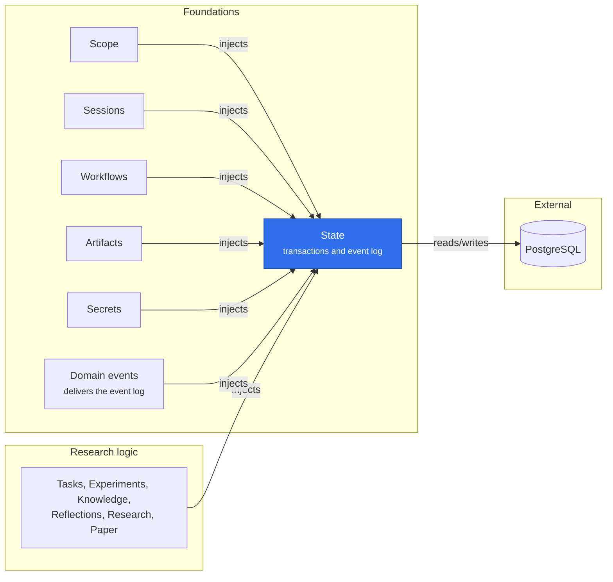

# @merv/state

State opens Merv's PostgreSQL database and provides `state`, the store every durable plugin writes through. Each write transaction takes the schema's advisory writer lock, so writers run one at a time; reads use a separate pool, and `snapshot` gives read-only scopes that never take that lock. Components run their own migrations through `migrate`, and publishers append domain events with `appendEvent` inside the transaction that made the change. It needs no other plugin; the connection string comes from `MERV_DB_URL` and the schema from configuration or `MERV_DB_SCHEMA`.

## Where it sits

State is the one door to PostgreSQL: almost every provider, research logic included, injects it, and the picture shows only a representative set. Publishers append events in their own transactions, and Domain events reads that log back to deliver it to consumers.

## Surface

- `ctx.state`: `transaction`, `read`, `snapshot`, `ambient`, `isolated`, `remember`.
- `migrate(component, migrations)` for each component's schema.
- `appendEvent`, `events`, `latestEvents`, `findEvents`, `eventBatch`, `eventHead` and `onEventsCommitted` for the domain event log. `findEvents` serves a plugin's narrow question of the log (the first event of a type for a subject, a later one of a type, one command's events), so no plugin queries the `events` table itself.
- The `State` and `Transaction` types live in `@merv/contracts`.
