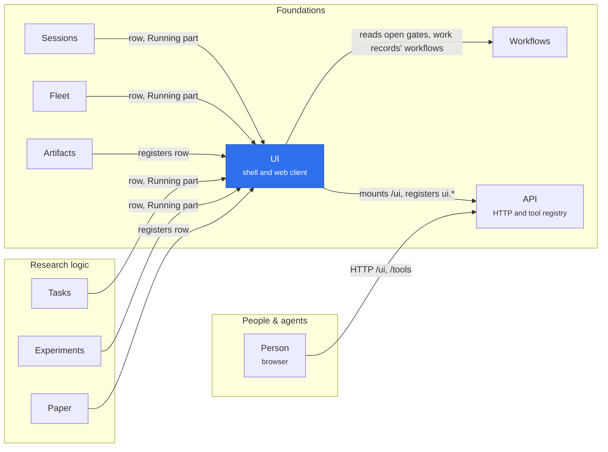

# @merv/ui

UI is the shell every other plugin draws into. Its server plugin keeps a registry of sidebar rows and Running-page parts that feature adapters register, mounts the built web client at `/ui`, and answers the page's own reads through `ui.*` tools. The web client (`web/`) is a React app that calls tools over the same `POST /tools/<name>` endpoint agents use and draws each row's page from its view `kind`. The plugin injects `api` and `tools`, provides `ui`, and is optional in the default composition.

## Where it sits

UI owns no research or work records: research and foundation plugins inject `ui` from their optional `/ui` adapters to add rows and Running parts, and withdraw them when they unload. A person's browser loads the bundle from `/ui` and then reads `ui.shell`, `ui.home` and each row's own tools through the API.

## Surface

- `ctx.ui.register(row)`: a sidebar row with an id, group, order, path and view, and an optional live `status` and `read`; disposing it removes the row at once.
- `ctx.ui.contribute(part)`: one owner's part of the Running page. An owner of work records declares their `workflows`, and a `work:` key's sidebar is asked only of the owner of its record's workflow.
- Tools: `ui.shell`, `ui.home`, `ui.running` and `ui.running_panel`, which no agent conversation is offered, and `ui.read`, which returns a row's data when the row has no domain tool of its own.
- Route: `/ui`, public, serving the built bundle.
- Row: `settings`.
