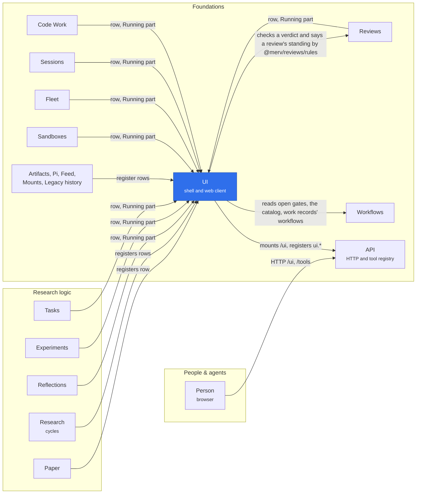

# @merv/ui

UI is the shell every other plugin draws into. Its server plugin keeps a registry of sidebar rows and Running-page parts that feature adapters register, mounts the built web client at `/ui`, and answers the page's own reads through `ui.*` tools. The web client (`web/`) is a React app that calls tools over the same `POST /tools/<name>` endpoint agents use and draws each row's page from its view `kind`. The plugin injects `api` and `tools`, provides `ui`, and is optional in the default composition.

## Where it sits

The server plugin owns no research or work records: research and foundation plugins inject `ui` from their optional `/ui` adapters to add rows and Running parts, and withdraw them when they unload. A row says in its owner's words what the shell would otherwise have to know: how Needs you asks for a move (`needs`) and what a state of its workflow means beyond its deployed definition (`states`: work not yet begun, and what crossing into a review gate says its producer did). The catalog says the rest: a gate is a state left through `review.submit`, and a state a deployed program works in reads as work under way. The web client is not yet free of research: it draws the research pages (Work, Tasks, Experiments, Cycles, Reflections, Paper) from those plugins' `models`, and reads a few of their pure rules (`@merv/experiments/rules`, `@merv/reflections/names`, `@merv/code-work/blockers`). A person's browser loads the bundle from `/ui` and then reads `ui.shell`, `ui.home` and each row's own tools through the API.

## Surface

- `ctx.ui.register(row)`: a sidebar row with an id, group, order, path and view, and an optional live `status` and `read`, and for a row that lists a workflow's records, the owner's `states` words and the workflows its records `holds` (a lens opens on its wave's page); disposing it removes the row at once.
- `ctx.ui.contribute(part)`: one owner's part of the Running page. An owner of work records declares their `workflows`, and a `work:` key's sidebar is asked only of the owner of its record's workflow.
- Tools: `ui.shell`, `ui.home`, `ui.running` and `ui.running_panel`, which no agent conversation is offered, and `ui.read`, which returns a row's data when the row has no domain tool of its own.
- Route: `/ui`, public, serving the built bundle.
- `@merv/ui/manifest`: the remote-row manifest a service outside this process publishes (Sandboxes, Fleet) and the browser renders, as a zod schema and its types; pure, so any unit may run it.
- Row: `settings`.
