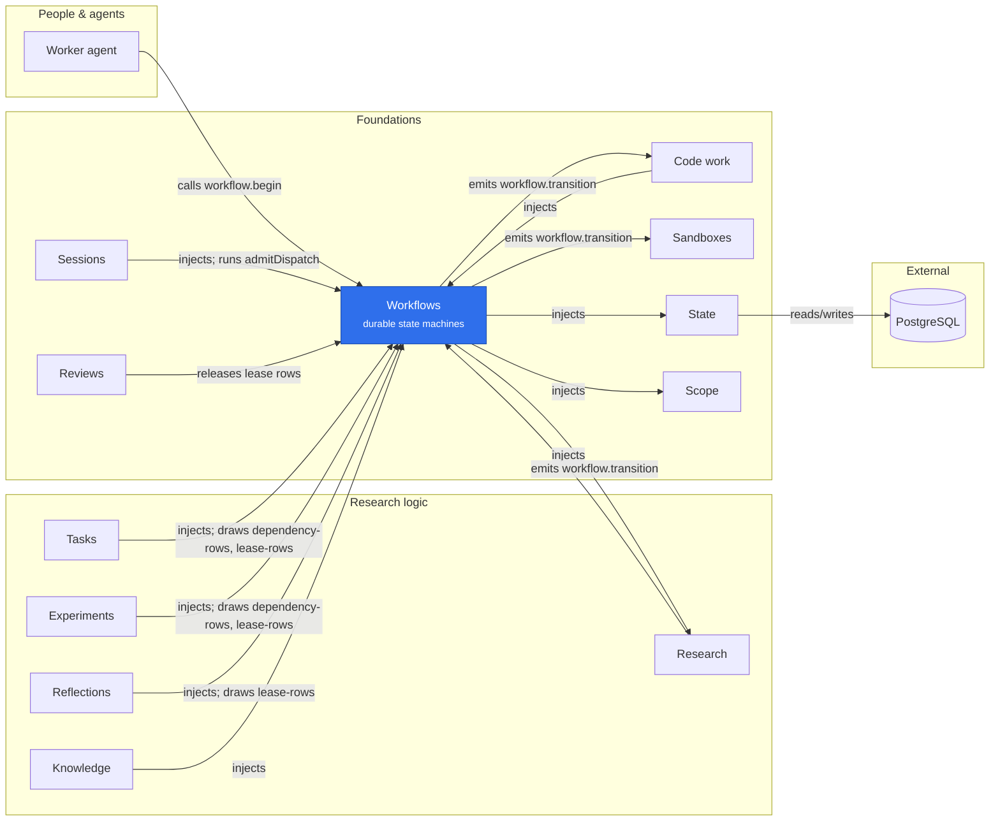

# Workflows

A Cordis service for durable, project-scoped declarative state machines. It depends
only on `state` and `scope`; it has no artifact, review, or task dependencies.

## Where it sits



Programs such as Tasks, Experiments, Reflections and Research register on Workflows and keep their own commands; Sessions leases the work they offer, and agents reach an instance only through the `workflow.*` tools. Every committed move is recorded as `workflow.transition`, which Sandboxes, Code work and Research follow.

Install `workflowsPlugin` after (or before) its providers. Cordis activates it when
both services are available. Its tool adapter exposes six tools:
`workflow.status_and_next` (caller-specific gate guidance, or a project overview),
`workflow.catalog`, `workflow.assignment`, `workflow.process`, `workflow.begin` and
`workflow.extend_limit`. Programs such as Tasks register their checks and retain their
own commands. `get`, `list` and `history` are in-process methods only; no tool exposes
them.

`await register(definition, policy)` registers awaited domain checks, action/tool
descriptions and optional argument/reference builders. `evaluate` returns the
current decision and supports read-only action preflight; `overview` decides every
instance in the caller's project, reading what they wait on in a fixed number of queries
however many there are, and sorts them into `ready`, `blocked`, `stalled`, `escalated`,
`terminal` and `unavailable`. A decision is the reader's own: where the program's
`describe` names the record's `owner` (the actor it belongs to, the actions that are their
move even with nothing refused, with the sentence asking each, and those only a leased worker
makes), a decision read by that owner carries `yours`, the rule Needs you draws by: their
input is wanted, a prerequisite ended without succeeding, or an ask of theirs is held open on a
step nobody else began. `process` draws one instance's graph with the traversals its
history records; a version whose program is not loaded is drawn from its pinned graph, with
no status on any edge. A supplied policy must guard every graph edge.
A policy may also declare `limits` on its loop edges: they are deployed policy rather than
fingerprinted graph, are counted from history, refuse the capped edge at commit with
`loop_limit_reached`, and are raised for one instance by `extendLimit`
([loop limits](../../docs/BUDGETS_AND_LIMITS.md)). Its optional `children` callback names
instances it fans out to without a dependency edge, which `dependencyClosure` and
`sponsoringRoots` union in. It is asked for many instances of its version at once, as
instance id to child ids, on behalf of no caller.
The same checks run before a transition commits. See [the complete contract,
task integration and lifecycle behavior](../../docs/WORKFLOW_GUIDANCE.md).

## Installing a program

```ts
import type { Context } from 'cordis';
import '@merv/contracts';

export const approvalProgram = {
  name: 'approval-program',
  inject: ['workflows'],
  async apply(ctx: Context) {
    await ctx.effect(async function* () {
      const program = await ctx.workflows.register({
        name: 'approval',
        version: 1,
        initial: 'draft',
        states: ['draft', 'done'],
        terminal: ['done'],
        edges: [{ from: 'draft', action: 'accept', to: 'done' }],
      });
      yield () => program.dispose();
      // Register program commands that perform domain checks, then use
      // await program.start(caller, input, tx) / await program.transition(caller, input, tx).
    });
  },
};
```

The registration handle is the only way to start, move or compose an instance, and it owns
exactly one name/version: a command naming another workflow or version, or an instance of
one, is refused with 403 `workflow_handle_mismatch`. Every graph is therefore managed: a
definition may say `managed: true` or nothing, and is stored with `managed: true`, so
published digests are unchanged. A handle's commands validate project access (`read`); the
program must authorize its specific action (for example `write` or `review`).

## Durability

- A definition keeps only each edge's `from`, `action` and `to`. Edges may not use the
  actions the engine records itself (`start`, `add_dependencies`, `replan_dependencies`),
  and a graph may have at most 256 states and 2,048 edges.
- A name/version has a persisted fingerprint. Changed graph definitions must use
  a new version, including after restart. An instance stays on the version it started on.
- A version's stored definition, success states and execution policies are immutable: the
  database refuses an UPDATE or DELETE of any of them. The service therefore loads them all
  at startup and keeps them. It reads a version it does not hold, such as one another service
  registered later, only once, unless that version still lacks its success row or an
  execution row for a nonterminal state, which a later registration would add.
- A definition's `blocksStarts` names workflows that may not start while any instance of that
  version, loaded or not, is in one of its nonterminal states (`workflow_creation_paused`). The
  check reads only instances in those states, through an index, so ended ones cost nothing, and
  a version with no nonterminal state pauses nothing.
- Starting without a version chooses the latest installed version. Retrying that
  request returns the original response even if a newer version was installed.
- Start data, transition data and input, and preflight input are each a JSON object of
  at most 256,000 encoded characters, 16,000 values and 32 levels of nesting; anything
  larger is `invalid_data` 400. The merged instance data is not capped.
- Request IDs are scoped to the project. Reuse requires identical actor and command
  content; replay returns the original snapshot, not the current instance state.
- Every mutation commits instance state, command response, history, and its durable
  event together. Revision mismatches fail without creating a command response.
- A `workflow.transition` event carries, besides the move, whether it left the instance in
  a terminal state (`terminal`) and in one of its version's success states (`settled`), so a
  consumer that acts only on ended work reads nothing for any other move. Events recorded
  before these fields existed lack them and are never rewritten.
- Pass a State-owned active `Transaction` to combine workflow changes with another
  component's records. Await every operation, including domain callbacks, before the transaction returns.
- Registration disposal stops new execution of its graph. It does not delete
  definitions, instances, history, or request receipts. Reads remain available;
  reinstalling the same version resumes operations. Explicit old handles stay invalid.

## Retired versions

A version that no current flow can start is retired: its program stops registering it and a
migration deletes its instances with every row keyed by them. The 2026-09-22 retirement
(task@1, experiment@1–4, reflection@1–2 and lens@1, research@2–5, consolidation, evidence
version 1, review format 1 and the `experiment.plan@1` recipe) also removed the engine's
`upgrade` primitive, which only task@1 used. On 2026-09-25 the `experiment.plan` task type went
the same way (workflows migration 8 deletes its task instances). The definition, success and
execution-policy rows of a retired version stay as history.

Workflows owns the ledger of that retirement, `wf_retired_instances` (id, project, workflow,
version, reason). Every component migration that deletes retired records first runs the shared
snippet in `@merv/workflows/retired-instances`, which fills the ledger insert-only; whichever
runs first captures the whole set while its inputs still exist, and the rest read it. A guard
refuses any update or delete of it, because once `wf_instances` has lost the retired rows the
set could not be computed again. The ledger is kept permanently: it explains the ids the
`events` log still names, which is never rewritten. The snippet then refuses the release while
deleting the set would strand a surviving record: a live session of a retired instance, a
surviving research cycle staged on a retired wave, a format 1 review of a survivor, or graph
evidence of a surviving experiment. Every retirement migration runs it before its deletes, so
the first to run refuses before any component commits and the previous image still boots. The
snippet's text is embedded in published migrations and may not change.

The engine does not yet implement child graphs, automatic effects or timers.
Programs can coordinate domain work through one caller-owned transaction.

## Dependencies between work items

The service also owns project-scoped dependency edges. Programs declare durable
`successStates` in policy and can pass `dependsOn` at start. The first registration
of a version pins its success states, or their absence; a later registration that
adds, drops or changes them is `workflow_version_conflict`. `prerequisites` returns the
live forward rows, and `records` both directions, each with its revision and whether it is
`settled`, `terminal` (ended, as a fact) or `failed` (ended in a way that fails the
dependent; a provider's edge never is). `ends` says the same `settled` and `failed` of a
record itself, from its pinned contract, so an owner sends them on its records and no page
reads an end from a state name. `requireDependencies`, a pure rule in
`@merv/workflows/rules`, is the shared prerequisite guard over them. Guidance, the guard and
transitions read only what an instance depends on, in a fixed number of queries; what depends
on it is read only when asked for. Attaching at start never walks the graph, because the new
id cannot be reached; `addDependencies` and a provider's `replace` refuse a cycle with one
recursive query, after every named target has been found and checked in the order given.
One call names at most 1,000 distinct ids (`invalid_dependencies` otherwise).
Only actions with `requiresDependencies: true` enforce that guard automatically.
Programs call it for assignment/execution gates as needed. A policy may name an
authorized `dependencyFailureAction`; this changes guidance, never state.

Private registration handles support additive, revision-fenced `addDependencies`
for transactional program composition. Edges reject cycles and cross-project
references and pin the target’s success contract. Legacy workflow definitions,
receipts and graph versions remain unchanged. See [the full behavior and limits](../../docs/WORK_ITEM_DEPENDENCIES.md).

## Assignments and first starts

Programs register per-state assignment checks and builders alongside action rules. `assignment` is read-only; `begin` rechecks admission and current revision, records the first activation and returns the complete packet in one transaction. Guidance exposes a preflightable begin action without rendering context. `workStarts` provides scoped durable history across program unload; begin itself does not transition or claim work. See [the integrated contract](../../docs/WORKFLOW_ASSIGNMENT_PLAN.md).

## Fixed execution declarations

Assignment rules may also declare a fixed `execution` policy and a metadata-only
`references` resolver. A lease offer returns both, resolved for its worker, and an
assignment shows the policy with its hash and registration generation; tool calls are
admitted against the offered execution only (see below). Policy hashes are pinned per
version and state, including explicit absence. Registration generations fence
unload/reload and restart. None of this creates session credentials or restricts
ordinary keys. See [the contract](../../docs/WORKFLOW_EXECUTION.md). Programs build a
policy's argument bindings with `target`, `reference`, `literal` and `grant` from
`@merv/workflows/rules`. `CheckedTransitions`, from the same module, lets a command that
already ran an action's guard take that transition without the guard running a second time.

## Leased execution

`dispatchCandidates(source, tx?, worker?)` discovers eligible leased assignments using
source/domain admission and metadata only. It checks prerequisite and recipe
availability without rendering prompts, resolving reference values or recording
work starting. Sessions still rechecks the selected revision before reservation.
Read-only work sorts first. An optional `lease.label` callback supplies a small
queue label without calling the assignment builder, and `lease.excludes` drops an
instance the named `worker` would be refused. It reads the instances at leasable steps,
their limits and their prerequisites in a fixed number of statements however many there
are. `role`, `label` and `excludes` share one frozen context per instance, prerequisites
included. A refusal (403, 404, 409, 503) skips the instance; one recheck after every
instance fails the scan if any callback changed a candidate instance, refused or not.

An assignment's fixed `execution.workspace` declaration specifies scratch,
ephemeral or persistent checkout intent. Omission preserves old policy hashes
and means scratch through `effectiveWorkspace()` from Contracts. Workspace
provisioning and reference resolution belong to the future machine runner.
See [the scheduling and workspace contract](../../docs/RUNNER_CONTROL_PLANE.md).

Programs can supply generic assignment lease hooks to acquire, check and release
their own ownership records. `offerLease` returns a frozen assignment, execution
policy and opaque receipt. `activateLease` records first-start using metadata only.
`checkLease` admits a durable lease against the current installed generation and
returns that generation's id. Given the execution the lease was offered, it also fences
that execution against the lease, its policy by content, and returns the references it
grants now: the frozen ones, extended only in declared arrays by the lease's own
`outputs`. Sessions fences each invocation's generation with the id and admits the tool
call: `admitDispatch` from `@merv/workflows/execution` (pure rules) applies the declared
bindings, and Sessions leaves a
read open where they do not bind it. A lease step runs the step's `check` and
`lease.check`, never `references`: the offer froze those, so a refusal that must end a
live lease belongs in one of the two checks. Sessions owns credentials,
expiry and source authority; Workflows still has no dependency on Sessions, Tasks,
Reviews or artifact storage. See [the integrated contract](../../docs/SESSION_LEASES.md).

## Conventions

**Authority.** A caller method authorizes its caller through Scope once, at entry: reads
need `read`; a handle's commands need `read`, and the program authorizes the action itself;
`extendLimit` needs `admin`. The trusted provider seams (`replaceBlockers`,
`systemPrerequisites(provider).replace`, `relations`, `sponsoringRoots`) take a
`projectId` and the caller's `tx` and authorize no caller: only in-process code reaches
them. `pinned` reads a version's frozen contract, which is no project's data, so it takes no
caller either. A lease step authorizes its worker at entry. No decision is repeated after the
callbacks, so a callback that revokes its own caller goes unnoticed; only
`dispatchCandidates` and `offerLease` authorize their source again once every callback has
run, and roll back if it was revoked.

**Transactions.** Every caller method places itself by one rule, `within` from
`@merv/contracts`. A `tx` given is asserted to belong to State and used. Without one, the
method joins the transaction its caller is already in (`state.ambient`). Outside any, a read
runs in a read-only snapshot transaction of its own and so never waits for the writer lock,
and a command (a handle's, `begin`, `extendLimit` and the lease offer, activation and
release) opens a write transaction. Inside a bare `state.snapshot` both are read-only;
inside a plain `state.read` both run on the read's own connection. The trusted provider
seams require the caller's `tx`.

**Callbacks.** Every program callback (guards, `describe`, lease hooks, builders) is
awaited in the engine's transaction and must not write to `wf_instances`: after each
group of callbacks the engine rereads the instance's stored `revision`, `state`,
`data_json` and `updated_at` and refuses the call as `invalid_workflow_policy` 500 if any
differs from what it read before them, even equal data in other bytes (a rewrite of the
same bytes is not seen). It then checks that the registration is still installed. Under a
snapshot it skips the reread, because State refuses every write there.
A guard's refusal is read as a blocker; a State fault (`read_only_scope`,
`nested_transaction`, `invalid_transaction`, `invalid_sql_parameters`, `transaction_*`,
`state_*`) never is, and a write under a read is `invalid_workflow_policy` 500.

**Batch reads.** A read that decides many instances at once (guidance and the overview
behind Home, the dispatch scan) first calls each version's optional `prepare` once with all
of its instances there (in parts of 1,000; a version with one instance is left to its
callbacks). The program reads in one pass what its callbacks will ask of each and keeps it
where they look (`state.remember`): Tasks reads every task row and which revisions a worker
holds in two reads. `prepare` only spares reads and never answers: its refusal is passed
over, each instance's callbacks still decide, and transitions never call it.

**Lease hooks.** `lease.role` answers for the source, at discovery and at offer, whether
the node may be leased now and which role its worker needs; it never runs once a lease
exists. `lease.check` answers for the worker, at offer and on every admission for the
lease's life, whether the program's reservation (its receipt) still holds. Source
admission belongs in `role`, reservation validity in `check`. `lease.release` runs only
while the program is loaded: Sessions calls `releaseLease` when it closes a session, as a
best effort.

**Lease rows.** Every leased step's lease is one `wf_leases` row (workflows@12), whatever
program owns the step: the step (instance, revision, workflow and state), the worker and
its source, the review claim it took, its exact receipt, and `details`, what the program
pinned with it. `@merv/workflows/lease-rows` is the one way to it: a program's `acquire`
writes its row with `insertLease`, reads it back with `leaseRows`, holds it by its receipt
with `checkReceipt` and releases it with `releasedLease`. `reviewedLeaseHooks` builds the
hooks of a step that is work or the review of it, all but who may hold it, what it pins and
which review it claims being the same for every owner: a worker the review excludes is
never offered it, a review lease holds only by the claim it took at the revision it pinned,
the outputs are what the worker made, and a release returns the claim. The row's provenance is immutable
and it is never deleted; only `released_at` is written. A release also returns the review
claim the lease took. Reviews releases every lease durably from one `session.closed`
consumer, `reviews.lease-release.v1` (`leaseReleaseConsumer` here): a session's id is its
lease's id, so the release needs neither the registration nor the receipt, and happens
whether or not the owning program is loaded. Tasks, Experiments and Reflections moved their
own lease tables into it (tasks@10, experiment_program@4, reflections@5).

**Dependencies.** A dependency's `failed` is a gating fact: a declared edge whose target
ended outside its pinned success states fails its dependent. A system edge, which a
provider owns, always reads `failed: false`, because its provider replans it. A handle's
`addDependencies` is a command: it records history and bumps the revision, so a lease
pinned to the old revision ends. A provider's system edges bump nothing.
`relations` hands a provider one instance, with its data, and both directions of its edges;
the instance has no edge to judge it by, so its `failed` says it ended outside success. Each
also says whether its version declares a workspace, read from the pinned manifests, so the
answer holds while the owning program is unloaded. A snapshot reads each instance's
relations once, and so does a write transaction until it writes; each caller gets a copy.

**System reads.** Other plugins read instances and history through these, not by SQL of
their own. `open` lists a workflow's
unended instances, `revisions` says where several instances stand without their data,
`movedBy` names who made a move and `moves` counts the moves of one action whose recorded
data names a value: each runs in the caller's `tx` and authorizes no caller.

**Blockers.** A provider's blockers stay on an instance across non-terminal moves until
the provider replaces them; they are cleared when the instance reaches a terminal state.
A blocker's optional `cause` is the provider's machine word for which kind of its code it is;
Workflows stores and returns it unread, so readers never parse the message.

**`dependencyClosure`** walks level by level, with a fixed number of reads per level and
one `children` call per declaring version and 1,000 of its instances, at most 5,000
instances, and refuses a larger closure with `closure_too_large` 409 rather than return part
of it. `sponsoringRoots` asks `children` only of the versions that declare it, in the same
batches.

**Read schema.** Other components may read these columns directly and nothing else:
`wf_instances(id, project_id, workflow, version, state, revision, data_json, created_at,
updated_at)` and `wf_history(instance_id, project_id, revision, action, actor_id,
request_id, from_state, to_state, data_json, created_at)`. `data_json` of an instance is
its merged data. `data_json` of a history row depends on its action: the start data for
`start`, the delta a transition merged for a program action, and `{dependsOn, dropped}`
for `add_dependencies` and `replan_dependencies`, which leave the instance data unchanged.
Only the engine writes either table.
