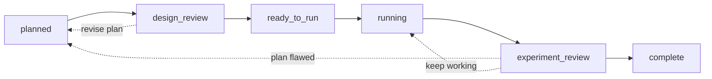
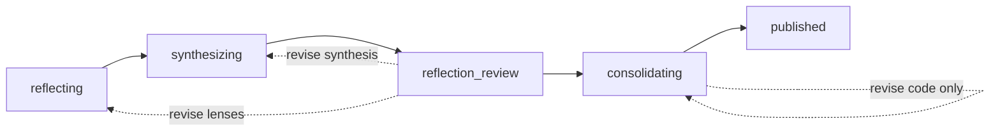

# Merv

Merv gives agentic coding clients (Claude Code, Codex, GitHub Copilot CLI,
Cursor, Gemini CLI, Qwen Code, OpenCode, Kilo, Hermes Agent, OpenHands, Replit Agent) a shared state machine
for machine learning research: claims, experiments, submitted artifacts, review
gates, reflection waves, and sandboxed execution. A brain running locally or
as a hosted service owns durable research state; every agent client connects
directly to the brain's `POST /mcp` HTTP endpoint, authenticated by a
short-lived OAuth access token or, for headless automation, a scoped static
key. The brain never receives the checkout root or reads it directly; gated
documents are explicitly uploaded as size-capped artifacts.

## Get started

Interactive users do not need this repository, Python, or a Merv key. Install
the plugin or extension and complete browser OAuth:

```bash
# Codex
codex plugin marketplace add rapidreview-io/Merv
codex plugin add merv@rapidreview
codex mcp login merv

# GitHub Copilot CLI (then run /mcp auth merv inside Copilot)
copilot plugin marketplace add rapidreview-io/Merv
copilot plugin install merv@rapidreview

# Claude Code
claude plugin marketplace add rapidreview-io/Merv
claude plugin install merv@rapidreview
claude mcp login plugin:merv:merv

# Gemini CLI (then run /mcp auth merv inside Gemini)
gemini extensions install https://github.com/rapidreview-io/Merv \
  --ref merv-client --auto-update

# Qwen Code (then open /mcp inside Qwen and sign in to Merv)
qwen extensions install rapidreview-io/Merv --ref=merv-client

# Cursor (then install merv from rapidreview in /plugin and Connect in Customize)
cursor-agent plugin marketplace add https://github.com/rapidreview-io/Merv

# Kilo Code
kilo plugin 'github:rapidreview-io/Merv#merv-client' --global
kilo mcp auth merv

# Hermes Agent
hermes plugins install rapidreview-io/merv-hermes-client --enable
hermes mcp add merv --url https://experiments.rapidreview.io/mcp --auth oauth
```

Claude users should enable auto-update for the RapidReview marketplace once in
`/plugin`; Gemini's install flag enables it immediately. Codex custom
marketplaces update with `codex plugin marketplace upgrade rapidreview`
followed by `codex plugin add merv@rapidreview`. Copilot updates with
`copilot plugin update merv@rapidreview`; Qwen prompts when its tracked branch
changes and updates with `qwen extensions update merv`. Cursor's individual custom
marketplace currently requires an interactive install and has no documented
automatic-update guarantee. Kilo updates skills at session start; run `/reload`
to update the current session. Hermes updates with
`hermes plugins update merv` when Merv announces an update.

Clone the repository only for self-hosting or client development:

```bash
git clone https://github.com/rapidreview-io/Merv.git ~/Merv
```

Every client connects directly to the brain's `/mcp` HTTP endpoint, so nothing
runs on the machine to broker it. Open a research repository and start a
session:

```text
Use Merv. Start with project(action="list"), pick the project, then
workflow.status_and_next(project_id).
```

The committed platform manifests contain only the hosted URL. The client's MCP
OAuth implementation discovers Merv's authorization endpoints, opens the
browser, stores the resulting token, and refreshes it automatically. Static
keys are documented separately for headless runners and CI in
[docs/AUTH.md](docs/AUTH.md#when-a-static-key-is-still-required).

### Hermes Agent

```bash
hermes plugins install rapidreview-io/merv-hermes-client --enable
hermes mcp add merv --url https://experiments.rapidreview.io/mcp --auth oauth
```

The generated plugin installs the canonical skills. Update it with
`hermes plugins update merv`. See
[docs/CLIENTS.md](docs/CLIENTS.md#use-with-hermes-agent) for runner and reviewer
setup.

## How work moves

Experiments move forward through two review gates; a rejected review sends the
work back (dashed):



Reflections distill what the project has learned, behind one gate of their own:



Merv can dispatch a reviewed experiment wave into separate local coding-agent
sessions. Configure any number of named platforms in the private machine file
`~/.merv/client.json`. Native process adapters cover Codex, Claude Code, Gemini
CLI, Cursor Agent, OpenCode, GitHub Copilot CLI, Qwen Code, and Hermes
Agent. The `command` adapter covers a custom executable that accepts its
instruction on stdin and emits a JSONL interaction stream on stdout:

```bash
# Guided: installs, prints an 8-character pairing code, dispatches once an
# owner approves it on the Auto-run page.
curl -fsSL https://rapidreview.io/merv/runner/install.sh | sh

# Headless: install without pairing, export MERV_MCP_KEY, name the project.
curl -fsSL https://rapidreview.io/merv/runner/install.sh | sh -s -- --install-only
$HOME/.merv/bin/merv-agent-runner --project proj_123
```

The provider-independent installer downloads the generated runner archive,
verifies its SHA-256 checksum, installs it under `~/.merv`, and starts the
runner. An unpaired runner generates its own `mk_` key, sends only its digest,
and prints a code; approving that code on the Auto-run page registers
the key for the project. It requires Python 3.11+ and Git, but no Merv
repository clone or Merv package, and works identically on a remote machine
because the browser never addresses it. Rerun the same command to update it;
`merv-agent-runner pair` re-pairs an installed machine.

Automatic dispatch is off by default and is a per-project setting, so a running
runner claims nothing until the project turns it on in Settings. Turning it back
off stops new claims; sessions already running continue until you stop them from
the same page, which ends their agent processes and keeps their committed work.

Codex and Claude Code receive only Merv's session-scoped MCP server. Other
platforms invoke the same scoped tools through
`merv-client call TOOL --arguments JSON`; the session key remains in the
environment and is never placed on the command line.

The runner holds the ordinary project/account key. Each child gets a separate,
short-lived session key only through `MERV_AGENT_SESSION_KEY`; the key never
appears in the child prompt, argv, settings, or logs. Merv owns assignment,
leases, and recovery while each platform supplies only the local process.
For every auto-run session, the runner creates
`~/.merv/agent-traces/<merv-agent-session-id>/`. `metadata.json` contains
exactly one immutable work-item snapshot and one sanitized harness/model setup;
`trace.jsonl` contains the provider's native event stream, and `stderr.log`
keeps diagnostics separate so they cannot corrupt the JSONL. Hermes writes the
same `trace.jsonl` through its post-run session export. These files stay on the
client machine and are never created for interactive, non-auto-run sessions;
the runner mirrors only a bounded, redacted excerpt (last events + stderr tail)
so the Auto-run job card can show what a job is doing.
The runner initializes a Merv-owned bare repository and central ref, then keeps
one persistent branch/worktree per experiment. Reflection approval dispatches a
separate consolidator and code reviewer; the runner alone advances central
after review. Temporary reviewer worktrees are removed, while experiment and
consolidation worktrees remain recoverable. The private bare clone has no
remotes and never pushes into the user's repository. Worktrees isolate Git
changes, not same-user filesystem access; use an OS sandbox for hostile agents.

Provider sign-in (`codex login`, signing in to `claude`, a provider API key)
happens once on the machine, as the user that runs the runner; Merv never
holds it. The runner notices a sign-in signal, runs one small test call
through each enabled agent (first run, when an agent is enabled, or on
**Test** in the page) — a real turn that calls Merv's `project` tool and
answers with the project id — and reads a dead child's stderr for the
provider's own refusal, so the page's per-agent ladder (installed → signed in
→ Merv skills → test call) says what to run on which machine.

The Auto-run page (each machine's drawer) edits a paired runner's tuning
through the brain:
which native platforms are enabled, their model, effort, and parallelism, and
the repository, worktree root, and base ref. The runner reports its non-secret
inventory on every heartbeat and pulls the desired settings back on the same
call, applying them in place; the page shows *Settings pending* until the
machine reports the version applied. Executable commands and custom
`command`-adapter agents stay in `client.json` on the machine (`merv-client
agent`); the brain neither stores nor sends argv.

Agent-authored evidence is kept in regular repo files. The brain records their
relative paths and versions and pins selected submitted bytes for gates and
review. System metrics exhibits and optional heavy storage objects are separate
brain-managed artifacts.

## Running a local brain (optional)

For development, or to keep all state on your machine:

```bash
cd /path/to/merv
python3 -m venv .venv && .venv/bin/pip install -r requirements.txt
./bin/merv-http --host 127.0.0.1 --port 8787
bin/merv-client configure --control-url http://127.0.0.1:8787
```

Sandbox provider credentials (Lambda Labs by default; Thunder, Modal, and a
fake test backend via `MERV_EXECUTION_BACKEND`) belong to the brain
process only — see `.env.example`. Startup details:
[docs/STARTUP_CHEATSHEET.md](docs/STARTUP_CHEATSHEET.md).

## Tests

```bash
PYTHONPATH=src .venv/bin/python -m unittest discover -s tests
```

Set `MERV_EXECUTION_BACKEND=fake` to keep tests and local workflows
off cloud providers.

## Documentation

- [docs/CLIENTS.md](docs/CLIENTS.md) - per-client install and reviewer handoff
- [docs/HOSTED_CLIENT_QUICKSTART.md](docs/HOSTED_CLIENT_QUICKSTART.md) - hosted setup
- [docs/AUTH.md](docs/AUTH.md) - hosted authentication and project membership
- [docs/STARTUP_CHEATSHEET.md](docs/STARTUP_CHEATSHEET.md) - local startup flow
- [docs/ARCHITECTURE.md](docs/ARCHITECTURE.md) - backend and mode architecture
- [docs/MODULE_BOUNDARIES.md](docs/MODULE_BOUNDARIES.md) - enforced backend dependency law
- [docs/MCP_SERVER_CONTRACT.md](docs/MCP_SERVER_CONTRACT.md) - MCP tools and contracts
- [docs/WORKFLOW_AND_REVIEW.md](docs/WORKFLOW_AND_REVIEW.md) - workflow gates and reviews
- [docs/REVIEW_IDENTITY.md](docs/REVIEW_IDENTITY.md) - reviewer session and capability boundary
- [docs/AGENT_IDENTITY.md](docs/AGENT_IDENTITY.md) - per-context-window `agent_id`, attributed tool-call ledger, and payload traces
- [src/merv/brain/artifacts/artifacts.md](src/merv/brain/artifacts/artifacts.md) - submitted-artifact lifecycle
- [src/merv/brain/object_storage/object_storage.md](src/merv/brain/object_storage/object_storage.md) - durable heavy-object storage
- [docs/UI_API.md](docs/UI_API.md) - frontend HTTP API
- [docs/CONTROL_PLANE_OPERATIONS.md](docs/CONTROL_PLANE_OPERATIONS.md) - hosted operations and security boundary
- [deploy/README.md](deploy/README.md) - ordinary PostgreSQL or Supabase
  PostgreSQL deployment, dashboard access, and database cutover runbook
