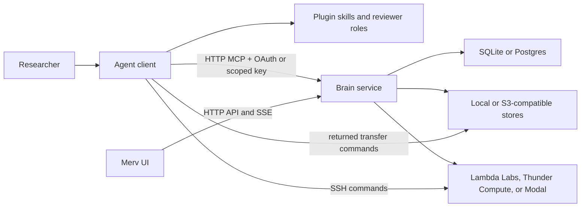

# Merv Architecture

This document describes the architecture implemented by the current codebase.
The workflow declarations in `research_core/{experiment_workflow,
reflection_workflow}.py`, the tool manifest in `surface/tools/contracts.py`,
and the structural tests under `tests/structure/` are authoritative when prose
and code disagree.

## Product model

Merv gives agentic coding clients a shared, server-directed workflow
for machine-learning research. Its durable model is:

- **Project** — the scope for research state and policy.
- **Claim** — what the project currently believes.
- **Experiment** — a planned, executed, and reviewed test of one or more claims.
- **Artifact** — a typed document submitted against a workflow target.
- **Review** — an independent judgment pinned to an immutable target snapshot.
- **Reflection** — a reviewed project-wide update to the logic graph, claims,
  and next experiment wave.
- **Sandbox** — an ephemeral SSH-reachable machine used for execution.
- **Storage object** — a durable heavy file kept outside the repo.

Agents do the reasoning and edit ordinary files. The brain owns research state
and decides which mutations and workflow transitions are allowed.

## Runtime topology

There is one topology for both hosted and local deployments:



### Brain service

The brain is the single authority for research records and policy. It owns:

- projects, claims, experiments, artifacts, reviews, reflections, and events;
- workflow gates, artifact lints, permissions, and reviewer capabilities;
- sandbox registry, provider credentials, quotas, reapers, and cleanup;
- blob metadata and optional heavy-object storage;
- the `/mcp/*`, `/api/*`, and server-sent-event surfaces.

The brain never receives a checkout root and never opens files from a user's
checkout. Bounded Artifact and Feed uploads use one-time brain endpoints, heavy
Storage bytes use provider-presigned transfers, and sandbox outputs move with
`rsync`. None of those bytes enter model context.

`MERV_MODE` selects deployment defaults, not a different component
graph:

| Preset | Brain location | Record/blob defaults | Intended exposure |
|---|---|---|---|
| `local` | `http://127.0.0.1:8787` | SQLite and local-directory blobs | Loopback development; auth off by default |
| `control` | Operator-provided HTTPS URL | Postgres and S3-compatible stores | Supabase-backed end-user auth; TLS and network controls |

`Postgres` here is provider-neutral: the same adapter supports ordinary
PostgreSQL and hosted or self-hosted Supabase PostgreSQL through `MERV_DB_URL`.
The Merv record database is isolated from the Supabase project used for
end-user authentication, and Supabase Storage is not part of this topology.

The control surface requires Supabase-backed end-user authentication
(`SupabaseVerifier` in `surface/auth.py`, attached per-request in
`transport/api/app.py`, with a membership gate that 404s foreign projects).
Hosted control fails closed: with no verifier configured it refuses to start
unless the operator sets `MERV_ALLOW_OPEN_CONTROL=1`, which serves an
unauthenticated plane and logs that state on every boot. The decision is taken
inside `create_fastapi_app`, where a hosted-policy app is composed, so it binds
every construction path rather than one outer builder; the flag is parsed
strictly, and a value it does not recognize fails the boot instead of opening
the plane. `MERV_REQUIRE_AUTH=1` says the same thing more strictly — missing
config is a startup failure with no escape. Local deployment (loopback, single user) never builds a verifier and is
unaffected. CORS and the client-version floor are still not authentication.

### Agent client connection

Every client connects directly to the brain's `/mcp` endpoint over HTTP. Codex,
Claude Code, Cursor, Gemini CLI, Kilo Code, and OpenCode use the endpoint's OAuth discovery and keep
their resulting access tokens in their native credential stores. The committed
manifests are therefore URL-only and contain no Merv key. Headless automation,
the standalone runner, and clients without remote-MCP OAuth use a scoped static
key through `MERV_MCP_KEY`; that key is never inlined because it is
bearer-equivalent to everything in its scope. There is no local proxy and no
local data plane: one wire protocol serves a local agent, a cloud agent, and a
browser-driven agent identically.

An authenticated session is scoped to the projects reachable by its user. A
static key is scoped to one project or to its owner's whole account, immutably.
The gateway does not inject a project:
it requires the agent to pass `project_id` on project-scoped tools and enforces
that it equals the key-bound project — a mismatched `project_id` is rejected and
omitting it is an error. An agent starts with `project(action="list")`; a
single-project credential can also use `project(action="current")`. It then
passes the selected id on every project-scoped call. Agents never pass
`repo_root` and the brain never receives
a checkout root. Tools return one-line transfer commands: Artifact and Feed use
bounded one-time upload endpoints, Storage uses presigned provider URLs, and
Sandbox uses SSH/`rsync`.

Pure two-sided contracts live in `merv.shared`: error identities, path naming,
narrow tool-shape validation, storage transfer/guidance, feed-media primitives,
artifact roles, and markdown-image parsing. Workflow policy, Pydantic models,
service composition, and mutation authority remain brain-owned.

The connection URL lives in `.mcp.json` (default
`https://experiments.rapidreview.io/mcp`); self-hosted deployments regenerate
the snippet with `merv-client env` pointed at their own brain.

### Browser UI

`research_state_ui` is a React/Vite supervisory interface, not an agent runtime.
It reads project-scoped HTTP views, uses server-sent events for prompt refreshes,
and falls back to conditional polling with ETags. It renders desktop and mobile
surfaces for claims, experiments, reviews, artifacts, reflection waves,
sandboxes, storage, events, and the research feed.

The browser cannot perform checkout-local operations. Local storage transfer,
feed-image capture, and sandbox output pulls are agent-driven through typed
tools and the upload/download commands they return, as is artifact submission
(artifact.submit plus the returned upload command).

## Composition and persistence

Both deployment presets use the same `ControlApp` composition. The composition
root selects adapters and wires the modular monolith:

- record store: SQLite locally or Postgres when `MERV_DB_URL` is set;
- submitted-byte blob store: local directory or S3-compatible bucket;
- optional heavy-object store: S3-compatible storage;
- sandbox backend: Lambda Labs by default; Thunder Compute, Modal, Hyperstack,
  DigitalOcean, Verda (DataCrunch), Voltage Park, or TensorDock.
  `MERV_EXECUTION_BACKENDS` (comma-separated)
  runs several at once behind one multiplexer that routes per-request by
  provider and prefixes sandbox ids with their owner (see
  [SANDBOX_PROVIDERS.md](SANDBOX_PROVIDERS.md)). A lazy driver registry is the
  runtime provider inventory: composition resolves one descriptor per selected
  name and imports only its factory. VM drivers share a management-SSH base;
  Modal remains a separate managed-container/provider-exec driver.

Research records live in the brain's selected record store. There is no durable
checkout-local state: a project is bound by its key, not by a machine-local link
database; research repos contain experiment files, not the brain database.

Core research-record mutations and workflow milestones append project events in
the same transaction as their state change. The UI reads those durable events
for the research timeline. Recent tool-call traffic is a bounded in-memory
diagnostic view and is not part of durable research state.

Application workflows can synchronously react to an exact committed event
through a composition-owned registry. Terminal Feed guidance uses this path.
Producer-facing review guidance correlates `review.status` with the existing
`review.submitted` event; it does not append a second event. Fatal, degraded,
and advisory registrations are explicit, and there is no background event worker
or delivery checkpoint yet. A committed transition is never reported as a
failure because post-response advisory work cannot roll it back.

## Tool routing

The brain registry in `src/merv/brain/surface/tools/contracts.py` is the single
generator and source of truth for tool schemas and plane assignments. Since the
no-dataplane transition every tool is a control tool that runs in the brain.
Byte operations (`storage.submit`, `storage.fetch`, `artifact.submit`, and
`feed.post`) hand back a one-line command. Storage uses presigned provider URLs;
Artifact and Feed use bounded token endpoints. Sandbox operations are served by
the brain, while output bytes move directly over `rsync`.

The merged `project` tool is special:

- `action="current"` returns the project bound to the caller's key;
- `action="overview"` reads the brain for the bound (or explicitly given) project;
- `action="create"` creates a brain project (a UI/owner action; a project-bound
  key cannot create projects).

`merv.shared` holds only pure two-sided contracts and imports no brain
internals, so the privacy boundary stays enforceable rather than conventional.

## Workflow architecture

Experiment transitions are declared once in
`src/merv/brain/research_core/experiment_workflow.py`:

```text
planned -> design_review -> ready_to_run -> running -> experiment_review -> complete
```

`failed` and `abandoned` are terminal exits. A result-review rejection returns
to `running` when the plan still stands, or to `planned` with a new attempt when
the design is flawed.

The same workflow declaration drives:

- enforcement in `ExperimentService`;
- semantic next-action guidance formatted by the Application workflow query;
- review rejection destinations and attempt behavior;
- transition discovery and gate checklists returned to agents and the UI.

Reflection transitions are declared in
`src/merv/brain/research_core/reflection_workflow.py`:

```text
reflecting -> synthesizing -> reflection_review -> consolidating -> published
```

Reflection-review rejections return to `synthesizing` when the five lens
documents stand or to `reflecting` when fan-out must repeat. After reflection
approval, consolidation review can return only to `consolidating`; it never
reopens the authoritative reflection.

All meaning-changing actions use typed MCP or HTTP operations. Editing a local
file does not mutate research state. A file becomes evidence only after
`artifact.submit` mints an upload and the agent runs the returned command,
pinning the bytes against a target and role.

## Evidence and storage

Three storage layers have distinct purposes:

1. **Repo files** hold source, plans, compact results, reports, figures, and
   logic graphs. The agent submits the mandated ones as artifacts.
2. **Submitted-byte blobs** pin size-capped gated artifacts and selected small
   metric JSON so lints and reviewers see immutable submissions rather than a
   later working-tree edit.
3. **Heavy-object storage** keeps large datasets, checkpoints, archives, and
   other valuable files that should not live in git.

Artifacts owns artifact identities, upload tokens, figure membership, and byte
retrieval. Research uses the concrete `Artifacts` root to read and seal that
evidence, then applies experiment/reflection gate and review policy. Research
never queries Artifact tables or reads blob providers directly.

Nothing on a sandbox is durable by default. Before release or expiry, agents
must pull compact evidence into the repo or upload heavy files to durable
storage.

## Reviewer boundary

Reviews use request-scoped capabilities rather than prompt trust:

1. The producer calls `review.request`.
2. The brain pins the target snapshot, stores only a hash of the capability, and
   returns the plaintext capability once with a reviewer handoff prompt.
3. A separate reviewer is expected to call `review.start` with a required
   caller-supplied session string different from the producer-supplied string.
4. `review.start` returns bounded project orientation, the target's slim
   experiment/reflection context, and full current-attempt gated artifacts plus
   any system exhibit; the reviewer skill imposes a procedural read-only role
   whose only intended state-changing call is `review.submit`.
5. Request creation validates a workflow role against the active gate. Start
   rejects invalid/expired/superseded capabilities, equal declared session
   strings, or stale snapshots. Submit rechecks that the request is open and
   the snapshot is current, and only the first valid submission is accepted.

The dispatcher also rejects other mutations that explicitly carry a
`review_session_id`, but it does not authenticate every read or unrelated tool
call as that reviewer. This is a practical workflow boundary, not cryptographic
proof that two separate models reasoned independently.

## Code boundaries

The brain is a modular monolith. Research, Artifacts, Sandbox, Feed, and Object
Storage expose concrete package-root capabilities. Application coordinates
only genuinely cross-component work. Surface delivers HTTP/MCP, and Kernel is
the shared dependency floor. Every file is classified independently by
component ownership and architectural layer. The exact mappings and import laws
live in
`tests/structure/test_module_boundaries.py`.

Additional structure tests enforce:

- every tool is a control tool servable from the brain;
- no checkout/process/local-IO dependencies in brain-owned policy modules;
- the record store never learns a `repo_root`;
- provider-neutral sandbox services.

See [MODULE_BOUNDARIES.md](MODULE_BOUNDARIES.md) for the import law.
