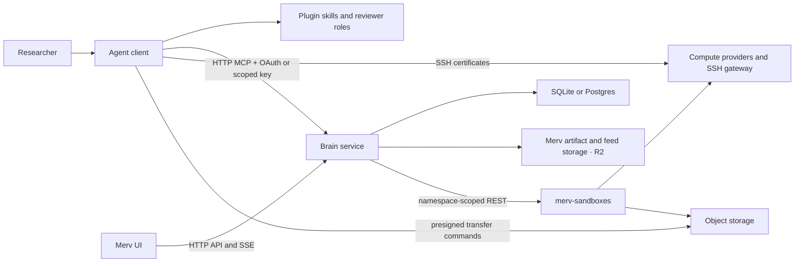

# Merv Architecture

This document describes the architecture implemented by the current codebase.
The workflow declarations in `workflows/definitions/`, the tool manifest in
`surface/tools/contracts.py`,
and the structural tests under `tests/structure/` are authoritative when prose
and code disagree.

## Product model

Merv gives agentic coding clients a shared, server-directed workflow
for machine-learning research. Its durable model is:

- **Project** — the scope for research state and policy.
- **Claim** — what the project currently believes.
- **Experiment** — a planned, executed, and reviewed test of one or more claims.
- **Task** — scoped non-experiment work with a verifiable finish line and no
  claim (a brief of checks in, a delivery of evidence out, one review).
  Experiments and tasks are the nodes of a wave; `depends_on` edges between
  them form the wave DAG.
- **Artifact** — immutable project content, reusable through research associations.
- **Review** — an independent judgment pinned to an immutable target snapshot.
- **Reflection** — a reviewed project-wide update to the logic graph, claims,
  and next wave of experiments and tasks.
- **Sandbox** — an ephemeral SSH-reachable machine used for execution.
- **Storage object** — a durable heavy file kept outside the repo.

Agents do the reasoning and edit ordinary files. The brain owns research state
and decides which mutations and workflow transitions are allowed.

## Runtime topology

There is one topology for both hosted and local deployments:



### Brain service

The brain is the single authority for research records and policy. It owns:

- projects, claims, experiments, artifacts, reviews, reflections, and events;
- workflow gates, artifact lints, permissions, and reviewer capabilities;
- research associations for native sandboxes, archived cost history, and spending policy;
- artifact identities, blob metadata, and the research association of each
  heavy object to the experiment that produced it;
- the `/mcp/*`, `/api/*`, and server-sent-event surfaces.

The brain never receives a checkout root and never opens files from a user's
checkout. Bounded Artifact and Feed uploads use one-time brain endpoints, heavy
Storage bytes use provider-presigned transfers, and sandbox outputs move with
`rsync`. None of those bytes enter model context.

`MERV_MODE` selects deployment defaults, not a different component
graph:

| Preset | Brain location | Record/blob defaults | Intended exposure |
|---|---|---|---|
| `local` | `http://127.0.0.1:8787` | SQLite records; local artifact bytes; external compute/ML storage | Loopback development; auth off by default |
| `control` | Operator-provided HTTPS URL | Postgres records; Merv R2 artifacts; external compute/ML storage | Supabase-backed end-user auth; TLS and network controls |

`Postgres` here is provider-neutral: the same adapter supports ordinary
PostgreSQL and hosted or self-hosted Supabase PostgreSQL through `MERV_DB_URL`.
The Merv record database is isolated from the Supabase project used for
end-user authentication, and Supabase Storage is not part of this topology.

The control surface requires Supabase-backed end-user authentication
(`SupabaseVerifier` in `surface/auth.py`, attached per-request in
`transport/api/app.py`, with a membership gate that 404s foreign projects).
Hosted control fails closed: with no verifier configured it refuses to start
unless the operator sets `MERV_ALLOW_OPEN_CONTROL=1`, which serves an
unauthenticated plane and logs that state on every boot. The decision is taken
inside `create_fastapi_app`, where a hosted-policy app is composed, so it binds
every construction path rather than one outer builder; the flag is parsed
strictly, and a value it does not recognize fails the boot instead of opening
the plane. `MERV_REQUIRE_AUTH=1` says the same thing more strictly — missing
config is a startup failure with no escape. Local deployment (loopback, single user) never builds a verifier and is
unaffected. CORS and the client-version floor are still not authentication.

### Agent client connection

Every client connects directly to the brain's `/mcp` endpoint over HTTP. Codex,
Claude Code, Cursor, Gemini CLI, Kilo Code, and OpenCode use the endpoint's OAuth discovery and keep
their resulting access tokens in their native credential stores. The committed
manifests are therefore URL-only and contain no Merv key. Headless automation,
the standalone runner, and clients without remote-MCP OAuth use a scoped static
key through `MERV_MCP_KEY`; that key is never inlined because it is
bearer-equivalent to everything in its scope. There is no local proxy and no
local data plane: one wire protocol serves a local agent, a cloud agent, and a
browser-driven agent identically.

An authenticated session is scoped to the projects reachable by its user. A
static key is scoped to one project or to its owner's whole account, immutably.
The gateway does not inject a project:
it requires the agent to pass `project_id` on project-scoped tools and enforces
that it equals the key-bound project — a mismatched `project_id` is rejected and
omitting it is an error. An agent starts with `project(action="list")`; a
single-project credential can also use `project(action="current")`. It then
passes the selected id on every project-scoped call. Agents never pass
`repo_root` and the brain never receives
a checkout root. Tools return one-line transfer commands: Artifact and Feed use
bounded one-time upload endpoints, Storage uses presigned provider URLs, and
Sandbox uses SSH/`rsync`.

Pure two-sided contracts live in `merv.shared`: error identities, narrow
tool-shape validation, storage transfer/guidance, feed-media primitives, and
markdown-image parsing. Research vocabulary stays in research: artifact roles
and association targets in `brain/workflows/definitions/artifact_roles.py`,
document summaries and experiment folder naming in `brain/research_core`.
Workflow policy, Pydantic models, service composition, and mutation authority
remain brain-owned.

The connection URL lives in `.mcp.json` (default
`https://experiments.rapidreview.io/mcp`); self-hosted deployments regenerate
the snippet with `merv-client env` pointed at their own brain.

### Browser UI

`research_state_ui` is a React/Vite supervisory interface, not an agent runtime.
It reads project-scoped HTTP views, uses server-sent events for prompt refreshes,
and falls back to conditional polling with ETags. It renders desktop and mobile
surfaces for claims, experiments, reviews, artifacts, reflection waves,
sandboxes, storage, events, and the research feed.

The browser cannot perform checkout-local operations. Local storage transfer,
feed-image capture, and sandbox output pulls are agent-driven through typed
tools and the upload/download commands they return, as is artifact submission
(artifact.upload plus the returned upload command).

## Composition and persistence

Both deployment presets build the same `Surface` (`surface/surface.py`). It is
the one composition root: it selects adapters, constructs each component, and
wires the modular monolith together —

- record store: SQLite locally or PostgreSQL through `MERV_DB_URL`;
- infrastructure transport: authenticated, namespace-scoped merv-sandboxes HTTP;
- artifact and feed blobs: Merv-owned R2, with a local disk adapter for development;
- heavy datasets/models: object storage through merv-sandboxes;
- sandbox/provider facades: native connections, offers, lifecycle, and jobs.

Composition is also where research meaning reaches support. A support component
declares a narrow `Protocol` in its own module and receives an implementation
here: Agent Sessions learns whether a leased instance still stands through
`InstanceFacts`, the Feed receives its reference vocabulary and author roles,
Artifacts receives the association vocabulary its tool schema renders, and the
kernel's activity log receives the argument names Research declares
(`register_activity_vocabulary`). Nothing in a support module names a research
record; `tests/structure/test_support_vocabulary.py` holds that.

The independent service owns compute-provider credentials, cloud SDKs, SSH
certificates, job workers, sandbox leases, and the heavy-object catalog
(names, versions, state, retention, expiry and bytes). Merv owns its
artifact byte adapters and credentials. Sandbox and heavy-object operations need
`MERV_SANDBOXES_URL` and `MERV_SANDBOXES_JWT_SECRET`; artifact storage is separate.

Research records live in the brain's selected record store. There is no durable
checkout-local state: a project is bound by its key, not by a machine-local link
database; research repos contain experiment files, not the brain database.

Each component owns the tables it reads. Kernel supplies the registration API —
a `SchemaModule` carrying idempotent DDL and any numbered `Migration` steps
above the baseline, installed through `BaseStateStore.install` — and keeps only
what everything writes through: projects, membership, events, the tool-call
ledger, tenants and the `schema_migrations` ledger itself. Every other table is
declared in a `persistence` module beside the service that uses it, and
`Surface` installs each component's schema as it constructs the component.

The ladder has a floor. Versions 1..64 were squashed into the DDL once every
live database had reached that head: the DDL alone states the shape, a fresh
install stamps `schema_migrations` with the `baseline` row, and a database
already carrying it applies only what came after. Because one ledger records
the numbering, the order above the baseline is global (`MIGRATION_ORDER` in
kernel) while the handlers belong to their owners; a step whose owner has not
installed yet is skipped and converges on a later install. Dialect translation
stays in kernel, so the SQLite and Postgres stores reach the identical shape.

Core research-record mutations and workflow milestones append project events in
the same transaction as their state change. The UI reads those durable events
for the research timeline. Recent tool-call traffic is a bounded in-memory
diagnostic view and is not part of durable research state.

The workflow runtime commits state, history, and requested support actions in
one transaction. A leased outbox worker delivers review requests, child-wave
starts, and tracking effects with retries and stable action/event identities.
Review requests are renewed while their exact review node remains current.
Immediate Feed guidance remains advisory; it cannot roll back a committed graph
transition.

## Tool routing

Each component declares its own tools in `<component>/tools.py` and exports the
table as `TOOLS`; the brain registry in `src/merv/brain/surface/tools/contracts.py`
merges those tables under unique names and is the served source of truth. Since
the no-dataplane transition every tool is a control tool that runs in the brain.
The `ToolContract` type lives in `kernel/tools.py`, so a component declares its
tools without importing delivery, and each contract also declares what the
gateway must supply for it — the verified producer session, a review
capability, the caller's bound project, the telemetry scope field, a base URL,
a wait secret, an action a machine key may not take. The gateway therefore
names no tool of its own. What an agent session may call is the support
baseline in `transport/http_policy.py` united with the tools that node's
`Execution` declared, and each `Scope` rule binds an argument to the leased
instance or to a reference the packet carried.

Byte operations (`storage.submit`, `storage.fetch`, `artifact.upload`, and
`feed.post`) hand back a one-line command. Storage uses presigned provider URLs;
Artifact and Feed use bounded token endpoints. Sandbox operations are served by
the brain, while output bytes move directly over `rsync`.

The merged `project` tool is special:

- `action="current"` returns the project bound to the caller's key;
- `action="overview"` reads the brain for the bound (or explicitly given) project;
- `action="create"` creates a brain project (a UI/owner action; a project-bound
  key cannot create projects).

`merv.shared` holds only pure two-sided contracts and imports no brain
internals, so the privacy boundary stays enforceable rather than conventional.

## Workflow architecture

`workflows/` owns the graph runtime and versioned definitions. A node specifies
its role, prerequisites, starting-context function, and execution needs; edges
specify checks, state changes, and support actions. The same evaluation drives
permitted transitions, dispatch, and next-action guidance.

```text
experiment: planned -> design_review -> running -> experiment_review -> complete
task: in_progress -> in_review -> done
reflection: reflecting -> synthesizing -> reflection_review -> consolidating
            -> consolidation_review -> published
```

Each reflection lens is its own child workflow. The parent joins the children's
exact submitted outputs before dispatching synthesis. Review verdicts apply the
graph's next state in the same transaction; rejection routes and retry/attempt
behavior remain part of each definition.

Research bindings supply experiment, task, reflection, review, and evidence
facts. They project graph changes into existing domain records atomically. New
workflow definitions can use generic content storage and knowledge reads without
adding a scheduler branch or a new API dispatch case.

Support systems own artifact bytes, review capabilities, agent leases, tracking,
and sandbox operations. Auto-run freezes the node's brief and exact references
while issuing a revision-fenced lease. Recovering a node retains its submitted
work; advancing it fences the prior credential. Interactive agents use
`workflow.begin(project_id, instance_id, expected_revision)` before doing work.
Both paths record actual start once per revision and queue the node's start
effects; neither needs another graph state after approval.

All meaning-changing actions use typed MCP or HTTP operations. Editing a local
file does not mutate research state. `artifact.upload` records immutable content
after the agent runs its returned command. An optional
`attach_to: {target_type, target_id, role, lens_id?}` activates a research
association when that upload completes; `artifact.attach` reuses existing
content. Workflow nodes can accept content IDs and let their bindings record the
association. `artifact.read` retrieves content or lists research evidence.

## Evidence and storage

Three storage layers have distinct purposes:

1. **Repo files** hold source, plans, compact results, reports, figures, and
   logic graphs. The agent submits the mandated ones as artifacts.
2. **Submitted-byte blobs** pin size-capped gated artifacts and selected small
   metric JSON so lints and reviewers see immutable submissions rather than a
   later working-tree edit.
3. **Heavy-object storage** keeps large datasets, checkpoints, archives, and
   other valuable files that should not live in git. merv-sandboxes is the
   catalog; Merv keeps one-time completion tokens and records which
   experiment produced each object.

Artifacts owns content identities, upload tokens, figure membership, and byte
retrieval. Research owns target/role associations and freezes exact evidence
versions through workflow bindings. Workflows owns document validation and gate
decisions. Research reads bytes through the public Artifacts root; it never
queries Artifact tables or reads blob providers directly.

Nothing on a sandbox is durable by default. Before release or expiry, agents
must pull compact evidence into the repo or upload heavy files to durable
storage.

## Reviewer boundary

Reviews use request-scoped capabilities rather than prompt trust:

1. Entering a review node queues a request; interactive coordinators may also
   call `review.request` to obtain a manual handoff.
2. The brain pins the target snapshot, stores only a hash of the capability, and
   returns the plaintext capability once with a reviewer handoff prompt.
3. A separate reviewer calls `review.start`. An auto-run credential supplies
   the authenticated session and exact request; an interactive handoff uses its
   capability and a declared session string distinct from the producer.
4. `review.start` returns bounded project orientation, the target's slim
   experiment/reflection context, and full current-attempt gated artifacts plus
   any system exhibit; the reviewer skill imposes a procedural read-only role
   whose only intended state-changing call is `review.submit`.
5. Request creation validates a workflow role against the active gate. Start
   rejects invalid/expired/superseded capabilities, equal declared session
   strings, or stale snapshots. Submit rechecks that the request is open and
   the snapshot is current, and only the first valid submission is accepted.

Auto-run reviewer credentials deny unrelated writes, artifacts uploads, and
arbitrary graph exits. General project keys used for interactive reviews still
rely on the skill's read-only procedure outside the capability-addressed review
calls. Session separation does not prove independent model reasoning.

## Code boundaries

The brain is a modular monolith in three layers. Research is the science —
research core, workflows, literature, and the cross-component coordination in
`application/` — and it reaches HTTP through its own routers inside `surface/`.
Artifacts, Feed, Agent Sessions and the rest of Surface are support: they carry
research work and never interpret it. Infrastructure adapts merv-sandboxes.
Kernel is the shared floor under all three.
Each component exposes package-root capabilities; every file is classified
independently by component and by architectural layer. The exact mappings and
import laws live in `tests/structure/test_module_boundaries.py`, and the
vocabulary law in `tests/structure/test_support_vocabulary.py`.

Additional structure tests enforce:

- every tool is a control tool servable from the brain;
- no support file names a research record in an identifier, a string, or SQL;
- no checkout/process/local-IO dependencies in brain-owned policy modules;
- the record store never learns a `repo_root`;
- provider-neutral sandbox services.

See [MODULE_BOUNDARIES.md](MODULE_BOUNDARIES.md) for the import law.
