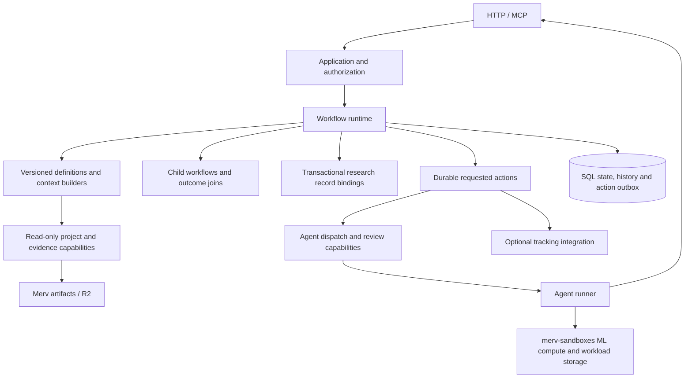

# Merv workflow architecture

Merv runs workflow definitions as ordinary, versioned Python graphs. Definitions
own research decisions and agent briefs. The runtime owns durable execution.
Composition routes named outcomes between workflows. These are modules in the
existing control plane, with no additional service or graph framework.

## Definition contract

A node declares its agent role, `build_context(snapshot, knowledge)`, dispatch
prerequisites, an `Execution` policy (read-only flag, node tools, mutating
tools, argument scopes, sandbox authority, runner workspace layout), and
optional actions on actual work start. Its
brief gives a concise task, the reason this node is active, durable progress, and
exact artifact/review references. Full documents remain available through tools.
Wait nodes declare children and a join; terminal states expose named outcomes.

Every edge has a source, action, destination, check and optional reducer.
Branches, revision loops and review rejection are ordinary edges. The same
`Evaluation` supplies transition enforcement, available and blocked actions,
suggested next action, and dispatch blockers. Compatibility views only format it.

Plugins register `Workflow` values explicitly in `WORKFLOWS`. A new workflow can
use generic instance data and the common project/artifact reader without a new
API, dispatcher branch or SQL table. Native research records use optional
transactional bindings. Pure document validators and legacy presentation metadata
live beside their workflow definitions, outside support modules.

## Persistence and boundaries

- `workflow_instances` owns graph name/version, state, revision, data, outcome,
  and parent membership. A definition interprets its data; SQL stores it.
- `workflow_history` retains immutable before-state identity, accepted action,
  after snapshot, child membership, and the exact committed event. Revision and
  request keys fence concurrent edits and deduplicate retried commands.
- `workflow_actions` commits requested effects with the transition. Expiring
  leases, stable delivery keys, retry backoff and stale-worker fencing support
  process recovery. External handlers must honor the delivery key or be idempotent.
- Existing experiment/task/reflection rows remain atomic compatibility projections
  and retain their research-specific fields, claims, evidence and review records.
- Artifacts remain generic immutable content in **Merv-owned R2**. Workflows keep
  semantic labels and content IDs in state/history. Acceptance verifies project
  ownership, complete document figures, and retained bytes. Future artifact GC
  must treat workflow history references as retention roots.
- merv-sandboxes supplies ML compute, datasets and models; it does not store Merv
  workflow artifacts. Agent leases, processes and permissions remain in dispatch.

## Built-in flows

Experiments use `planned → design_review → running → experiment_review → complete`.
Approval enters execution immediately. Dependencies gate assignment. Actual
activation starts the attempt clock and tracking: auto-run activates its lease;
interactive clients call `workflow.begin`. Read-only status calls start no work.
Review verdicts atomically follow the declared approval or revision edge.

Tasks use `in_progress → in_review → done`, with ordinary revision and failure
edges. The immutable goal and deliverables stay pinned across delivery revisions.

Reflections wait for independent lens children, synthesize their findings, and
pass reflection review before consolidation. A separate code review grades the
exact proposal. Publication still requires its bound central Git receipt and
atomically materializes the approved change spec. A `research_wave` composition
attaches the exact existing experiment/task instances and joins their named
outcomes. It retains the resulting reflection/replanning handoff in its state.

## Upgrades and recovery

Instances retain their registered definition version. New registrations do not
upgrade live work. An explicit migration compares the revision, maps state/data,
and chooses whether to preserve the exact child set. Active children cannot be
silently replaced. Historical snapshots remain unchanged.

Schema 60 adopts released native records, preserves evidence and valid live
leases, maps `ready_to_run` to `running` without starting its clock, and expires
stale assignments. Bootstrap preserves completed lenses, resumes already-reviewed
gates, and attaches unfinished published waves without replaying their work.

The public workflow tools are `catalog`, `start`, `status_and_next`, `assignment`,
`begin`, `transition`, and `history`. Assigned agents receive a frozen revision
packet; dispatch rechecks that revision and prerequisites inside the transaction
that issues the real lease. A completed node hands off rather than continuing
with its old assignment or capabilities.
